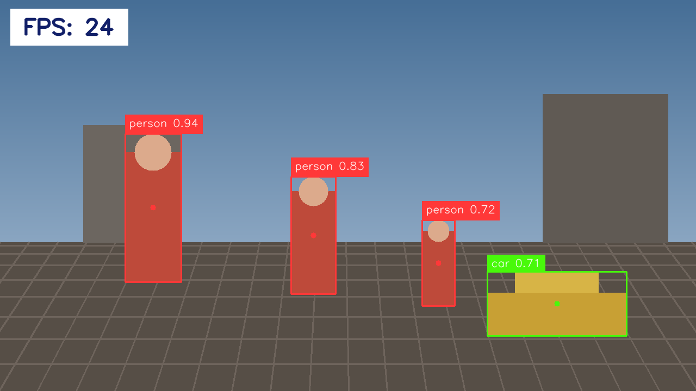
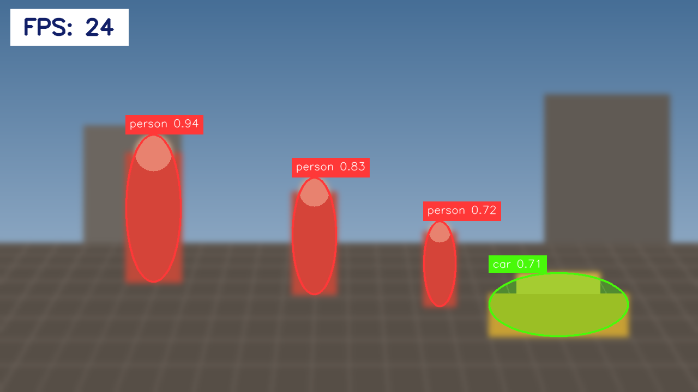
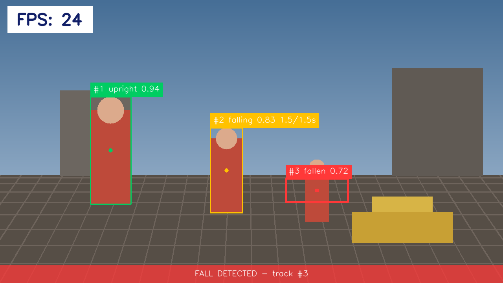

<div align="center">


<br>

[](https://sima.ai)
[](https://docs.sima.ai)
[](https://docs.sima.ai)

<br>

[](https://github.com/RizwanMunawar/sima-projects/actions/workflows/ci.yml)
[](https://pypi.org/project/sima-vision/)
[](https://www.python.org/)
[](LICENSE)
[](https://github.com/ultralytics/ultralytics)

</div>

**`sima-vision`** runs [Ultralytics YOLO26](https://github.com/ultralytics/ultralytics) on
the MLA accelerator of a [SiMa.ai Modalix DevKit 3.0](https://sima.ai) — object detection,
instance segmentation with a background blur, and fall detection with email alerts. Three
apps, one pipeline, one command.

Inference needs the board. **Everything else does not** — checking a config, and seeing
exactly what the overlay will look like, both run on a laptop. So you can set the whole
thing up before you own any hardware.

<div align="center">

|  |  |  |
|:--:|:--:|:--:|
| **`detect`** | **`segment`** | **`fall`** |

<sub>Drawn on a laptop by <code>sima-vision preview</code> — no board, no model.</sub>

</div>

## <div align="center">Documentation</div>

<details open>
<summary>Install</summary>

Python 3.10 or later. Needs no compiler, and pulls only PyYAML:

```bash
pip install sima-vision
```

To draw previews on a machine that has no board, add numpy and OpenCV:

```bash
pip install "sima-vision[preview]"
```

On the DevKit you want the plain install: the board already provides numpy and OpenCV, and
`pip install opencv-python` there would pull numpy 2.x and break `pyneat`.

```bash
sima-vision doctor       # what is installed, and what it lets you do
```

</details>

<details open>
<summary>Quickstart</summary>

### Without a board

```bash
sima-vision preview --task segment -o blur.png    # draw the overlay your config makes
sima-vision init segment                          # write a documented config.yaml
sima-vision segment --validate                    # check it
```

`preview` runs **no model**. It draws synthetic detections using the real overlay code, so
what you are judging is styling, not accuracy.

### On the DevKit

```bash
pip install sima-vision
sima-vision fetch detect                          # sample clips + the model command

sima-vision detect \
  --source assets/videos/people-walking-outside-mall.h264 \
  --model  assets/models/yolo26m-det-bf16-mla_tess-b1.tar.gz
```

`fetch` downloads the clips and prints the one `sima-cli download` line for the model,
which needs a [community.sima.ai](https://community.sima.ai) login. Out comes
`detections.mp4` and a `frames/` directory; `scp` them back and look.

> **New board?** It gets brought up once — cabling, WSL2, Docker, the 12.6 GB Neat SDK.
> That is **[docs/setup.md](docs/setup.md)**, about two hours. Nothing above needs it.

</details>

<details open>
<summary>Usage</summary>

Every setting has a flag and a Python keyword under the same name. Both write the same
config key, and both go through the same validation.

### CLI

```bash
sima-vision detect  --source clip.h264 --model det.tar.gz --conf 0.5
sima-vision segment --source clip.h264 --model seg.tar.gz --blur-strength 81
sima-vision segment --source clip.h264 --anonymise --keep-classes person
sima-vision fall    --source rtsp://cam/live --alert-to ops@example.com --send
```

`sima-vision <command> --help` lists every flag.

### Python

```python
from sima_vision import run, preview, validate

# No board: draw the overlay a setting produces, and write a PNG.
preview("segment", out="blur.png", blur_strength=81, keep_classes=["person"])

# No board: resolve and check a config, then look at what it became.
cfg = validate("detect", conf=0.5, max_det=20)
print(cfg.score_threshold, cfg.video_path)

# On the DevKit: run it.
run("detect", source="clip.h264", model="det.tar.gz", conf=0.5, frames=200)
```

Anything the keywords do not cover is still reachable by its config path:

```python
run("segment", **{"runtime.output_buffers": 2})
```

</details>

<details open>
<summary>Adjust it</summary>

Three layers, each beating the one above it:

```
built-in defaults   →   config.yaml   →   flags / keywords
```

So **a config file is optional** — `--model` and `--source` are enough to run. For a setup
you keep:

```bash
sima-vision init detect     # a documented config.yaml, right here
$EDITOR config.yaml
sima-vision detect          # picks up ./config.yaml on its own
```

### What people actually change

| I want | Flag | Python | Config key |
|:--|:--|:--|:--|
| Fewer spurious boxes | `--conf 0.5` | `conf=0.5` | `decode.score_threshold` |
| To catch more, noisily | `--conf 0.15` | `conf=0.15` | `decode.score_threshold` |
| A short test run | `--frames 100` | `frames=100` | `runtime.frames` |
| No video file | `--no-video` | `video=False` | `output.video.enable` |
| No stills | `--no-save` | `save=False` | `output.save.enable` |
| Fewer stills | `--save-every 30` | `save_every=30` | `output.save.every` |
| To see where the time goes | `--profile` | `profile=True` | `runtime.profile` |
| A live Insight view | `--insight` | `insight=True` | `output.insight.enable` |
| A stronger blur | `--blur-strength 81` | `blur_strength=81` | `blur.kernel` |
| A pixelated background | `--blur-method pixelate` | `blur_method="pixelate"` | `blur.method` |
| Only people kept sharp | `--keep-classes person` | `keep_classes=["person"]` | `blur.keep_classes` |
| People blurred, scene sharp | `--anonymise` | `anonymise=True` | `blur.invert` |
| Masks, but no blur | `--no-blur` | `blur=False` | `blur.enable` |
| To track something else | `--classes forklift` | `classes=["forklift"]` | `tracking.classes` |
| Falls confirmed faster | `--confirm 0.8` | `confirm=0.8` | `fall.confirm_seconds` |
| An email on a fall | `--alert-to me@x.com --send` | `alert_to=[...], send=True` | `alerts.*` |

Check any of it before deploying:

```bash
sima-vision segment --conf 0.5 --blur-strength 81 --validate   # does it parse?
sima-vision preview --task segment --blur-strength 81          # what does it look like?
```

### When it runs too slowly

In the order worth trying: `blur.downscale: 4` (the biggest single win at 1080p),
`output.save.every: 30`, `--no-save`, then `blur.feather: 0`.

### When a run stops part-way through a clip

That is the decoder running out of buffers. Lower `runtime.output_buffers`, and use
`sima-vision segment --minimal` to tell "the app is too slow" apart from "the graph is
wrong" in a single run.

</details>

<details open>
<summary>Tasks</summary>

| Task | What it does | Model | Guide |
|:--|:--|:--|:--|
| **`detect`** | Boxes, class names and confidence on every frame | YOLO26 detect | [docs/detect.md](docs/detect.md) |
| **`segment`** | Per-pixel masks, and a background blur that keeps the subject sharp | YOLO26 segment | [docs/segment.md](docs/segment.md) |
| **`fall`** | Tracks people and emails when one of them goes down | YOLO26 detect | [docs/fall.md](docs/fall.md) |

All three share one pipeline — the same source handling, Neat graph, sample decoding,
drawing and sinks. Each guide covers only what is genuinely its own: its model, its
settings, its tuning and its errors.

**Task-specific flags:**

```bash
# segment
--blur / --no-blur      --blur-method gaussian|pixelate|none    --blur-strength PX
--keep-classes ...      --anonymise      --mask-threshold T     --no-masks   --minimal

# fall
--classes ...           --confirm S      --no-fall
--alert-to EMAIL...     --alert-from EMAIL     --alerts    --send
--smtp-host / --smtp-port / --smtp-user        --site NAME
--test-alert            # send one fake alert now and exit; needs no board
```

Alerts stay a dry run until `--send`, and the SMTP password is only ever read from
`$FALL_ALERT_SMTP_PASSWORD` — never from a config file, which is committed.

</details>

<details>
<summary>Commands</summary>

| Command | Board? | What it does |
|:--|:--:|:--|
| `sima-vision preview` | no | Draw the overlay your config produces, to a PNG |
| `sima-vision init <task>` | no | Write a documented `config.yaml` here |
| `sima-vision <task> --validate` | no | Parse and check a config, print what it resolved to |
| `sima-vision doctor` | no | What is installed, and what it lets you do |
| `sima-vision fetch [task]` | no | Download the sample clips, print the model command |
| `sima-vision detect` | **yes** | Run detection on the MLA |
| `sima-vision segment` | **yes** | Run segmentation, with the optional blur |
| `sima-vision fall` | **yes** | Run fall detection, with SMTP alerts |

**Shared flags:**

| Flag | Config key | What it does |
|:--|:--|:--|
| `--source`, `-s` | `source.uri` | File, RTSP URL, or nothing for the camera |
| `--source-type` | `source.type` | `video`, `rtsp` or `usb` |
| `--model`, `-m` | `model.path` | Compiled model archive |
| `--labels` | `model.labels` | Class names. Defaults to the packaged COCO list |
| `--family` | `model.family` | Detection head. Must match the model |
| `--conf` / `--iou` / `--max-det` | `decode.*` | Confidence, NMS IoU, top-K |
| `--frames`, `-n` | `runtime.frames` | Stop after N frames |
| `--profile` | `runtime.profile` | Per-stage timings |
| `--video-path` / `--no-video` | `output.video.*` | The annotated recording |
| `--save-dir` / `--save-every` / `--no-save` | `output.save.*` | Annotated stills |
| `--insight` / `--insight-host` | `output.insight.*` | The live Neat Insight feed |
| `--config`, `-c` / `--no-config` | — | Which config file, or none |
| `--validate` | — | Check and print, then exit |

`--validate` loads neither pyneat nor the model, so it runs anywhere:

```
config OK: config.yaml
  model: assets/models/yolo26m-seg-bf16-mla_tess-b1.tar.gz
  family=yolo26-seg -> BoxDecodeType.YoloV26Seg
  source: type=video uri=assets/videos/people-walking-outside-mall.h264
  decode: conf=0.3 iou=0.6 max_det=50
  segmentation: masks=on source=auto space=auto threshold=0.5
  blur: background | method=gaussian kernel=41 sigma=auto down=2 feather=9
  output: video=segmentation.mp4 stills=frames/ every=10
```

</details>

<details>
<summary>How it works</summary>

The pipeline is a Neat `Graph`, not a single `Model.run`, because it has several stages,
named public endpoints and a branch with a fan-in:

```
source ──> branch ──> frame ──────────────┐
              │                           ├──> combine("<task>_output")
              └───> model ──> results ────┘

<task>_output ──> parse ──> overlay ──> video file + stills
                        ├─> MetadataSender  (JSON over UDP)
                        └─> VideoSender     (H.264 RTP over UDP)
```

Frames come off the hardware decoder, whose buffer pool is small — the boot log prints
`BufferNum=8`. Everything expensive therefore happens on a sink thread, so the pull loop
hands each buffer back immediately. Holding one across a `pull()` is what deadlocks the
decoder part-way through a clip.

```
sima_vision/
  cli.py        the command line          api.py     the Python API
  config.py     loading and validation    scene.py   the preview scene
  media.py      H.264 and geometry        neat.py    graph assembly
  samples.py    decoding a sample         masks.py   masks and compositing
  draw.py       the overlay               sinks.py   video, stills, Insight
  runloop.py    the pull loop
  tasks/        detect.py   segment.py   fall.py
```

Each task supplies only what is its own; everything above it is written once. See
[docs/detect.md](docs/detect.md#how-the-app-works) for the long version.

</details>

<details>
<summary>Contributing</summary>

```bash
git clone https://github.com/RizwanMunawar/sima-projects.git
cd sima-projects
pip install -e ".[dev,preview]"

ruff check sima_vision tests
pytest -q
```

The tests need no board: the mask decoding, compositing, overlay, tracker and fall rules
are plain numpy and OpenCV, so they run anywhere. CI covers Python 3.10 to 3.13, builds
the wheel and installs it clean.

</details>

## <div align="center">License</div>

The models used here for testing are **Ultralytics YOLO26**, under **AGPL-3.0**. All other
parts of this repository are under **Apache-2.0** — see [LICENSE](LICENSE).

## <div align="center">Credits</div>

- [SiMa.ai](https://github.com/SiMa-ai) — Modalix, the Palette SDK and Neat
- [Ultralytics](https://github.com/ultralytics/ultralytics) — YOLO26 models

<div align="center">

Created with ❤️ by **Muhammad Rizwan Munawar**, passionate about implementing
computer vision ideas and sharing my gains with the community.

If this saved you an afternoon, **⭐ the repo** and pass it on to someone else
bringing up a DevKit.

<br>

<a href="https://github.com/RizwanMunawar"></a>
&nbsp;&nbsp;
<a href="https://www.linkedin.com/in/muhammadrizwanmunawar/"></a>
&nbsp;&nbsp;
<a href="https://x.com/muhammdrizwanmr"></a>
&nbsp;&nbsp;
<a href="https://www.youtube.com/@muhammadrizwanmunawar"></a>
&nbsp;&nbsp;
<a href="https://muhammadrizwanmunawar.medium.com/"></a>

</div>
