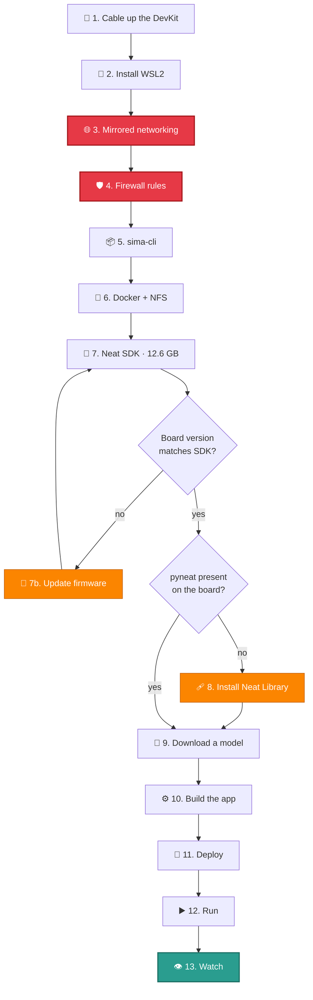
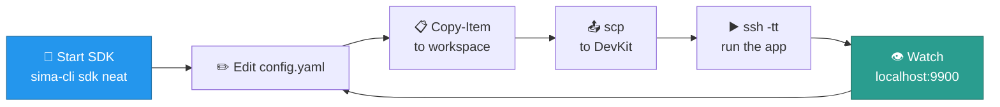

<div align="center">

<br>

# SiMa Neat SDK

### Zero to live YOLO object detection on a Modalix DevKit

<br>

[](https://sima.ai)
[](https://docs.sima.ai)
[](https://docs.sima.ai)

<br>


<br>

</div>

---

## 📖 About

This repository holds two things that grew out of setting up a SiMa Modalix DevKit
from scratch.

The first is a **setup guide**. Not the polished version from the vendor docs, but the
one written while things broke. Every warning in it marks somewhere real time was lost,
and the ordering of the sections is deliberate for that reason. Follow it top to bottom
and you should avoid the traps entirely.

The second is a **working object detection application** for the Neat Library, built
by following the `neat-application-builder` playbook. Every API call in it was checked
against the packaged core source inside the SDK container rather than written from
memory, so the preprocessing options and decode types reflect what the library actually
exposes.

<table>
<tr>
<td width="50%" valign="top">

**📘 The guide**

Thirteen sections from a bare Windows PC to detections rendering in your browser.
Networking and firewall come early because everything downstream silently depends on
them.

</td>
<td width="50%" valign="top">

**⚙️ The app**

A Neat `Graph` pipeline with video, RTSP and camera sources, writing annotated frames
to disk while streaming H.264 and JSON detections to Neat Insight.

</td>
</tr>
</table>

---

## 🏗️ Architecture

Three machines are involved, and they do not share files or paths. Knowing which is
which resolves most confusion before it starts.

```
     ┌───────────────────┐      ┌────────────────────────┐      ┌──────────────────┐
     │   WINDOWS 11 PC   │      │      WSL2  UBUNTU      │      │  MODALIX DEVKIT  │
     ├───────────────────┤      ├────────────────────────┤      ├──────────────────┤
     │                   │      │                        │      │                  │
     │   Chrome          │◄────►│   sima-cli             │◄────►│   MLA            │
     │   VS Code         │HTTPS │   Docker Engine        │ UDP  │   pyneat         │
     │   scp / ssh       │ 9900 │   SDK container        │ 9000 │   your app       │
     │                   │      │   Neat Insight         │ 9100 │                  │
     │                   │      │   NFS export           │      │                  │
     └───────────────────┘      └────────────────────────┘      └──────────────────┘
            VIEWER                    BUILD + RECEIVE                 INFERENCE
        192.168.18.15                  192.168.137.1              192.168.137.123
```

| | Machine | Role | You will spend time here |
|:--:|:--|:--|:--|
| 🪟 | **Windows PC** | Viewer and file transfer | Browser, PowerShell |
| 🐧 | **WSL2 Ubuntu** | Build host and stream receiver | Most of the setup |
| 🔴 | **Modalix DevKit** | Inference. Nothing else runs the MLA | Running the app |

### The inference pipeline

Your application does not draw anything on your screen. It runs the model, then pushes
two separate streams back over UDP. Insight recombines them.

```
   ┌─────────────┐    ┌──────────────┐    ┌─────────────┐    ┌───────────────┐
   │   SOURCE    │    │  PREPROCESS  │    │  INFERENCE  │    │   BOXDECODE   │
   │             │───►│              │───►│             │───►│               │
   │ file / rtsp │    │  letterbox   │    │  YOLO on    │    │  NMS + boxes  │
   │  / camera   │    │  normalize   │    │    MLA      │    │  in px coords │
   │    NV12     │    │  tessellate  │    │             │    │               │
   └─────────────┘    └──────────────┘    └─────────────┘    └───────┬───────┘
                                                                     │
                        ┌────────────────────────────────────────────┼────────────────┐
                        ▼                                            ▼                ▼
              ┌───────────────────┐                    ┌────────────────────┐  ┌─────────────┐
              │   VideoSender     │                    │   MetadataSender   │  │  JPEG files │
              │  H.264 RTP :9000  │                    │    JSON UDP :9100  │  │   on disk   │
              └─────────┬─────────┘                    └──────────┬─────────┘  └─────────────┘
                        │                                         │
                        └──────────────► NEAT INSIGHT ◄───────────┘
                                        https://localhost:9900
```

---

## ⚡ Quick start

Already set up and just want the loop? This is it.

```bash
# 1 ── start the SDK container
sudo su - && cd /mnt/d/work/sima-projects && source sima/bin/activate && sima-cli sdk neat

# 2 ── ship the app to the board
cd /workspace && scp -r yolo-detector sima@192.168.137.123:~/

# 3 ── run it
ssh -tt sima@192.168.137.123
source ~/pyneat/bin/activate && cd ~/yolo-detector && python3 src/main.py --config config.yaml
```

Then open **[https://localhost:9900](https://localhost:9900)** and select channel 0.

Starting fresh? Work through the sections below in order.

---

## 🗺️ Setup flow



<table>
<tr><td>🔴</td><td><b>Red steps are load bearing.</b> Doing them late is the single most common way to lose an afternoon, because pairing installs onto the board over the network and fails silently without a route.</td></tr>
<tr><td>🟠</td><td><b>Orange steps are recovery paths.</b> Most people skip both. A check tells you when you need them.</td></tr>
</table>

---

## 📑 Contents

| # | Section | Runs in | ⏱️ |
|:--:|:--|:--|:--|
| 0 | [The three machines](#0-the-three-machines) | 📖 read first | 3 min |
| 1 | [Cable up the DevKit](#1-cable-up-the-devkit) |  | 15 min |
| 2 | [Install WSL2](#2-install-wsl2) |  | 10 min |
| 3 | [Mirrored networking](#3-mirrored-networking) |  | 5 min |
| 4 | [Firewall rules](#4-firewall-rules) |  | 2 min |
| 5 | [Install sima-cli](#5-install-sima-cli) |  | 5 min |
| 6 | [Docker Engine and NFS](#6-docker-engine-and-nfs) |  | 10 min |
| 7 | [Install the Neat SDK](#7-install-the-neat-sdk) |  | 30–60 min |
| 7b | [Update DevKit firmware](#7b-update-devkit-firmware) |  | 15–40 min |
| 8 | [Neat Library on the board](#8-neat-library-on-the-board) |  | 15 min |
| 9 | [Download a model](#9-download-a-model) |  | 5 min |
| 10 | [Build the app](#10-build-the-app) |  | 10 min |
| 11 | [Deploy](#11-deploy) |  | 5 min |
| 12 | [Run](#12-run) |  | 2 min |
| 13 | [Watch](#13-watch) |  | 2 min |

**Reference:** [Daily workflow](#-daily-workflow) · [Troubleshooting](#-troubleshooting) · [Cheat sheet](#-cheat-sheet)

### Requirements

| | Resource | Minimum | Why it matters |
|:--:|:--|:--|:--|
| 💻 | Operating system | Windows 11 + WSL2, Ubuntu 22.04/24.04, macOS 15.5+ | SDK container support |
| 🧮 | CPU | 4 cores | Model compiler and build tooling |
| 🧠 | Memory | 16 GB | Container plus compiler working set |
| 💾 | Free disk | 100 GB | The image alone is 12.6 GB |
| 🔑 | Account | [community.sima.ai](https://community.sima.ai) | Required to download models and packages |

---

## 0. The three machines

Most problems in this stack come from typing a command into the wrong box. The commands
themselves are fine, they just run somewhere that cannot see the files they reference.

Check your prompt before every block. Every code block below is labelled.

| Prompt looks like | You are in | Paths look like |
|:--|:--|:--|
| `PS C:\Users\you>` | 🪟 Windows PowerShell | `D:\work\sima-projects\...` |
| `root@neat-sdk-...:/workspace#` | 🐳 SDK container | `/workspace/...` |
| `sima@modalix:~$` | 🔴 DevKit | `~/yolo-detector/...` |

> [!WARNING]
> **Windows paths only work in PowerShell.** Linux reads a colon as `hostname:path`, so
> pasting `D:\work\...` into the container gives you this, which looks like a network
> fault but is not:
> ```
> ssh: Could not resolve hostname d: Temporary failure in name resolution
> ```

### One folder, three names

The shared workspace is how files move between machines. It is the same directory seen
from three places.

```
   WINDOWS                              WSL                   SDK CONTAINER
   \\wsl$\Ubuntu\root\workspace   ═══   /root/workspace  ═══   /workspace
```

---

## 1. Cable up the DevKit


Physical setup comes first, and the direct Ethernet cable matters more than it looks.
It gives you a private subnet where Windows takes `192.168.137.1` and the board takes
`192.168.137.123`, and later it doubles as the board's route to the internet.

1. Connect the **USB cable** supplied by SiMa. This is the serial console.
2. Connect an **Ethernet cable** directly from your PC to the DevKit.
3. Open the [serial console tool](https://docs.sima.ai/_static/tools/serial/index.html)
   and set the DevKit network to **DHCP**.

```powershell
ping 192.168.137.123
```

> [!IMPORTANT]
> ✅ **Exit criteria:** replies. Nothing later in this guide works without it, so do not
> move on hoping it sorts itself out.

---

## 2. Install WSL2


```powershell
wsl --install -d Ubuntu
```

Reboot if prompted. First launch asks you to create a username and password. Write the
password down, `sudo` will want it repeatedly.

```powershell
wsl -l -v
wsl --version
```

> [!IMPORTANT]
> ✅ **Exit criteria:** `Ubuntu / Running / 2`, and WSL 2.0.0 or newer. The next section
> needs mirrored networking, which older WSL builds do not support.

---

## 3. Mirrored networking


This is the step that decides whether the rest of the guide works.

By default WSL sits behind NAT on its own private network. It can reach the internet,
which makes everything feel fine, but it has no route at all to the `192.168.137.x`
subnet your DevKit lives on.

```
   ┌────────── BEFORE · default NAT ──────────┐   ┌───────── AFTER · mirrored ──────────┐
   │                                          │   │                                     │
   │   WSL      172.22.41.196                 │   │   WSL      192.168.137.1            │
   │              │                           │   │              │                      │
   │              │  ✗  no route              │   │              │  ✓  same subnet      │
   │              ▼                           │   │              ▼                      │
   │   DevKit   192.168.137.123               │   │   DevKit   192.168.137.123          │
   │                                          │   │                                     │
   └──────────────────────────────────────────┘   └─────────────────────────────────────┘
```

The reason this bites so hard is timing. In section 7, `sima-cli sdk setup --devkit`
does two jobs: it configures the SDK on your PC and it installs the Neat Library onto
the board over the network. Without a route, the PC half succeeds and reports success,
while the board half quietly does nothing. You discover it much later, in section 12,
when `source ~/pyneat/bin/activate` says "not found" and there is no obvious connection
back to a networking decision you made an hour earlier.

```powershell
@"
[wsl2]
networkingMode=mirrored
"@ | Set-Content -Path "$env:USERPROFILE\.wslconfig" -Encoding utf8

wsl --shutdown
Start-Sleep -Seconds 10
```

Open a WSL terminal so it boots, then verify:

```powershell
wsl -- hostname -I
wsl -- ping -c 2 192.168.137.123
```

> [!IMPORTANT]
> ✅ **Exit criteria:** the first command lists `192.168.137.1`, the second replies.
> Both must pass. This is the one place worth being stubborn.

> [!TIP]
> Created the file in Notepad? Check it is not silently saved as `.wslconfig.txt`. In
> the save dialog set **Save as type → All Files**.

---

## 4. Firewall rules


Mirrored networking has a side effect. It places WSL behind the Hyper-V firewall, which
blocks all inbound traffic by default. Your DevKit pushing video into WSL is inbound
traffic.

```
   DevKit                    Hyper-V firewall              Neat Insight
   ──────                    ────────────────              ────────────
   UDP 9000  ──────────────►  ╳  BLOCKED  ╳  ─ ─ ─ ─ ─ ─►   (nothing)
   UDP 9100  ──────────────►  ╳  BLOCKED  ╳  ─ ─ ─ ─ ─ ─►   (nothing)
```

What makes this one nasty is the failure mode. Insight loads perfectly in your browser,
shows a normal interface, and simply displays nothing. No error, no log line, no clue.

```powershell
New-NetFirewallHyperVRule -Name "NeatInsightVideo" -DisplayName "Neat Insight video UDP" `
  -Direction Inbound -VMCreatorId '{40E0AC32-46A5-438A-A0B2-2B479E8F2E90}' `
  -Protocol UDP -LocalPorts 9000-9079 -Action Allow

New-NetFirewallHyperVRule -Name "NeatInsightMeta" -DisplayName "Neat Insight metadata UDP" `
  -Direction Inbound -VMCreatorId '{40E0AC32-46A5-438A-A0B2-2B479E8F2E90}' `
  -Protocol UDP -LocalPorts 9100-9179 -Action Allow

Get-NetFirewallHyperVRule | Where-Object DisplayName -match 'Neat'
```

Two narrow rules rather than flipping the firewall default to Allow. They open only the
port ranges Insight actually uses.

> [!IMPORTANT]
> ✅ **Exit criteria:** both rules appear in the listing.

> [!TIP]
> These rules live in Windows and are tied to the WSL VM creator ID, not to the distro.
> They survive `wsl --unregister`, so if you ever rebuild WSL you can skip this section.

---

## 5. Install sima-cli


[](https://pypi.org/project/sima-cli/)


`sima-cli` goes into a virtual environment. Recent Ubuntu refuses `pip install` into the
system Python, and a venv sidesteps that cleanly without needing
`--break-system-packages`.

```bash
sudo su -
cd /mnt/d/work/sima-projects
apt update && apt install -y python3-venv python3-pip
python3 -m venv sima
source sima/bin/activate
pip install sima-cli
sima-cli --version
sima-cli login
```

> [!IMPORTANT]
> ✅ **Exit criteria:** prints `2.1.15` or newer, and login succeeds. You need a
> [community.sima.ai](https://community.sima.ai) account for the login.

> [!CAUTION]
> **The `cd` comes after `sudo su -`, never before.** The trailing `-` makes it a login
> shell, which drops you into `/root`. Reverse the two lines and your venv is silently
> created at `/root/sima`. Nothing errors. Everything afterwards points at the wrong
> place and you will not find out for a while.

<details>
<summary><b>📌 Session reminder and upgrades</b></summary>

<br>

Every new terminal session needs all three lines again, or `sima-cli` will not be found:

```bash
sudo su -
cd /mnt/d/work/sima-projects
source sima/bin/activate
```

To upgrade later, either works:

```bash
pip install --upgrade sima-cli
sima-cli selfupdate
```

Official reference: <https://docs.sima.ai/tools/sima-cli/>

</details>

---

## 6. Docker Engine and NFS


Worth being explicit about, because it surprises people: the Neat SDK **is** a Docker
container. There is no separate installer. `sima-cli install` pulls a 12.6 GB image and
`sima-cli sdk neat` runs it. If Docker is missing, section 7 fails on the first command.

NFS matters too. The SDK exports your workspace so the board can mount it, which is how
files reach the DevKit without copying.

> [!TIP]
> Docker Desktop is not required and not recommended here. Docker Engine natively inside
> WSL is lighter and avoids the Desktop integration layer entirely.

### 6a · Install the packages

Commands taken from the [official Docker docs](https://docs.docker.com/engine/install/ubuntu/).
Note the `deb822` `.sources` format, which replaced the older one line `deb [arch=...]`
entry you will still find in most blog posts.

```bash
sudo apt update
sudo apt install -y ca-certificates curl
sudo install -m 0755 -d /etc/apt/keyrings
sudo curl -fsSL https://download.docker.com/linux/ubuntu/gpg -o /etc/apt/keyrings/docker.asc
sudo chmod a+r /etc/apt/keyrings/docker.asc

sudo tee /etc/apt/sources.list.d/docker.sources <<EOF
Types: deb
URIs: https://download.docker.com/linux/ubuntu
Suites: $(. /etc/os-release && echo "${UBUNTU_CODENAME:-$VERSION_CODENAME}")
Components: stable
Architectures: $(dpkg --print-architecture)
Signed-By: /etc/apt/keyrings/docker.asc
EOF

sudo apt update
sudo apt install -y docker-ce docker-ce-cli containerd.io docker-buildx-plugin docker-compose-plugin
sudo apt install -y nfs-kernel-server nfs-common
```

### 6b · Enable systemd so Docker survives a restart

WSL only runs a service manager if you ask for one. Without systemd, Docker has to be
started by hand after every single WSL restart, which gets old quickly.

```bash
grep -q 'systemd=true' /etc/wsl.conf 2>/dev/null || sudo tee -a /etc/wsl.conf <<'EOF'

[boot]
systemd=true
EOF
cat /etc/wsl.conf
```

Restart WSL so it takes effect:

```powershell
wsl --shutdown
Start-Sleep -Seconds 10
```

### 6c · Start and verify

```bash
sudo systemctl enable --now docker
sudo docker run hello-world
```

> [!IMPORTANT]
> ✅ **Exit criteria:** prints **"Hello from Docker!"**. If you get
> `Cannot connect to the Docker daemon`, the daemon is not running. Go back to 6b.

<details>
<summary><b>📌 Optional: drop sudo from docker commands</b></summary>

<br>

```bash
sudo usermod -aG docker $USER
```

Then `wsl --shutdown` from PowerShell and reopen WSL for the group change to apply.
Not needed if you work as root via `sudo su -`.

</details>

---

## 7. Install the Neat SDK


```bash
sudo su -
cd /mnt/d/work/sima-projects
source sima/bin/activate
sima-cli install ghcr:sima-neat/sdk
```

### Check the board and SDK agree on a version

Pairing refuses to run on a version mismatch, and it tells you about forty minutes in.
Five seconds now saves that.

```bash
ssh sima@192.168.137.123 "cat /etc/buildinfo | head -5"
```

> [!IMPORTANT]
> ✅ **Exit criteria:** `DISTRO_VERSION` matches your SDK Platform Version, `2.1.2` for
> this guide. If it does not, go to [7b](#7b-update-devkit-firmware) first.

### Pair the DevKit

```bash
sima-cli sdk setup --devkit 192.168.137.123
```

### Every prompt it asks you

Setup is interactive in more places than the docs suggest. Here is the full list:

| Prompt | Answer | Why |
|:--|:--|:--|
| `Some system checks failed. Continue anyway?` | **`y`** | The Firewall row says `Unverified`, not failed. `sima-cli` cannot inspect the Windows firewall from inside WSL. |
| `Select SDK images to start` | **Space, then Enter** | Usually one entry. Space selects it, Enter confirms. |
| `Use this workspace? /root/workspace` | **`Y`** | |
| `Remove and recreate container?` | **`Y`** | Safe, it rebuilds from the same image. |
| `Install the Model Compiler extension now?` | **`Y`** | Adds about **9 GB** and up to 15 minutes. Only needed to quantize and compile your own models. Add it later with `sima-cli install -v 2.1.2 tools/model-compiler/amd64`. |
| `Install SiMa Neat, Claude, and Codex VSCode Extensions?` | **`y`** | Lowercase. A bare Enter is rejected as an invalid choice. |
| `Apply passwordless sudo on the DevKit?` | **`y`** | Required for the workspace sync to configure itself. |
| `Enter sudo password for sima@…` | your DevKit password | Enter alone tries the default. |
| `Destination mount path on DevKit [/workspace]` | **Enter** | |

> [!IMPORTANT]
> **The DevKit IP can change between reboots.** It comes from DHCP, so a board that
> was `192.168.137.123` may return as `192.168.137.193`. If commands suddenly hang or
> time out, re-check the address before assuming something broke:
> ```powershell
> arp -a | Select-String "192.168.137"
> ```

> [!NOTE]
> **NFS often fails and falls back to rsync. That is fine.** You will see:
> ```
> mount.nfs: Connection timed out
> ERROR: DevKit NFS workspace setup was not successful.
> WARNING: using rsync fallback: /workspace -> sima@…:/workspace-rsync
> ```
> Setup continues and `dk` still works. The practical difference is that the board
> sees `/workspace-rsync`, not a live mount, so files are synced rather than shared.
> This guide copies with `scp` anyway, so it does not affect anything below.

Then check the board half actually happened, because it is the part that fails quietly:

```bash
ssh sima@192.168.137.123 "ls -d ~/pyneat && ~/pyneat/bin/python3 -c 'import pyneat; print(pyneat.__version__)'"
```

| Result | What it means | Next |
|:--|:--|:--|
| ✅ prints a version | Board is fully set up | **Skip to [section 9](#9-download-a-model)** |
| ❌ `No such file or directory` | Board half never ran | Go to [section 8](#8-neat-library-on-the-board) |

> [!WARNING]
> `sdk` is a **PC side** command. Running `sima-cli sdk setup` on the DevKit itself
> fails with `Error: No such command 'sdk'`, because the board ships a different build
> of the CLI.

### ⏱️ What takes how long

| Phase | Typical | What you see on screen |
|:--|:--:|:--|
| Pull the 12.6 GB image | **20–45 min** | Docker layer progress bars |
| Requirements check | seconds | Python / Docker / CPU table |
| Image selection menu | instant | Arrow key list, usually one entry |
| Container first start | **1–3 min** | "Starting Neat SDK container…" |
| NFS export | seconds | Little or no output |
| DevKit pairing | **5–20 min** | Package installs on the board |
| *(if mismatched)* [firmware update](#7b-update-devkit-firmware) | **15–40 min** | APT upgrade then reboot |

Measured on one machine, 6 cores and 33 GB RAM on home broadband: image pull through to
container start took about **30 minutes**. Yours will vary mostly with download speed.

<details>
<summary><b>📌 It is not hung if…</b></summary>

<br>

* Docker is still drawing layer progress. The image really is 12.6 GB.
* The screen sits on "Starting Neat SDK container" for a couple of minutes. First start
  unpacks a lot of filesystem.
* Nothing prints during pairing for several minutes. Packages are installing on the
  board and the output is sparse. This is the worst one, because it is exactly where you
  are most tempted to hit Ctrl-C.

Watch real progress from a second WSL terminal:

```bash
sudo docker ps
cat /etc/exports.d/*.exports 2>/dev/null
```

Seeing `ghcr.io-sima-neat-sdk-latest` as `Up`, plus a line like
`/root/workspace 192.168.137.123(rw,sync,...)`, means the container and NFS phases are
done and pairing is underway.

</details>

---

## 7b. Update DevKit firmware


Run this only if you saw:

```
ERROR: DevKit/SDK version mismatch.
  DevKit DISTRO_VERSION: 2.0.0
  SDK Platform Version : 2.1.2
Please update your DevKit to 2.1.2, then reconnect.
```

New DevKits often ship with older firmware, so hitting this is normal rather than a sign
something went wrong.

> [!CAUTION]
> **eLxr firmware cannot be updated remotely.** Pushing the update from your PC with
> `--ip` is rejected outright:
> ```
> ⚠️  ELXR does not support remote update.
>    Please connect the DevKit to the Internet and run:  sima-cli update
> ```
> `--dryrun` is on-device only as well. **The update runs on the board.**

### Step 1 · Give the board internet access

```
   Internet ──► Wi-Fi ──► [ Windows ICS ] ──► Ethernet ──► DevKit
                           192.168.137.1                 192.168.137.123
```

If you followed section 1, Windows Internet Connection Sharing is already doing this.
Sharing `192.168.137.1` is precisely how the board received its address in the first
place, so this usually needs no work at all.

```powershell
Get-Service SharedAccess | Select-Object Name, Status
Get-ItemProperty 'HKLM:\SYSTEM\CurrentControlSet\Services\SharedAccess\Parameters' | Select-Object ScopeAddress
```

> [!IMPORTANT]
> ✅ **Exit criteria:** `Status = Running` and `ScopeAddress = 192.168.137.1`.

If ICS is off, turn it on via **Network Connections → right click your Wi-Fi adapter →
Properties → Sharing → allow sharing → select Ethernet**. Alternatively plug the board
into a normal router with internet and use whatever address it gets there.

### Step 2 · Update, on the board

On eLxr this is an **APT package upgrade** driven by `simaai-ota`, not a monolithic
firmware flash. `sima-cli` points APT at SiMa's release channel and runs the upgrade.

```powershell
ssh sima@192.168.137.123
```

Preview it first:

```bash
ip route
ping -c 2 8.8.8.8
sima-cli login
sima-cli update --dryrun
```

Expected tail of a healthy dry run:

```
✅ ELXR APT channel already set to external release.
🧪 ELXR dry run complete. Would run: sudo /usr/bin/simaai-ota -f -o
ℹ️  No ELXR update was applied.
```

> [!WARNING]
> **"No ELXR update was applied" is the correct ending of a dry run, not a failure.**
> Nothing has changed yet. You still have to run the command again without `--dryrun`.

```bash
sima-cli update
```

Two prompts appear along the way:

| Prompt | What to do |
|:--|:--|
| Update menu | Choose **"Update all packages to the latest"** |
| `[sudo] password for sima` | The **same password you SSH in with**. Repeated `Sorry, try again` just means a typo |

Budget **15–40 minutes** for a few hundred packages plus a reboot.

> [!CAUTION]
> **Do not interrupt power or the network** while it runs.
>
> **Assume the board's home directory does not survive.** `~/pyneat`, `~/yolo-detector`,
> your model and video may all be gone afterwards. That is fine, you re-pair in step 3
> and re-copy in section 11. The rule it teaches is worth keeping: **never leave the
> only copy of anything on the DevKit.**

### Step 3 · Confirm and re-pair

```bash
ssh sima@192.168.137.123 "cat /etc/buildinfo | head -5"
sima-cli sdk setup --devkit 192.168.137.123
```

> [!IMPORTANT]
> ✅ **Exit criteria:** `DISTRO_VERSION` matches your SDK, and pairing runs to
> completion this time.

<details>
<summary><b>📌 Still on the old version afterwards?</b></summary>

<br>

The APT release channel does not carry the version you need. Two options:

1. **[Net Boot Recovery](https://developer.sima.ai/hardware/getting-started/firmware-update/net-boot)**
   TFTP boots the board from your host and flashes eMMC directly. Works regardless of
   what the APT channel offers.
2. **Move the SDK instead of the board.** Compatibility only requires the two to agree,
   not that either be newest. Installing an SDK matching your board's version is a valid
   fix, just a larger download.

</details>

<details>
<summary><b>📌 SSH complains the host key changed</b></summary>

<br>

Expected after a reflash, and not a security problem:

```bash
ssh-keygen -R 192.168.137.123
```

Then reconnect and accept the new fingerprint. Any SSH key that pairing installed
earlier is likely gone too, so expect password prompts until you re-pair.

</details>

---

## 8. Neat Library on the board


Most people never need this section. It exists for when the section 7 check came back
with `No such file or directory`, meaning pairing did not install anything on the board.

First, confirm you actually need it. The check is safe to repeat at any time:

```bash
ssh sima@192.168.137.123 "ls -d ~/pyneat && ~/pyneat/bin/python3 -c 'import pyneat; print(pyneat.__version__)'"
```

| Result | Next |
|:--|:--|
| ✅ prints a version | **Skip to [section 9](#9-download-a-model)** |
| ❌ `No such file or directory` | Continue below |

> [!TIP]
> Before doing this by hand, try `sima-cli sdk setup --devkit 192.168.137.123` once
> more. Now that networking works, pairing does everything in this section for you and
> picks the matching version automatically, which removes the risk of installing a
> version that does not match your SDK.

Find the version to install. Run `neat` inside the container and read the **"Neat core"**
line:

```bash
sima-cli sdk neat
```

Then, on the board, replacing `v0.3.0` with your version:

```bash
sudo mkdir -p /media/nvme/neat
sudo chown "$USER:$USER" /media/nvme/neat
cd /media/nvme/neat
sima-cli login
sima-cli neat install core@v0.3.0
```

Verify:

```bash
source ~/pyneat/bin/activate
python3 -c "import pyneat; print(pyneat.__version__)"
```

> [!IMPORTANT]
> ✅ **Exit criteria:** prints your version.

> [!WARNING]
> **`sima-cli` downloads into the current directory.** `/media/nvme` is root owned, so
> running the install straight from there gives
> `Current directory '/media/nvme' is not writable`. That is exactly why the block above
> creates and chowns a subfolder first.
>
> **`sima-cli neat install core -t pyneat` fetches only the PyNeat wheel**, which is not
> enough to run an application. The full `core` install also brings the runtime and the
> GStreamer plugins.

<details>
<summary><b>📌 No /media/nvme on your board?</b></summary>

<br>

```bash
mkdir -p ~/sima-install && cd ~/sima-install
sima-cli login
sima-cli neat install core@v0.3.0
```

This works, but risks filling the smaller root filesystem. Prefer the NVMe when it
exists.

</details>

---

## 9. Download a model


Start the SDK container from WSL:

```bash
sudo su -
cd /mnt/d/work/sima-projects
source sima/bin/activate
sima-cli sdk neat
```

That drops you into a shell inside the container. From there:

```bash
sima-cli login
mkdir -p /workspace/assets/models
cd /workspace/assets/models
sima-cli download https://docs.sima.ai/pkg_downloads/SDK2.1.2/models/modalix/yolo26-detection/yolo26m-det-bf16-mla_tess-b1.tar.gz
ls -la
```

> [!IMPORTANT]
> ✅ **Exit criteria:** the `.tar.gz` appears in the listing.

### Which variant to pick

| Model | Speed | Accuracy | Good for |
|:--|:--:|:--:|:--|
| `yolo26n` | ⚡⚡⚡⚡⚡ | ★★☆☆☆ | High frame rate, many streams |
| `yolo26s` | ⚡⚡⚡⚡ | ★★★☆☆ | Balanced, resource constrained |
| `yolo26m` | ⚡⚡⚡ | ★★★★☆ | **Recommended starting point** |
| `yolo26l` | ⚡⚡ | ★★★★☆ | Accuracy matters more than latency |
| `yolo26x` | ⚡ | ★★★★★ | Offline or single stream analysis |

---

## 10. Build the app


Inside the SDK environment, ask Claude:

> *"Claude, I am in the SiMa Neat SDK environment (2.1.2_Palette_SDK). I want to build
> an object detection application using a YOLO model. Please read the
> neat-application-builder playbook, help me configure the pre-processing inputs, and
> generate the python framework to build the pipeline."*

You get:

```
yolo-detector/
├── config.yaml          ← every setting lives here
├── README.md            ← preprocessing and tuning notes
└── src/
    ├── main.py
    ├── coco_labels.txt
    └── requirements.txt
```

### Five settings you have to edit

```yaml
model:
  path: assets/models/yolo26m-det-bf16-mla_tess-b1.tar.gz
  family: yolo26                     # must match the model you downloaded

source:
  type: video                        # video | rtsp | usb
  uri: assets/video/video-4.mp4      # DevKit path, relative to ~/yolo-detector

output:
  insight:
    host: 192.168.137.1              # NOT 127.0.0.1
```

### Four ways to get this wrong

| Mistake | What actually happens |
|:--|:--|
| `uri: C:\Users\...\video.mp4` | The DevKit has no `C:` drive. Use a Linux path relative to the app folder. |
| `uri: r"C:\path\file.mp4"` | `r"..."` is Python syntax. YAML keeps the `r` and both quotes as part of the filename. |
| `host: 127.0.0.1` | From the board that means "the board itself". Video goes nowhere and Insight stays blank. |
| `family` not matching the model | Detections come back empty, or every score sits near zero. |

### Verify before you deploy

The board decodes H.264 in hardware. H.265, VP9 and AV1 will not decode at all, so
check first:

```powershell
ffprobe -v error -select_streams v:0 -show_entries stream=codec_name,width,height,avg_frame_rate -of csv=p=0 video-4.mp4
```

Then validate the config, which needs no DevKit and catches most mistakes:

```bash
cd /workspace/yolo-detector
/opt/sima-cli/venv/bin/python3 src/main.py --config config.yaml --validate-config
```

> [!IMPORTANT]
> ✅ **Exit criteria:** `ffprobe` output starts with `h264`, and the validator prints
> `config OK`.

---

## 11. Deploy


`pyneat` is compiled for the board's ARM processor and will not import on your PC, so
the application has to travel. Stage everything into the project folder first and a
single copy carries the lot.

```
   D:\work\sima-projects\yolo-detector
              │
              │  Copy-Item          (PowerShell)
              ▼
   \\wsl$\Ubuntu\root\workspace\yolo-detector       ═  /workspace  in the container
              │
              │  scp                (SDK container)
              ▼
   sima@192.168.137.123:~/yolo-detector
```

```powershell
Copy-Item -Recurse -Force d:\work\sima-projects\yolo-detector \\wsl$\Ubuntu\root\workspace\
```

```bash
cd /workspace
scp -r yolo-detector sima@192.168.137.123:~/
scp assets/models/yolo26m-det-bf16-mla_tess-b1.tar.gz sima@192.168.137.123:~/yolo-detector/
```

First connection asks you to confirm a fingerprint. Type **`yes`**. Normal for a first
SSH connection, and it only happens once.

> [!TIP]
> **Every config change means running both blocks again.** It is genuinely easy to spend
> twenty minutes debugging a fix you made in a copy that never left your PC.

---

## 12. Run


```powershell
ssh -tt sima@192.168.137.123
```

```bash
source ~/pyneat/bin/activate
pip install -r ~/yolo-detector/src/requirements.txt
cd ~/yolo-detector
python3 src/main.py --config config.yaml
```

> [!CAUTION]
> **Never let pip upgrade numpy past 2.x on the DevKit.** `pyneat 0.3.0` requires
> `numpy<2`, as do every `simaai-*` package. An unpinned install produces this, and
> it is easy to scroll past because the app still starts:
> ```
> pyneat 0.3.0 requires numpy<2,>=1.24, but you have numpy 2.4.6 which is incompatible.
> ```
> `requirements.txt` pins `numpy>=1.24,<2` and `opencv-python<5` for this reason. If
> you already broke it:
> ```bash
> pip install "numpy>=1.24,<2" "opencv-python>=4.7,<5"
> ```

> [!TIP]
> **Paths are relative to where you launch from.** Run from inside `~/yolo-detector`,
> not from your home directory, or `config.yaml` and `assets/…` will not resolve.
> Check the layout on the board matches what the config expects:
> ```bash
> cd ~/yolo-detector && find assets -type f
> # assets/models/<your-model>.tar.gz
> # assets/video/<your-video>.mp4
> ```
> `scp` drops files wherever you point it, so a model landing in `~/yolo-detector/`
> instead of `~/yolo-detector/assets/models/` is a common first-run stumble.

A healthy startup banner looks like this. Read it, it confirms four separate things at
once:

```
source: type=video uri=assets/video/video-4.mp4 stream=1920x1080@25
preprocess: kind=image enable=on in=NV12 out=AUTO ... resize=letterbox ... pad=114
model: ...tar.gz family=yolo26 decode_type=YoloV26 labels=80
insight: host=192.168.137.1 video=9000 metadata=9100 channel=0
```

> [!CAUTION]
> **Use `ssh -tt`, with two t's.** Without a pty, Ctrl-C never reaches the application.
> It keeps running invisibly on the board holding the MLA, and your next run fails with
> a busy device. If it happens:
> ```powershell
> ssh sima@192.168.137.123 pkill -f src/main.py
> ```

---

## 13. Watch


<div align="center">

### 🔗 [https://localhost:9900](https://localhost:9900)

</div>

Accept the certificate warning, it is the SDK's own certificate, and it covers
`localhost` and `127.0.0.1` explicitly. Then select **channel 0**.

> [!WARNING]
> **Ignore the address `neat` prints.** It reports
> `Insight Web UI  https://192.168.137.1:9900`, and that address does **not** work from
> Windows. Connecting to the mirrored interface counts as inbound traffic to the WSL
> VM, so the Hyper-V firewall drops it. Only the two UDP ranges from section 4 are
> allowed through. `localhost` takes a different path that the firewall does not gate.
>
> This does not affect the DevKit's video feed, which is UDP and already permitted.
>
> The same substitution applies to the VS Code browser URL setup prints. Keep the
> token, swap the host:
> ```
> https://localhost:10000/?tkn=<your-token>&folder=/workspace
> ```

<details>
<summary><b>📌 Want the LAN address to work as well?</b></summary>

<br>

Useful for viewing from a phone or another machine on the subnet. In an
**Administrator** PowerShell:

```powershell
New-NetFirewallHyperVRule -Name "NeatInsightWebUI" -DisplayName "Neat Insight web UI TCP" `
  -Direction Inbound -VMCreatorId '{40E0AC32-46A5-438A-A0B2-2B479E8F2E90}' `
  -Protocol TCP -LocalPorts 9900,8081,9999,10000,8022,8554 -Action Allow
```

Covers the web UI, video UI, both Code UI ports, web SSH and RTSP. It widens what is
reachable on your network, so add it deliberately rather than by default.

</details>

---

## 🧪 Recommended first run

Prove the model works before you debug the network. Chasing two unknowns at once is what
makes this stack feel harder than it is.

```yaml
runtime:
  frames: 100
  profile: true
output:
  save:
    enable: true
  insight:
    enable: false
```

This runs 100 frames, writes annotated JPEGs to disk, prints per stage timings, and
exits on its own, with **zero networking involved**. If the boxes look right in those
images then your model, preprocessing and decode family are all correct, and anything
that breaks afterwards is a transport problem rather than a modelling one.

---

## 🔄 Daily workflow



```bash
sudo su -
cd /mnt/d/work/sima-projects
source sima/bin/activate
sima-cli sdk neat
```

If Docker did not autostart, run `sudo service docker start` first.

---

## 🔧 Troubleshooting

<details open>
<summary><b>🧰 Setup and sima-cli</b></summary>

<br>

| Symptom | Cause and fix |
|:--|:--|
| `sima-cli: command not found` | Venv not active. `sudo su -`, then `cd /mnt/d/work/sima-projects && source sima/bin/activate` |
| Venv landed in `/root/sima` | You ran `cd` before `sudo su -`. Delete it and redo section 5 in the right order. |
| `externally-managed-environment` | Installing into system Python. Create the venv first. |
| `python3 -m venv` fails | `sudo apt install -y python3-venv` |
| `Error: No such command 'sdk'` | You ran `sima-cli sdk` on the board. It is PC side only. |
| WSL cannot ping the DevKit | `.wslconfig` missing, saved as `.txt`, or WSL not restarted. Section 3. |

</details>

<details>
<summary><b>🐳 Docker</b></summary>

<br>

| Symptom | Cause and fix |
|:--|:--|
| `Cannot connect to the Docker daemon` | `sudo systemctl start docker`, or `sudo service docker start` without systemd. |
| Docker dead after every WSL restart | systemd not enabled. Redo section 6b, then `wsl --shutdown`. |
| `sima-cli install ghcr:...` fails instantly | Docker missing or stopped. Section 6 was skipped. |
| `docker: permission denied` | Run as root, or `sudo usermod -aG docker $USER` then restart WSL. |
| SDK container gone after reboot | Expected behaviour. `sima-cli sdk neat`. |

</details>

<details>
<summary><b>🔴 DevKit and firmware</b></summary>

<br>

| Symptom | Cause and fix |
|:--|:--|
| `DevKit/SDK version mismatch` | Board firmware older than the SDK. [Section 7b](#7b-update-devkit-firmware). |
| `ELXR does not support remote update` | Firmware cannot be pushed from the PC. SSH in and run `sima-cli update` there. |
| `--dryrun is only supported when running update on an ELXR devkit` | Same cause. `--dryrun` is on-device only. |
| `No ELXR update was applied` | That is what a dry run does. Re-run without `--dryrun`. |
| Version unchanged after updating | Either only the dry run ran, or the APT channel lacks that version. |
| `[sudo] password for sima: Sorry, try again` | Same password you SSH in with. |
| DevKit has no internet | Enable Windows ICS on Wi-Fi, shared to Ethernet. Section 7b step 1. |
| `REMOTE HOST IDENTIFICATION HAS CHANGED` | Expected after a reflash. `ssh-keygen -R 192.168.137.123` |
| `Current directory '/media/nvme' is not writable` | `sima-cli` downloads into the cwd. Create a folder you own first. |
| `source ~/pyneat/bin/activate` not found | Neat Library never installed on the board. [Section 8](#8-neat-library-on-the-board). |
| `ModuleNotFoundError: pyneat` | Either you are on the PC, or section 8 was skipped. |
| Device busy at startup | Orphaned run. `ssh sima@192.168.137.123 pkill -f src/main.py` |

</details>

<details>
<summary><b>📁 File copying</b></summary>

<br>

| Symptom | Cause and fix |
|:--|:--|
| `ssh: Could not resolve hostname d:` | Windows path used inside Linux. `scp` read `D:` as a hostname. |
| `scp: Connection closed` | Usually follows the above. The source path did not exist. |
| `No such file or directory: assets/video/...` | Video never reached the board, or `source.uri` is still a Windows path. |

</details>

<details>
<summary><b>🎯 Inference and display</b></summary>

<br>

| Symptom | Cause and fix |
|:--|:--|
| `gst_parse_launch failed: No src-element named "n1_demux"` | Known `groups.video_input` bug: element named `n1_demux_8`, pad link written as `n1_demux`. Use an RTSP source instead. See [Known issues](#-known-issues). |
| `model archive not found: assets/models/…` | The `.tar.gz` is not where the config points. `find assets -type f` on the board. |
| `failed to open source for probing: assets/video/…` | Same, for the video. Also check you launched from `~/yolo-detector`. |
| `pyneat 0.3.0 requires numpy<2` | pip upgraded numpy. `pip install "numpy>=1.24,<2"`. |
| `192.168.137.1:9900` will not load | Expected under mirrored networking. Use `https://localhost:9900`. The address `neat` prints is blocked by the Hyper-V firewall. |
| Insight loads, no video | Firewall. Section 4 skipped. By far the most common failure. |
| Insight blank, no errors anywhere | `output.insight.host` is `127.0.0.1`. Use `192.168.137.1`. |
| No detections at all | `model.family` does not match the model. Then lower `decode.score_threshold`. |
| Boxes in the wrong place | Set `resize.mode: letterbox` with `pad_value: 114`. Do not add your own correction maths. |
| Scores all near zero | Head format mismatch. YOLOX, v6 and v26 use raw logit heads. |
| Video never decodes | Not H.264. Check with `ffprobe`. |
| Dropped frames on live sources | Raise `runtime.queue_depth`, keep `overflow_policy: keep_latest`. |
| Running slowly | `runtime.profile: true` for per stage timings. |

</details>

---

## 🐞 Known issues

### `groups.video_input` generates an unlinkable pipeline


Local video files fail at pipeline start with:

```
[ERR] [build.parse_launch] RunCore::start(plan/source): gst_parse_launch failed:
      No src-element named "n1_demux" - omitting link
```

Look at the generated pipeline and the cause is visible:

```
filesrc ! qtdemux name=n1_demux_8   n1_demux.video_0 ! queue ! h264parse ! …
                            ^^^^^^^^  ^^^^^^^^^
                            declared   referenced without the _8 suffix
```

The group applies a per-graph instance suffix to every element name, but writes the
demuxer pad link using the unsuffixed name, so GStreamer cannot resolve it. Nothing
in your config causes this and nothing in it can avoid it.

**Isolate it** with the source-only probe, which builds nothing but the source and one
output node:

```bash
cd ~/yolo-detector
python3 src/probe_source.py assets/video/video-4.mp4
```

### Root cause

`VideoTrackSelect::backend_fragment()` emits both names from the same variable, so the
fragment it produces is internally consistent:

```cpp
const std::string base = "n" + std::to_string(node_index) + "_demux";
ss << "qtdemux name=" << base << " " << base << ".video_" << idx_;
```

The graph then appends an instance suffix, but the renamer only rewrites `name=<x>`
declarations. `element_names()` reports just `{"n1_demux"}`, so it never learns to
rewrite the pad reference. **Any non-empty suffix breaks it**, which is why reordering
graph construction does not help.

### Fix: drop the container

No demuxer means no bug. `main.py` detects a raw H.264 elementary stream by extension
and builds the source chain by hand, skipping `VideoTrackSelect` entirely:

```
FileInput → H264Parse → Queue → SimaDecode → CapsRaw
```

Convert once, on any machine with ffmpeg:

```bash
ffmpeg -i video-4.mp4 -c:v copy -bsf:v h264_mp4toannexb -f h264 video-4.h264
```

`-c:v copy` remuxes without re-encoding, so it is fast and lossless. Then point the
config at it and set the geometry explicitly, since a raw stream carries no container
metadata:

```yaml
source:
  type: video
  uri: assets/video/video-4.h264
  fps: 25
  width: 1920
  height: 1080
```

Recognised extensions: `.h264`, `.264`, `.bin`, `.avc`. Anything else still uses
`groups.video_input`, and `main.py` prints a warning with the conversion command.

### Alternative: RTSP

`groups.rtsp_decoded_input` builds no demuxer either, and is the path SiMa's own
reference example exercises:

```bash
python3 src/probe_source.py rtsp://<host>:8554/<stream>
```

Everything upstream of the source works: the model archive loads, the graph builds, the
MLA firmware activates and passes its dispatch probe. The failure was confined to this
one fragment.

---

## 📋 Cheat sheet

### Addresses

| What | Value |
|:--|:--|
| DevKit | `192.168.137.123`, user `sima` |
| Your PC, as the board sees it | `192.168.137.1` |
| Insight browser view | `https://localhost:9900` |

### Ports

| Port | Proto | Purpose |
|:--|:--:|:--|
| `9000–9079` | UDP | Video to Insight, `9000 + channel` |
| `9100–9179` | UDP | Detection metadata, `9100 + channel` |
| `9900` | TCP | Insight web view |
| `8081` | TCP | Insight video UI |
| `8022` | TCP | Web SSH |
| `8554` | TCP | RTSP |
| `40000–40199` | UDP | WebRTC |

### Paths

| What | Where |
|:--|:--|
| sima-cli venv | `/mnt/d/work/sima-projects/sima` |
| Shared workspace | `/workspace` = `/root/workspace` = `\\wsl$\Ubuntu\root\workspace` |
| Container name | `ghcr.io-sima-neat-sdk-latest` |
| Playbooks and skills | `/neat-resources/apps-src/skills/` |
| Neat source of truth | `/neat-resources/core-src/` |
| Board install directory | `/media/nvme/neat` |
| Board PyNeat venv | `~/pyneat` |

### Commands worth remembering

```bash
neat                          # SDK: component versions and exposed ports
neat update                   # SDK: update Neat components
sudo docker ps                # WSL: is the SDK container up
sudo systemctl status docker  # WSL: is the daemon healthy
sima-cli device discover      # find DevKits on the network
cat /etc/buildinfo            # DevKit: firmware version
```

---

## ⭐ Six rules that prevent most problems

| # | Rule | Because |
|:--:|:--|:--|
| 1 | Networking (§3) before pairing (§7) | No route means a silent no-op install |
| 2 | Docker running before installing the SDK | The SDK **is** a container |
| 3 | `cd` **after** `sudo su -`, never before | Otherwise you land in `/root` |
| 4 | `sima-cli` downloads into the cwd | Always `cd` somewhere you own |
| 5 | `insight.host = 192.168.137.1` | `127.0.0.1` means "the board itself" |
| 6 | Always `ssh -tt` | So Ctrl-C releases the MLA |

---

<div align="center">

<br>

**Built with the `neat-application-builder` playbook**

API details verified against `/neat-resources/core-src` in the SDK container
rather than written from memory

<br>


</div>
