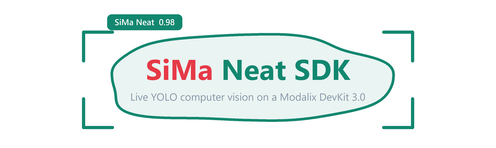

<div align="center">



[](https://sima.ai)
[](https://docs.sima.ai)
[](https://docs.sima.ai)

[](https://github.com/RizwanMunawar/sima-projects/actions/workflows/ci.yml)
[](https://pypi.org/project/sima-vision/)
[](https://www.python.org/)
[](LICENSE)
[](https://github.com/ultralytics/ultralytics)

[](https://github.com/ultralytics/ultralytics)
[](https://github.com/ultralytics/ultralytics)
[](https://github.com/ultralytics/ultralytics)

</div>

## Usage

```bash
# 1. Install the SiMa.ai Neat Core
sima-cli login
sima-cli neat install core@v0.3.0

# 2. Install the sima-vision Python package
pip install sima-vision

# 3. Download the YOLO26 detection model
mkdir -p assets/models
sima-cli download \
  https://docs.sima.ai/pkg_downloads/SDK2.1.2/models/modalix/yolo26-detection/yolo26m-det-bf16-mla_tess-b1.tar.gz \
  -o assets/models/yolo26m-det-bf16-mla_tess-b1.tar.gz

# 4. Run YOLO26 object detection on the DevKit
sima-vision detect

# 5. Pull inference results back to the host for visualization/verification
#
# macOS / Linux:
# export SIMA_VISION_DEVKIT=sima@<DEVKIT_IP>
#
# PowerShell:
# $env:SIMA_VISION_DEVKIT = "sima@<DEVKIT_IP>"
#
sima-vision pull
```

Steps 1 and 3 are one-time. After them the run is the only command: there is no setup
step, no init and no doctor, because `sima-vision detect` finds the Neat runtime itself,
puts the board's numpy and OpenCV on the path, fetches anything still missing, and says
what it is doing at every stage.

> **Inference runs on the board; you drive it from your PC.** `sima-vision watch -- detect`
> starts the task on the DevKit and streams the real annotated video back to your screen.

## Additional commands

The other two apps, run exactly like `detect` and sharing its clip and settings:

```bash
# Instance segmentation, with an optional background blur
sima-vision segment
sima-vision segment --blur --keep-classes person

# Fall detection, with SMTP alerts. Nothing is emailed until you pass --send
sima-vision fall
sima-vision fall --alert-to ops@example.com
```

Your own footage or your own model, as a path or an `https` URL. Video must be raw
H.264; [Quickstart](#on-the-devkit) has the one-line `ffmpeg` conversion:

```bash
sima-vision detect --source my-clip.h264 --model my-model.tar.gz
sima-vision detect --source https://example.com/my-clip.h264
```

Driving the board from your PC, once `$SIMA_VISION_DEVKIT` is set as in step 5:

```bash
sima-vision watch  -- detect                # run it there, live video on your screen
sima-vision remote -- detect --frames 200   # run it there, output in this terminal
sima-vision push my-clip.h264               # host -> DevKit
sima-vision pull --into results/            # DevKit -> host
```

On a laptop, with no board and no network:

```bash
sima-vision detect --validate               # resolve and check the settings, then stop
```

The flags worth knowing before you read [Settings](#settings):

| Flag | What it does |
|:--|:--|
| `--frames 200` | Stop after N frames. The quickest way to try something |
| `--conf 0.5` | Raise the confidence floor. Default `0.30` |
| `--no-video` / `--no-save` | Skip the recording or the stills. Together they are the cheapest possible run, which is how you tell a slow app apart from a stalled graph |
| `--quiet` | Warnings, errors and the closing report only |
| `--profile` | Per-stage timings, when a run is slower than it should be |
| `--help` | Every flag a command takes |

## Contents

| | |
|:--|:--|
| [Install](#install) | One command, and what the first run does for you |
| [Quickstart](#quickstart) | Start to finish, host then DevKit |
| [What the first run does](#what-the-first-run-does) | The seven steps, and how to read them |
| [Give the board internet](#the-board-needs-your-pcs-internet) | Sharing your PC's connection over the cable |
| [The three tasks](#the-three-tasks) | What each does, and its own flags |
| [Commands](#commands) | Every subcommand in one table |
| [Settings](#settings) | Flags, Python keywords, `config.yaml` |
| [Python API](#python-api) | The same three verbs, importable |
| [Driving the board from your PC](#driving-the-board-from-your-pc) | `watch`, `push`, `pull`, `remote` |
| [Adding your own app](#adding-your-own-app) | A fourth task, from your own package |
| [Troubleshooting](#troubleshooting) | Symptom to fix, in one table |
| [How it works](#how-it-works) | The pipeline, and why it is shaped that way |

## Install

Python 3.10 or later. The only dependency is PyYAML, on every platform.

```bash
pip install sima-vision
```

That is the whole install, on the board and on your laptop. Nothing else is needed and
nothing else is asked of you: the pieces that cannot come from PyPI are found, and where
possible installed, by the first run. See
[What the first run does](#what-the-first-run-does).

| Where | What you get |
|:--|:--|
| **On the DevKit** | Everything. Inference on the MLA, recording, stills, alerts |
| **Your laptop** | Everything except inference. Check settings, and drive the board |
| **Contributing** | `pip install -e ".[dev]"` adds ruff, pytest, numpy and OpenCV |

> [!NOTE]
> **It does not matter which Python you pip-installed into.** On the DevKit, `pyneat`
> lives in a virtualenv of its own that `sima-cli sdk setup` created, and pip installs
> into whichever Python you ran pip with. Those are almost never the same place, and
> reconciling them is the run's job, not yours.

> [!CAUTION]
> **`sima-vision` depends on neither numpy nor OpenCV, on purpose.** `pyneat` and every
> `simaai-*` package need `numpy<2`, so a dependency that could pull numpy 2.x over the
> board's own copy would break the board by being installed. Anything the run does
> install for you is pinned below 2 for the same reason.

## Quickstart

### On the DevKit

```bash
pip install sima-vision
sima-vision detect
```

No arguments. Each task has a default sample clip and model archive, and the first run
puts both in `./assets/`: the clip comes straight from a public GitHub release, the model
through `sima-cli`, which holds your login. Every run after that reuses them.

Out comes `detections.mp4` and a `frames/` directory. Bring them back with
[`sima-vision pull`](#driving-the-board-from-your-pc).

Your own clip or model, as a path or an `https` URL:

```bash
sima-vision detect --source my-clip.h264 --model my-model.tar.gz
sima-vision detect --source https://example.com/my-clip.h264
```

A URL is downloaded into `assets/` once and reused. There is **one** `assets/` for all
three tasks, not one per task: they share the clips, and `detect` and `fall` share the
model archive outright.

> [!IMPORTANT]
> **Video must be raw H.264, not `.mp4`.** The board decodes H.264 in hardware, and
> containers hit a [demuxer bug](#known-issues) in Neat 0.3.0. Convert once, losslessly:
>
> ```bash
> ffmpeg -i clip.mp4 -c:v copy -bsf:v h264_mp4toannexb -f h264 clip.h264
> ```
>
> Renaming an `.mp4` does not work and is caught at startup, with that command in the
> error. Leave `source.fps`, `source.width` and `source.height` at `0`: the real geometry
> is read out of the stream's SPS.

> [!NOTE]
> **This starts from a board that already runs `pyneat`.** Pairing a new DevKit and
> installing the Palette SDK onto it is SiMa's own procedure and is documented at
> [docs.sima.ai](https://docs.sima.ai); it is not repeated here, and nothing on this page
> replaces it.

### Without a board

```bash
sima-vision segment --conf 0.5 --validate
```

`--validate` resolves everything, prints what it came to, and stops. It loads no runtime,
downloads nothing and touches no network, so it is the honest thing to run on a laptop.
Everything else off the board is [driving a real one](#driving-the-board-from-your-pc).

## What the first run does

Seven steps, printed as they happen. The first four get the machine ready; the last
three start the run. Every one of them says what it is about to do before it does it, so a
slow step is never a silent one.

```
sima-vision 0.1.0  detect

  [1/7] environment  checking this machine
        -> Modalix DevKit  aarch64  python 3.11.2
  [2/7] pyneat       locating the Neat runtime
        -> 0.3.0  using pyneat from /home/sima/pyneat
  [3/7] imaging      numpy and OpenCV
        -> numpy 1.26.4  opencv 4.9.0
  [4/7] assets       model archive and video source
        have  assets/videos/people-walking-outside-mall.h264  (13.0 MB)
        get   https://docs.sima.ai/pkg_downloads/SDK2.1.2/models/modalix/...
        got   assets/models/yolo26m-det-bf16-mla_tess-b1.tar.gz  (118.4 MB)
        -> ready
  [5/7] source       probing the stream
        assets/videos/people-walking-outside-mall.h264  (video, 13.0 MB)
        -> 1920x1080 @ 24 fps
  [6/7] model        loading yolo26m-det-bf16-mla_tess-b1.tar.gz
        the first load unpacks the archive, which can take a minute
        -> yolo26 -> YoloV26, 80 classes (41.2s)
  [7/7] pipeline     building the Neat graph
        flow: preset=reliable overflow=block queue_depth=1 output_buffers=1
        video: detections.mp4 codec=mp4v fps=24 hud=True
        -> yolo_detector ready (3.1s)

running  press Ctrl-C to stop
```

| Step | What it is for | If it cannot |
|:--|:--|:--|
| environment | Board or not. It decides what every later failure means | Nothing to fail |
| pyneat | The library that talks to the MLA | It says which of the two cases you are in, below |
| imaging | numpy and OpenCV, which draw the overlay | Installs them, with numpy pinned below 2 |
| assets | The model pack and the clip, downloaded once into `./assets` | Says whether to log in, or to send the pack over with `push` |
| source | Proves the stream is readable and reads its real geometry | Names the file and how to convert it |
| model | Unpacks the archive onto the MLA. Slow the first time only | Names the archive and the decode head |
| pipeline | The Neat graph, the recorder, the stills, Insight | Releases the MLA rather than leaving it held |

`--quiet` drops all of it and keeps warnings, errors and the closing report.

### When step 2 cannot finish

`pyneat` is an aarch64 wheel that ships with the Palette SDK. It is not on PyPI, so pip
cannot fetch it, and this is the one thing a run cannot always fix by itself. It tries, in
this order:

1. **Import it.** An interpreter that already has it is never second-guessed.
2. **Find its virtualenv** at `~/pyneat`, `/media/nvme/neat/pyneat`, `/media/nvme/pyneat`
   or `/opt/pyneat`, then one level down from `~`, `/opt`, `/media/nvme`,
   `/media/nvme/neat`, `/usr/local`, `/srv` and `/data`. What it finds goes on `sys.path`
   ahead of everything, which also picks up the `numpy<2` the extension was compiled
   against.
3. **Install the SDK's own wheel**, if `sima-cli sdk setup` left one on the board.

Only if all three come up empty does it stop, and it stops by telling you which case
you are in. **On the board:**

```
  ERROR  pyneat is missing: no pyneat for python3.11 anywhere under ~, /opt, /media/nvme, ...
         It comes with the Neat core, which is not on PyPI. Install it here, on the board:
           sima-cli login
           sima-cli neat install core@v0.3.0
         Then run this command again. If pyneat is installed but somewhere unusual:
           export SIMA_VISION_PYNEAT=/path/to/the/venv
         If `sima-cli` is not on the board either, pairing never finished: run
         `sima-cli sdk setup --devkit <this board's ip>` from the PC that pairs with it.
```

The path `SIMA_VISION_PYNEAT` wants is the virtualenv root, the directory holding `lib/`
and `bin/`, not the `pyneat` folder inside it.

**A board paired with an older SDK** has `pyneat`, just not one this can drive. That is
caught while probing the source, before the model load, and says the same thing:

```
  ERROR  this Neat Library build cannot read a raw H.264 file.
           installed: pyneat 0.2.2
           wanted:    pyneat 0.3.0
           missing:   pyneat.SimaDecodeOptions, pyneat.SimaDecodeType
         Install the core this is written against, here on the board:
           sima-cli login
           sima-cli neat install core@v0.3.0
```

**On your laptop**, missing `pyneat` is simply what a laptop is. Nothing is wrong, and the
message says so instead of pretending something can be installed:

```
  ERROR  pyneat is missing, and this is not a DevKit.
         It is an aarch64 wheel from the Palette SDK, so inference only runs on the board.
         From here you can still drive one:
           sima-vision watch -- detect        run it there, live video here
           sima-vision detect --validate      check a config, no hardware at all
```

> [!NOTE]
> The version has to match. `pyneat` is compiled for one CPython, so a venv built for 3.10
> cannot be used from 3.12. When that is the mismatch the error names the interpreter that
> *can* use it, rather than just saying no.

### The board needs your PC's internet

Step 4 downloads the model pack, and the board has no internet of its own: it is cabled
straight to your PC, so the PC has to pass its connection along. Without that, `sima-cli
login` hangs and the model download fails.

**On Windows**, that is Internet Connection Sharing. Open Network Connections
(`ncpa.cpl`), right-click the adapter that *has* the internet, Properties, Sharing, and
tick **Allow other network users to connect through this computer's Internet
connection**, choosing the adapter the board is cabled to. Windows gives that adapter
`192.168.137.1`, which is not configurable.

**On Linux**, with `wlan0` as the internet and `eth0` going to the board:

```bash
sudo sysctl -w net.ipv4.ip_forward=1
sudo iptables -t nat -A POSTROUTING -o wlan0 -j MASQUERADE
sudo iptables -A FORWARD -i eth0 -o wlan0 -j ACCEPT
```

You also need something to hand the board an address; `dnsmasq` on `eth0` is the usual
choice. On macOS it is System Settings, General, Sharing, Internet Sharing.

**Then, on the board**, ask for an address and check the whole path:

```bash
sudo dhclient -v eth0
ping -c1 192.168.137.1      # the PC answers
ping -c1 1.1.1.1            # the internet answers
ping -c1 docs.sima.ai       # names resolve
```

The **first** of those three that fails says what is wrong: no answer from the PC is the
cable or the wrong adapter shared; no answer from the internet is sharing not forwarding;
no name resolution is DNS alone, fixed by putting `nameserver 192.168.137.1` in
`/etc/resolv.conf` on the board.

> [!TIP]
> **It stops working after every reboot?** That is Windows, not you: ICS does not come
> back on its own, and re-ticking the box does not change that. Two settings do. In an
> Administrator PowerShell, once:
>
> ```powershell
> New-ItemProperty -Path 'HKLM:\SYSTEM\CurrentControlSet\Services\SharedAccess\Parameters' `
>   -Name EnableRebootPersistConnection -Value 1 -PropertyType DWord -Force
> Set-Service SharedAccess -StartupType Automatic
> ```

> [!NOTE]
> **No internet for the board at all?** Download the pack on your PC and send it over:
> `sima-vision push yolo26m-det-bf16-mla_tess-b1.tar.gz`, then
> `sima-vision detect --model yolo26m-det-bf16-mla_tess-b1.tar.gz`.

## The three tasks

| Task | What it does | Model | Output |
|:--|:--|:--|:--|
| **`detect`** | Boxes, class names and confidence on every frame | YOLO26 detect | `detections.mp4` |
| **`segment`** | Per-pixel masks, and a background blur that keeps the subject sharp | YOLO26 segment | `segmentation.mp4` |
| **`fall`** | Tracks people and emails when one of them goes down | YOLO26 detect | `falls.mp4`, `alerts/` |

All three share one pipeline: the same source handling, Neat graph, sample decoding,
drawing and sinks. A task supplies only what is genuinely its own.

<details>
<summary><b>detect</b> &nbsp;&middot;&nbsp; boxes, labels and confidence</summary>

The simplest thing that proves the whole chain works. No task-specific flags: everything
it understands is in [Settings](#settings).

```bash
sima-vision detect
sima-vision detect --conf 0.5 --frames 200
sima-vision detect --source rtsp://cam/live --source-type rtsp
```

| Problem | Fix |
|:--|:--|
| No detections at all | Check `model.family` is `yolo26`, then lower `--conf` |
| Scores all near zero | `model.family` does not match the archive, so a raw-logit head is being decoded wrong |

</details>

<details>
<summary><b>segment</b> &nbsp;&middot;&nbsp; masks, and a background blur</summary>

Needs a `-seg` model pack. A plain detect head carries no mask data, and the run says so
rather than guessing.

```bash
sima-vision segment                                        # masks and the default blur
sima-vision segment --blur-strength 81                     # a stronger blur
sima-vision segment --blur-method pixelate                 # pixelate instead
sima-vision segment --keep-classes person                  # only people stay sharp
sima-vision segment --anonymise --keep-classes person      # the other way round
sima-vision segment --no-blur                              # masks, no background effect
```

| Flag | What it does |
|:--|:--|
| `--blur` / `--no-blur` | Whether the background is treated at all |
| `--blur-method` | `gaussian`, `pixelate` or `none` |
| `--blur-strength PX` | Gaussian kernel width for a 1080p frame. Default 41 |
| `--keep-classes` | Class names or ids that stay sharp. Default: everything detected |
| `--anonymise` | Blur the instances instead of the background |
| `--mask-threshold T` | Mask cut-off as a probability. Default 0.5; lower grows instances |
| `--no-masks` | Blur around plain boxes. Works with a detect head |
| `--minimal` | Pull frames and do nothing else. See below |

`--minimal` is the diagnostic. If a run that stalls part-way through a clip completes
with `--minimal`, the cause is how much work the app does per frame. If it stalls at the
same frame, the cause is the graph.

| Problem | Fix |
|:--|:--|
| `model.family ... is a detect head` | Point `--model` at a `-seg` pack, or pass `--no-masks` |
| Whole frame blurred | Nothing was detected. Lower `--conf` |
| Mask edges jagged | Raise `blur.feather`, then `segmentation.blur_mask` |
| Masks in the wrong place | Pin `segmentation.space` to `net` or `box` instead of `source` |
| Too slow at 1080p | `blur.downscale: 4` is the biggest win, then `--save-every 30` |

</details>

<details>
<summary><b>fall</b> &nbsp;&middot;&nbsp; tracking, a fall state machine, SMTP alerts</summary>

Tracks people across frames and watches three signals from the plain bounding box: the
box turning wide-and-short, its height collapsing, and how fast its centre is dropping. A
fall has to hold for `--confirm` seconds before an alert fires, which is what keeps
someone crouching from setting it off.

```bash
sima-vision fall                                       # track and judge, no email
sima-vision fall --no-fall                             # track only, to tune tracking first
sima-vision fall --confirm 0.8                         # confirm faster
sima-vision fall --alert-to ops@example.com --send     # actually email
sima-vision fall --test-alert                          # one fake alert now, needs no board
```

| Flag | What it does |
|:--|:--|
| `--classes` | Class names or ids that can fall. Default `person` |
| `--confirm S` | How long a fall signal must hold. Default 1.5 |
| `--no-fall` | Track without judging |
| `--alert-to EMAIL` | Recipients. Implies `--alerts` |
| `--alert-from EMAIL` | From address |
| `--alerts` | Enable alerts, still a dry run |
| `--send` | Actually connect to the SMTP server |
| `--smtp-host` / `--smtp-port` / `--smtp-user` | Server, 587 for STARTTLS or 465 for SSL, and the login |
| `--site NAME` | Human name for this camera, used in the subject |
| `--test-alert` | Send one fake alert and exit |

> [!WARNING]
> Alerts stay a **dry run** until `--send`. The SMTP password is only ever read from
> `$FALL_ALERT_SMTP_PASSWORD`, never from a config file, because config files get
> committed.

```bash
export FALL_ALERT_SMTP_PASSWORD='your-app-password'    # macOS, Linux, the DevKit
```

```powershell
$env:FALL_ALERT_SMTP_PASSWORD = "your-app-password"    # PowerShell
```

Gmail needs an [app password](https://support.google.com/accounts/answer/185833), not
your account password. `--test-alert` proves the whole path synchronously and needs no
board.

| Problem | Fix |
|:--|:--|
| `falls=0` on footage that has one | Lower `--confirm` and `fall.aspect_ratio`; first check the person is tracked at all with `--no-fall` |
| Alerts fire constantly | Raise `--confirm` first, then `alerts.cooldown_seconds` |
| Track ids change every few frames | Lower `tracking.iou_threshold`, raise `tracking.max_age` |
| Gmail rejects the login | App password, not the account password. `--test-alert` prints the SMTP error verbatim |

</details>

## Commands

| Command | Board? | What it does |
|:--|:--:|:--|
| `sima-vision detect` | **yes** | Run detection on the MLA |
| `sima-vision segment` | **yes** | Run segmentation, with the optional blur |
| `sima-vision fall` | **yes** | Run fall detection, with SMTP alerts |
| `sima-vision watch` | no | Run a task on the DevKit and watch its live video here |
| `sima-vision push` | no | Copy files to the DevKit |
| `sima-vision pull` | no | Copy results back |
| `sima-vision remote` | no | Run a task on the DevKit over SSH |

That is the whole surface. Anything that was once its own setup subcommand now happens
inside a run; see [What the first run does](#what-the-first-run-does).

Add `--validate` to any task to parse and check a config, print what it resolved to, and
exit. It loads neither pyneat nor the model, so it runs anywhere:

```bash
sima-vision segment --conf 0.5 --blur-strength 81 --validate
```

```
sima-vision 0.1.0  segment --validate

  ok  config OK: /home/sima/config.yaml
    model:   assets/models/yolo26m-seg-bf16-mla_tess-b1.tar.gz
    labels:  /home/sima/pyneat/lib/python3.11/site-packages/sima_vision/data/coco_labels.txt
    family:  yolo26-seg -> BoxDecodeType.YoloV26Seg
    source:  type=video uri=assets/videos/people-walking-outside-mall.h264
    decode:  conf=0.5 iou=0.6 max_det=50
    preprocess: kind=image enable=on in=NV12 out=AUTO capacity=0x0 | resize=letterbox ...
    segmentation: masks=on source=auto space=auto threshold=0.5 net=<from the first mask>
    blur: background | method=gaussian kernel=81 sigma=auto down=2 feather=9 | foreground=every detected class
    output:  video=segmentation.mp4 stills=frames/ every=10

    nothing was downloaded and no hardware was touched.
```

`sima-vision <command> --help` lists every flag.

## Settings

Three layers, each beating the one above it:

```
built-in defaults   ->   config.yaml   ->   flags / Python keywords
```

So **everything is optional**. With no file and no flags you get this task's sample clip
and model. For a setup you keep, write a `config.yaml` next to where you run:

```yaml
model:
  path: assets/models/yolo26m-det-bf16-mla_tess-b1.tar.gz
  family: yolo26
source:
  uri: assets/videos/people-walking-outside-mall.h264
decode:
  score_threshold: 0.4
```

`sima-vision detect` picks that up on its own, and a flag still beats it. Every key is
listed in the tables below, and `tests/configs/` in this repo has one fully commented
file per task if you would rather start from a complete one.

Every setting has a flag and a Python keyword under the same name. Both write the same
config key, and both go through the same validation.

### What people actually change

| I want | Flag | Python | Config key |
|:--|:--|:--|:--|
| Fewer spurious boxes | `--conf 0.5` | `conf=0.5` | `decode.score_threshold` |
| To catch more, noisily | `--conf 0.15` | `conf=0.15` | `decode.score_threshold` |
| A short test run | `--frames 100` | `frames=100` | `runtime.frames` |
| No video file | `--no-video` | `video=False` | `output.video.enable` |
| No stills | `--no-save` | `save=False` | `output.save.enable` |
| Fewer stills | `--save-every 30` | `save_every=30` | `output.save.every` |
| To see where the time goes | `--profile` | `profile=True` | `runtime.profile` |
| A live Insight view | `--insight` | `insight=True` | `output.insight.enable` |
| A stronger blur | `--blur-strength 81` | `blur_strength=81` | `blur.kernel` |
| A pixelated background | `--blur-method pixelate` | `blur_method="pixelate"` | `blur.method` |
| Only people kept sharp | `--keep-classes person` | `keep_classes=["person"]` | `blur.keep_classes` |
| People blurred, scene sharp | `--anonymise` | `anonymise=True` | `blur.invert` |
| Masks, but no blur | `--no-blur` | `blur=False` | `blur.enable` |
| To track something else | `--classes forklift` | `classes=["forklift"]` | `tracking.classes` |
| Falls confirmed faster | `--confirm 0.8` | `confirm=0.8` | `fall.confirm_seconds` |
| An email on a fall | `--alert-to me@x.com --send` | `alert_to=[...], send=True` | `alerts.*` |

### Shared flags

| Flag | Config key | What it does |
|:--|:--|:--|
| `--source`, `-s` | `source.uri` | File, `https` URL, RTSP URL, or nothing for the sample clip |
| `--source-type` | `source.type` | `video`, `rtsp` or `usb` |
| `--fps` / `--width` / `--height` | `source.*` | Leave at 0. Read from the stream |
| `--model`, `-m` | `model.path` | Compiled model archive, or an `https` URL to one |
| `--labels` | `model.labels` | Class names. Defaults to the packaged COCO list |
| `--family` | `model.family` | Detection head. Must match the model |
| `--conf` / `--iou` / `--max-det` | `decode.*` | Confidence, NMS IoU, top-K |
| `--frames`, `-n` | `runtime.frames` | Stop after N frames |
| `--timeout` / `--queue-depth` | `runtime.*` | Pull timeout, and how far ahead of the sinks to run |
| `--profile` | `runtime.profile` | Per-stage timings |
| `--video-path` / `--no-video` | `output.video.*` | The annotated recording |
| `--save-dir` / `--save-every` / `--no-save` | `output.save.*` | Annotated stills |
| `--no-hud` | `output.video.hud` | Leave the frame-rate badge off |
| `--insight` / `--insight-host` | `output.insight.*` | The live Neat Insight feed |
| `--config`, `-c` / `--no-config` | | Which config file, or none |
| `--validate` | | Check and print, then exit |

### Cameras and streams

```bash
sima-vision detect --source-type usb                            # the DevKit camera
sima-vision detect --source rtsp://cam/live --source-type rtsp
```

For a live source, raise `--queue-depth` and leave `runtime.overflow_policy` on `auto`.
For a file, `auto` resolves to `block`, which keeps every frame so the recording matches
the input length.

### Environment

| Variable | What it does |
|:--|:--|
| `SIMA_VISION_ASSETS` | Where clips and models are downloaded. Default `./assets` |
| `SIMA_VISION_PYNEAT` | The `pyneat` virtualenv, when the search does not find it |
| `SIMA_VISION_PYNEAT_INDEX` | A pip index carrying a `pyneat` wheel, if your site publishes one |
| `SIMA_VISION_AUTO_INSTALL` | `0` to look but never install. The search and the path still happen |
| `SIMA_VISION_DEVKIT` | The board, as `user@address`, so `push`, `pull` and `remote` stop asking |
| `SIMA_VISION_QUIET` | Non-empty is `--quiet` for every command |
| `SIMA_VISION_COLOR` | `0` or `1` to force colour off or on. `NO_COLOR` also works |
| `FALL_ALERT_SMTP_PASSWORD` | The only place the SMTP password is ever read from |

## Python API

```python
from sima_vision import run, validate

# No board: resolve and check a config, then look at what it became.
cfg = validate("detect", conf=0.5, max_det=20)
print(cfg.score_threshold, cfg.video_path)

# On the DevKit: run it. Every argument is optional, exactly like the CLI.
run("detect")
run("detect", source="clip.h264", model="det.tar.gz", conf=0.5, frames=200)
```

Every keyword is derived from the CLI's own flags, so `--blur-strength 81` and
`blur_strength=81` cannot drift apart. Anything the keywords do not cover is still
reachable by its config path:

```python
run("segment", **{"runtime.output_buffers": 2})
```

## Driving the board from your PC

Four wrappers around `ssh` and `scp`, so the awkward parts stop being yours.

```bash
sima-vision watch  -- detect                # run it there, live video here
sima-vision push my-clip.h264               # PC -> board
sima-vision remote -- detect --frames 200   # run it there, output in the terminal
sima-vision pull                            # board -> PC
```

### Live video while it runs

```bash
sima-vision watch -- detect
```

The board is already able to stream what it draws: real annotated frames, the same
overlay that goes into the recording, H.264 over RTP. It is off by default only because
it points at the board's own localhost, where nothing is listening. `watch` aims it at
this machine and starts the run.

It prints the exact player command and writes the SDP file it needs:

```
sima-vision 0.1.0  watch detect on sima@192.168.137.50

  live video: sima@192.168.137.50 -> 192.168.137.1:9000   (as the board sees us)
              metadata on 9100, same address
  wrote /home/you/sima-vision.sdp

  Open this in a second terminal, then come back:

    ffplay -hide_banner -fflags nobuffer -flags low_delay -protocol_whitelist file,rtp,udp -i "/home/you/sima-vision.sdp"

  $ ssh -tt sima@192.168.137.50 sima-vision detect --insight --insight-host 192.168.137.1
```

Nothing is decoded by `sima-vision` itself. `ffplay`, GStreamer and VLC already do that
properly, and whichever of them you have is the one it names. Install one with
`winget install Gyan.FFmpeg`, `brew install ffmpeg` or `sudo apt install ffmpeg`.

> [!NOTE]
> **Which address the board sends to is asked, not guessed.** A laptop cabled to a DevKit
> has at least two addresses, and only one of them is on the board's network. `watch`
> reads `$SSH_CONNECTION` over the SSH connection it is already making, so the answer
> comes from the board itself. Guessing from the local routing table looks right and
> quietly picks the Wi-Fi address whenever the board is not answering ARP, which produces
> a run that streams into nowhere. Override with `--to` if you need to.

Say the address once:

```bash
export SIMA_VISION_DEVKIT=sima@192.168.137.50     # macOS, Linux
```

```powershell
$env:SIMA_VISION_DEVKIT = "sima@192.168.137.50"   # PowerShell
```

or pass `--host` to any of the four. Authentication is `ssh`'s own business: an agent, a
key, or it asks you. Nothing here handles or stores a password.

| Command | Notes |
|:--|:--|
| `sima-vision push FILE...` | Folders are copied whole. `--dest` changes where they land, default `~/` |
| `sima-vision pull` | With no names, takes whatever a run of any task left: the video, `frames/`, `alerts/`, `config.yaml`. `--into` chooses where they land here |
| `sima-vision pull detections.mp4` | Or name exactly what you want |
| `sima-vision remote -- ARGS` | Everything after `--` runs as `sima-vision ARGS` on the board |

Three things these get right that a hand-written `scp` usually does not:

1. **On Windows, `scp D:\clips\a.h264 sima@ip:~` fails** with `could not resolve hostname
   d:`, because `scp` reads everything before the first colon as a host. `push` never
   passes a full local path: it groups files by folder and runs `scp` from inside each
   one. `pull` does the same at the other end.
2. **`ssh host cmd` without a pty means Ctrl-C never reaches the task.** It keeps running,
   keeps the MLA, and your next launch fails with a busy device. `remote` always passes
   `-tt`.
3. **`pull` with no arguments cannot be one `scp`**, because `scp` fails the whole
   transfer on a name that is not there and the outputs depend on which task ran. So the
   names are listed over `ssh` first and only what exists is fetched.

They need an OpenSSH client, which macOS and Linux ship and Windows 10/11 has under
Settings > Apps > Optional features > OpenSSH Client.

## Adding your own app

The three built-in tasks are not special. A task is one class saying what to do with a
frame once the MLA has finished with it; config loading, the automatic setup, asset
downloads, the Neat graph, the pull loop and every sink are shared and already written.

Write the class:

```python
from sima_vision.tasks import Task
from sima_vision.runloop import TaskRuntime

class CountRuntime(TaskRuntime):
    output_label = "detector_output"
    stream = "counting"
    unit = "crossings"

    def decode(self, pipeline, cfg, sample, index):
        ...

    def render(self, cfg, pipeline, frame, results, fps):
        ...

class CountTask(Task):
    name = "count"
    help = "Count objects crossing a line"

    def add_arguments(self, parser):
        parser.add_argument("--line", dest="count.line", metavar="Y")

    def runtime(self, cfg, pipeline):
        return CountRuntime()
```

Advertise it from your own package's `pyproject.toml`:

```toml
[project.entry-points."sima_vision.tasks"]
count = "my_package.count:CountTask"
```

`pip install` it beside `sima-vision` and `sima-vision count` exists, with every shared
flag, the same seven-step startup and the same `--validate`. Nothing in this repository
is edited, and a plugin that fails to import is reported and skipped rather than taking
the whole command down with it.

## Troubleshooting

<details>
<summary><b>Symptom to fix, for a running task.</b></summary>

| Symptom | Fix |
|:--|:--|
| `ModuleNotFoundError: pyneat` **on the board** | The search covers the usual places and one level down from `~`, `/opt`, `/media/nvme`, `/media/nvme/neat`, `/usr/local`, `/srv` and `/data`. Somewhere else: `export SIMA_VISION_PYNEAT=/the/venv` |
| `ModuleNotFoundError: pyneat` **on your PC** | Expected. Inference only happens on the board; use `sima-vision remote -- detect` to drive it from here |
| `pyneat` missing after pairing | Pairing installs it over the network, so no route means a silent no-op. Fix the connection, then re-run `sima-cli sdk setup --devkit <ip>` from your PC |
| `pyneat requires numpy<2` | `~/pyneat/bin/pip install "numpy>=1.24,<2" "opencv-python>=4.7,<5"` |
| `model archive not found` | `sima-cli login`, then run again. It fetches the pack itself |
| `sima-cli download did not produce ...` | Not logged in. `sima-cli login`, or pass `--model` with a path or URL |
| `source file not found` | The error lists what is actually in the folder. Paths are relative to where you launch |
| `is not a raw H.264 elementary stream` | You renamed an `.mp4` instead of converting it. The error carries the ffmpeg command |
| `No src-element named "nN_demux"` | The `.mp4` demuxer bug. Convert to `.h264` |
| Device busy | An orphaned run still holds the MLA: `ssh sima@<devkit-ip> pkill -f sima-vision` |
| Stuck on step 6, `model` | The first load unpacks the archive. Give it a minute. It is timed, so the second run tells you what to expect |
| First run is slow at step 4, `assets` | That is the 13 MB clip and the 118 MB model pack downloading. It only happens once |
| `processed=0` and a 20 second timeout | The source caps are not negotiating. Leave `--fps`, `--width` and `--height` at 0 |
| Output video shorter than the input, plays fast | Frames are being dropped. Set `runtime.overflow_policy: auto` |
| Recording only a few frames long | Usually `output.insight`. Its encoder shares the codec daemon with the decoder |
| `timed out waiting for instances` after a few frames | The graph starved the decoder's buffer pool. Lower `runtime.output_buffers`, and use `--minimal` to tell "too slow" from "wrong graph" |
| Dropped frames on a live source | Raise `--queue-depth`, keep `overflow_policy: auto` |
| `has unknown class` | A typo. The error suggests near matches from the labels file |

### Known issues

**`groups.video_input` cannot play `.mp4`, Neat 0.3.0.**

```
gst_parse_launch failed: No src-element named "n1_demux" - omitting link
```

`VideoTrackSelect` builds its fragment from one variable, so what it emits is correct. The
graph then appends an instance suffix, but the renamer only rewrites `name=<x>`
declarations, so the pad reference is never fixed. Any non-empty suffix breaks it, and
reordering does not help.

The fix is no container, so no demuxer. `sima-vision` detects `.h264`, `.264`, `.avc` and
`.bin` and builds the chain by hand:

```
FileInput -> H264Parse -> Queue -> SimaDecode -> CapsRaw
```

A container input still goes through `groups.video_input` and prints the conversion
command.

</details>

## How it works

<details>
<summary><b>The pipeline, and why it is shaped that way.</b></summary>

The pipeline is a Neat `Graph`, not a single `Model.run`, because it has several stages,
named public endpoints and a branch with a fan-in:

```
source --> branch --> frame ---------------+
              |                            +--> combine("<task>_output")
              +----> model --> results ----+

<task>_output --> parse --> overlay --> video file + stills
                        |-> MetadataSender  (JSON over UDP)
                        +-> VideoSender     (H.264 RTP over UDP)
```

Frames come off the hardware decoder, whose buffer pool is small: the boot log prints
`BufferNum=8`. Everything expensive therefore happens on a sink thread, so the pull loop
hands each buffer back immediately. Holding one across a `pull()` is what deadlocks the
decoder part-way through a clip, and it looks exactly like the app being slow.

Boxes arrive as one UInt8 tensor tagged `BBOX`, packed as a `uint32` count followed by
24-byte records of `x, y, w, h, score, class_id` in source-image pixels. A segment head
packs its masks into the tail of that same buffer.

```
sima_vision/
  cli.py        the command line          api.py       the Python API
  bootstrap.py  the automatic setup       console.py   the steps you read
  config.py     loading and validation    runtime.py   the deferred imports
  assets.py     clips and model archives  devkit.py    push, pull, watch, remote
  media.py      H.264 and geometry        neat.py      graph assembly
  samples.py    decoding a sample         masks.py     masks and compositing
  draw.py       the overlay               sinks.py     video, stills, live feed
  runloop.py    the pull loop             tasks/       one file per app, plus base.py
```

Three modules reach the network and no others: `assets.py` downloads the clip and the
model pack, `bootstrap.py` shells out to `pip` on the one path where it installs
something, and `devkit.py` runs `ssh` and `scp`. The first two are reached only from a
run. `--validate` resolves the same paths, imports nothing and fetches nothing, which is
what makes it safe to run anywhere.

</details>

## Contributing

```bash
git clone https://github.com/RizwanMunawar/sima-projects.git
cd sima-projects
pip install -e ".[dev]"

ruff check sima_vision tests
pytest -q
```

The tests need no board. Mask decoding, compositing, the overlay, the tracker and the fall
rules are plain numpy and OpenCV, so they run anywhere, and the `ssh` and `scp` wrappers
are tested against a fake subprocess. CI covers Python 3.10 to 3.13 on Linux, macOS and
Windows, builds the wheel and installs it clean.

## License

The models used here for testing are **Ultralytics YOLO26**, under **AGPL-3.0**. All other
parts of this repository are under **Apache-2.0**. See [LICENSE](LICENSE).

## Credits

- [SiMa.ai](https://github.com/SiMa-ai) for Modalix, the Palette SDK and Neat
- [Ultralytics](https://github.com/ultralytics/ultralytics) for the YOLO26 models

<div align="center">

Built by **Muhammad Rizwan Munawar**. If this saved you an afternoon, **star the repo**
and pass it on to someone else bringing up a DevKit.

<a href="https://github.com/RizwanMunawar"></a>
&nbsp;&nbsp;
<a href="https://www.linkedin.com/in/muhammadrizwanmunawar/"></a>
&nbsp;&nbsp;
<a href="https://x.com/muhammdrizwanmr"></a>
&nbsp;&nbsp;
<a href="https://www.youtube.com/@muhammadrizwanmunawar"></a>
&nbsp;&nbsp;
<a href="https://muhammadrizwanmunawar.medium.com/"></a>

</div>
