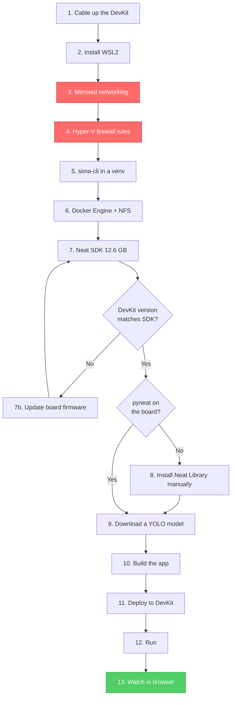
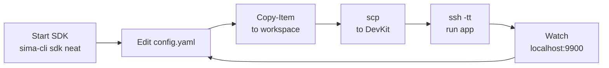

<div align="center">

# SiMa Neat SDK — Setup Guide

**Zero to live YOLO object detection on a Modalix DevKit**


</div>

---

## What you are building

```
        ┌─────────────────┐        ┌──────────────────────┐        ┌─────────────┐
        │  Windows 11 PC  │        │     WSL2 (Ubuntu)    │        │   Modalix   │
        │                 │        │                      │        │   DevKit    │
        │  • Browser      │◄──────►│  • sima-cli          │◄──────►│             │
        │  • VS Code      │  HTTPS │  • Docker Engine     │  UDP   │  • MLA      │
        │  • scp / ssh    │  :9900 │  • SDK container     │  :9000 │  • pyneat   │
        │                 │        │  • Neat Insight      │  :9100 │  • your app │
        └─────────────────┘        └──────────────────────┘        └─────────────┘
              viewer                    build + receive               inference
```

Your application runs on the DevKit. It decodes video, runs YOLO on the MLA
accelerator, and streams two things back: H.264 video and JSON detections. Neat
Insight recombines them and you watch the result in a browser.

```
  ┌────────────┐   ┌──────────────┐   ┌─────────────┐   ┌────────────────┐
  │   Source   │──►│  Preprocess  │──►│  YOLO / MLA │──►│   BoxDecode    │
  │ file/rtsp  │   │   letterbox  │   │  inference  │   │   NMS + boxes  │
  │  /camera   │   │  normalize   │   │             │   │                │
  └────────────┘   └──────────────┘   └─────────────┘   └───────┬────────┘
                                                                │
                              ┌─────────────────────────────────┼──────────────┐
                              ▼                                 ▼              ▼
                    ┌──────────────────┐            ┌────────────────┐  ┌────────────┐
                    │  VideoSender     │            │ MetadataSender │  │ JPEG files │
                    │  H.264 RTP :9000 │            │  JSON UDP :9100│  │  on disk   │
                    └──────────────────┘            └────────────────┘  └────────────┘
```

---

## Quick start

Already have WSL, Docker, and a paired DevKit? This is the whole loop.

```bash
# 1. Start the SDK
sudo su - && cd /mnt/d/work/sima-projects && source sima/bin/activate && sima-cli sdk neat

# 2. Ship the app to the board
cd /workspace && scp -r yolo-detector sima@192.168.137.123:~/

# 3. Run it
ssh -tt sima@192.168.137.123
source ~/pyneat/bin/activate && cd ~/yolo-detector && python3 src/main.py --config config.yaml
```

Then open **`https://localhost:9900`** and pick channel 0.

Starting from scratch? Work through the sections below in order.

---

## Setup flow



> Steps 3 and 4 are marked red because doing them late is the single most common way
> to lose an afternoon. Everything downstream depends on them.

---

## Contents

| # | Section | Runs on | Time |
|:--|:--|:--|:--|
| 0 | [The three machines](#0-the-three-machines) | read this first | 3 min |
| 1 | [Cable up the DevKit](#1-cable-up-the-devkit) | `PowerShell` | 15 min |
| 2 | [Install WSL2](#2-install-wsl2) | `PowerShell` (Admin) | 10 min |
| 3 | [Mirrored networking](#3-mirrored-networking) | `PowerShell` | 5 min |
| 4 | [Firewall rules](#4-firewall-rules) | `PowerShell` (Admin) | 2 min |
| 5 | [Install sima-cli](#5-install-sima-cli) | `WSL` | 5 min |
| 6 | [Docker Engine and NFS](#6-docker-engine-and-nfs) | `WSL` | 10 min |
| 7 | [Install the Neat SDK](#7-install-the-neat-sdk) | `WSL` | 30–60 min |
| 7b | [Update DevKit firmware](#7b-update-devkit-firmware) | `DevKit` | 15–40 min |
| 8 | [Neat Library on the board](#8-neat-library-on-the-board) | `DevKit` | 15 min |
| 9 | [Download a model](#9-download-a-model) | `SDK container` | 5 min |
| 10 | [Build the app](#10-build-the-app) | `SDK container` | 10 min |
| 11 | [Deploy](#11-deploy) | `PowerShell` + `container` | 5 min |
| 12 | [Run](#12-run) | `DevKit` | 2 min |
| 13 | [Watch](#13-watch) | browser | 2 min |

**Reference:** [Daily workflow](#daily-workflow) · [Troubleshooting](#troubleshooting) · [Cheat sheet](#cheat-sheet)

Sections 7b and 8 are recovery paths. Skip them unless a check tells you otherwise.

### Requirements

| Resource | Minimum | Why |
|:--|:--|:--|
|  | Windows 11 + WSL2, Ubuntu 22.04/24.04, or macOS 15.5+ | SDK container support |
|  | 4 cores | SDK build tooling |
|  | 16 GB | container plus model compiler |
|  | 100 GB free | 12.6 GB image plus models |
|  | [community.sima.ai](https://community.sima.ai) | downloading models and packages |

---

## 0. The three machines

Most problems come from typing a command into the wrong box. Check your prompt before
every block.

| Prompt | Machine | Paths look like |
|:--|:--|:--|
| `PS C:\Users\you>` | Windows PowerShell | `D:\work\sima-projects\...` |
| `root@neat-sdk-...:/workspace#` | SDK container | `/workspace/...` |
| `sima@modalix:~$` | DevKit | `~/yolo-detector/...` |

Every code block below is tagged with where it runs.

> **Windows paths only work in PowerShell.** Linux reads a colon as `hostname:path`, so
> pasting `D:\work\...` into the container produces this:
>
> ```
> ssh: Could not resolve hostname d: Temporary failure in name resolution
> ```

### The shared workspace

One folder, three names. This is how files move between machines.

```
  Windows                            WSL                    SDK container
  \\wsl$\Ubuntu\root\workspace  ═══  /root/workspace  ═══  /workspace
```

---

## 1. Cable up the DevKit

Physical setup first:

1. Connect the **USB cable** supplied by SiMa. This is the serial console.
2. Connect an **Ethernet cable** directly from your PC to the DevKit.
3. Open the [serial console tool](https://docs.sima.ai/_static/tools/serial/index.html)
   and set the DevKit network to **DHCP**.

Windows takes `192.168.137.1`, the DevKit gets `192.168.137.123`.

**`PowerShell`**

```powershell
ping 192.168.137.123
```

> ✅ **Exit criteria:** replies. Nothing later works without this.

---

## 2. Install WSL2

**`PowerShell (Administrator)`**

```powershell
wsl --install -d Ubuntu
```

Reboot if prompted. First launch asks for a username and password. Remember the
password, `sudo` needs it.

**`PowerShell`**

```powershell
wsl -l -v
wsl --version
```

> ✅ **Exit criteria:** `Ubuntu / Running / 2`, and WSL 2.0.0 or newer.

---

## 3. Mirrored networking


By default WSL sits on a private NAT network and cannot see your DevKit:

```
  BEFORE (default NAT)                      AFTER (mirrored)

  WSL   172.22.41.196  ✗                    WSL   192.168.137.1  ✓
         │                                          │
         │  no route                                │  same subnet
         ▼                                          ▼
  DevKit 192.168.137.123                    DevKit 192.168.137.123
```

In section 7, `sima-cli sdk setup --devkit` installs software onto the board **over the
network**. With no route the PC half succeeds, the board half silently does nothing,
and you find out much later when `source ~/pyneat/bin/activate` says "not found".

**`PowerShell`**

```powershell
@"
[wsl2]
networkingMode=mirrored
"@ | Set-Content -Path "$env:USERPROFILE\.wslconfig" -Encoding utf8

wsl --shutdown
Start-Sleep -Seconds 10
```

Open a WSL terminal to boot it, then verify:

**`PowerShell`**

```powershell
wsl -- hostname -I
wsl -- ping -c 2 192.168.137.123
```

> ✅ **Exit criteria:** first command lists `192.168.137.1`, second replies. Do not
> continue until both pass.

> 💡 Made the file in Notepad? Check it is not secretly `.wslconfig.txt`. Set
> **Save as type → All Files**.

---

## 4. Firewall rules


Mirrored mode puts WSL behind the Hyper-V firewall, which blocks all inbound traffic
by default. Your DevKit pushing video to WSL is inbound traffic.

```
  DevKit ──UDP 9000/9100──►  ╳ Hyper-V firewall ╳  ──►  Neat Insight
                              (blocks by default)         (never receives)
```

Symptom if you skip this: Insight loads in the browser and shows nothing, with no error
message anywhere.

**`PowerShell (Administrator)`**

```powershell
New-NetFirewallHyperVRule -Name "NeatInsightVideo" -DisplayName "Neat Insight video UDP" `
  -Direction Inbound -VMCreatorId '{40E0AC32-46A5-438A-A0B2-2B479E8F2E90}' `
  -Protocol UDP -LocalPorts 9000-9079 -Action Allow

New-NetFirewallHyperVRule -Name "NeatInsightMeta" -DisplayName "Neat Insight metadata UDP" `
  -Direction Inbound -VMCreatorId '{40E0AC32-46A5-438A-A0B2-2B479E8F2E90}' `
  -Protocol UDP -LocalPorts 9100-9179 -Action Allow

Get-NetFirewallHyperVRule | Where-Object DisplayName -match 'Neat'
```

> ✅ **Exit criteria:** both rules listed.

> 💡 These rules live in Windows, not in the distro, so they survive
> `wsl --unregister`. On a rebuild you can skip this section.

---

## 5. Install sima-cli


**`WSL`**

```bash
sudo su -
cd /mnt/d/work/sima-projects
apt update && apt install -y python3-venv python3-pip
python3 -m venv sima
source sima/bin/activate
pip install sima-cli
sima-cli --version
sima-cli login
```

> ✅ **Exit criteria:** prints `2.1.15` or newer, and login succeeds.

> ⚠️ **`cd` comes after `sudo su -`, never before.** The `-` makes it a login shell
> that drops you in `/root`. Reverse the order and your venv is silently created at
> `/root/sima` while everything afterwards points somewhere else.

<details>
<summary><b>Session reminder and upgrades</b></summary>

Every new session needs all three lines again:

```bash
sudo su -
cd /mnt/d/work/sima-projects
source sima/bin/activate
```

To upgrade later:

```bash
pip install --upgrade sima-cli   # or: sima-cli selfupdate
```

Reference: <https://docs.sima.ai/tools/sima-cli/>

</details>

---

## 6. Docker Engine and NFS

The Neat SDK **is** a Docker container. The SDK also shares your workspace with the
DevKit over NFS, so both package sets are needed.

> 💡 Docker Desktop is not required. Docker Engine natively inside WSL is lighter and
> avoids the Desktop integration layer.

### 6a. Install packages

**`WSL`**

```bash
sudo apt update
sudo apt install -y ca-certificates curl
sudo install -m 0755 -d /etc/apt/keyrings
sudo curl -fsSL https://download.docker.com/linux/ubuntu/gpg -o /etc/apt/keyrings/docker.asc
sudo chmod a+r /etc/apt/keyrings/docker.asc

sudo tee /etc/apt/sources.list.d/docker.sources <<EOF
Types: deb
URIs: https://download.docker.com/linux/ubuntu
Suites: $(. /etc/os-release && echo "${UBUNTU_CODENAME:-$VERSION_CODENAME}")
Components: stable
Architectures: $(dpkg --print-architecture)
Signed-By: /etc/apt/keyrings/docker.asc
EOF

sudo apt update
sudo apt install -y docker-ce docker-ce-cli containerd.io docker-buildx-plugin docker-compose-plugin
sudo apt install -y nfs-kernel-server nfs-common
```

### 6b. Enable systemd so Docker autostarts

WSL only runs a service manager if systemd is enabled. Without it, Docker dies on every
restart.

**`WSL`**

```bash
grep -q 'systemd=true' /etc/wsl.conf 2>/dev/null || sudo tee -a /etc/wsl.conf <<'EOF'

[boot]
systemd=true
EOF
cat /etc/wsl.conf
```

**`PowerShell`**

```powershell
wsl --shutdown
Start-Sleep -Seconds 10
```

### 6c. Start and verify

**`WSL`**

```bash
sudo systemctl enable --now docker
sudo docker run hello-world
```

> ✅ **Exit criteria:** prints **"Hello from Docker!"**

<details>
<summary><b>Optional: drop sudo from docker commands</b></summary>

```bash
sudo usermod -aG docker $USER
```

Then `wsl --shutdown` from PowerShell and reopen WSL. Not needed if you work as root
via `sudo su -`.

</details>

---

## 7. Install the Neat SDK


**`WSL`**

```bash
sudo su -
cd /mnt/d/work/sima-projects
source sima/bin/activate
sima-cli install ghcr:sima-neat/sdk
```

### Check board and SDK versions match

Pairing refuses to run on a version mismatch. Check now instead of finding out later.

**`WSL`**

```bash
ssh sima@192.168.137.123 "cat /etc/buildinfo | head -5"
```

> ✅ **Exit criteria:** `DISTRO_VERSION` matches your SDK Platform Version (`2.1.2`).
> If it does not, go to [7b](#7b-update-devkit-firmware) first.

### Pair the DevKit

**`WSL`**

```bash
sima-cli sdk setup --devkit 192.168.137.123
```

Answer **`Y`** to every prompt. It asks two or three times about extra modules.

**`WSL`** verify the board half actually happened:

```bash
ssh sima@192.168.137.123 "ls -d ~/pyneat && ~/pyneat/bin/python3 -c 'import pyneat; print(pyneat.__version__)'"
```

| Result | Next step |
|:--|:--|
| ✅ prints a version | Board is ready. **Skip to [section 9](#9-download-a-model).** |
| ❌ `No such file or directory` | Board half did not run. Go to [section 8](#8-neat-library-on-the-board). |

> ⚠️ `sdk` is a **PC-side** command. On the DevKit it fails with
> `Error: No such command 'sdk'`.

### ⏱️ Timing

| Phase | Typical | What you see |
|:--|:--|:--|
| Pull the 12.6 GB image | **20–45 min** | Docker layer progress bars |
| Requirements check | seconds | Python / Docker / CPU table |
| Image selection menu | instant | arrow-key list |
| Container first start | **1–3 min** | "Starting Neat SDK container…" |
| NFS export | seconds | little output |
| DevKit pairing | **5–20 min** | package installs on the board |

Measured on one machine (6 cores, 33 GB RAM, home broadband): image pull through to
container start took about **30 minutes**. Yours varies mostly with download speed.

<details>
<summary><b>It is not hung if…</b></summary>

* Docker is still drawing layer progress. The image really is 12.6 GB.
* The screen sits on "Starting Neat SDK container" for a couple of minutes. First start
  unpacks a lot.
* Nothing prints during pairing for several minutes. Packages are installing on the
  board and output is sparse.

Watch progress from a second terminal:

**`WSL`**

```bash
sudo docker ps
cat /etc/exports.d/*.exports 2>/dev/null
```

Seeing `ghcr.io-sima-neat-sdk-latest` as `Up` plus a line like
`/root/workspace 192.168.137.123(rw,sync,...)` means container and NFS phases are done
and pairing is in progress.

</details>

---

## 7b. Update DevKit firmware


Run this only if you saw:

```
ERROR: DevKit/SDK version mismatch.
  DevKit DISTRO_VERSION: 2.0.0
  SDK Platform Version : 2.1.2
Please update your DevKit to 2.1.2, then reconnect.
```

New DevKits often ship with older firmware, so this is common.

> 🔴 **eLxr firmware cannot be updated remotely.** Running the update from your PC with
> `--ip` fails:
>
> ```
> ⚠️  ELXR does not support remote update.
>    Please connect the DevKit to the Internet and run:  sima-cli update
> ```
>
> `--dryrun` is on-device only too. **The update runs on the board.**

### Step 1 — give the board internet

```
  Internet ──► Wi-Fi ──► [ Windows ICS ] ──► Ethernet ──► DevKit
                          192.168.137.1                192.168.137.123
```

Windows Internet Connection Sharing already does this if you followed section 1.
Sharing `192.168.137.1` is exactly how the board got its address.

**`PowerShell`**

```powershell
Get-Service SharedAccess | Select-Object Name, Status
Get-ItemProperty 'HKLM:\SYSTEM\CurrentControlSet\Services\SharedAccess\Parameters' | Select-Object ScopeAddress
```

> ✅ **Exit criteria:** `Status = Running`, `ScopeAddress = 192.168.137.1`.

If ICS is off: **Network Connections → right-click Wi-Fi → Properties → Sharing →
allow sharing → select Ethernet**. Or plug the board into a router with internet.

### Step 2 — update, on the board

On eLxr this is an **APT package upgrade** driven by `simaai-ota`, not a monolithic
firmware flash.

**`PowerShell`**

```powershell
ssh sima@192.168.137.123
```

**`DevKit`** preview first:

```bash
ip route
ping -c 2 8.8.8.8
sima-cli login
sima-cli update --dryrun
```

Expected tail:

```
✅ ELXR APT channel already set to external release.
🧪 ELXR dry run complete. Would run: sudo /usr/bin/simaai-ota -f -o
ℹ️  No ELXR update was applied.
```

> ⚠️ **"No ELXR update was applied" is the correct ending of a dry run, not a failure.**
> You still have to run it without `--dryrun`.

**`DevKit`** run it for real:

```bash
sima-cli update
```

Two prompts appear:

1. A menu. Choose **"Update all packages to the latest"**.
2. Your sudo password. It is the **same password you use to SSH in** as `sima`.
   Repeated `Sorry, try again` just means a typo.

Budget **15–40 minutes** for a few hundred packages plus a reboot.

> ⚠️ **Do not interrupt power or the network** while it runs.

> ⚠️ **Assume the board's home directory does not survive.** `~/pyneat`,
> `~/yolo-detector`, your model and video may all be gone. That is fine, you re-pair in
> step 3 and re-copy in section 11. **Never keep the only copy of anything on the
> DevKit.**

### Step 3 — confirm and re-pair

**`WSL`**

```bash
ssh sima@192.168.137.123 "cat /etc/buildinfo | head -5"
sima-cli sdk setup --devkit 192.168.137.123
```

> ✅ **Exit criteria:** `DISTRO_VERSION` matches your SDK, pairing completes.

<details>
<summary><b>Still on the old version afterwards?</b></summary>

The APT release channel does not carry the version you need. Use
[Net Boot Recovery](https://developer.sima.ai/hardware/getting-started/firmware-update/net-boot),
which TFTP-boots the board from your host and flashes eMMC directly.

The other direction also works: install an SDK matching your board's version instead.
Compatibility only requires the two to agree, not that either be newest.

</details>

<details>
<summary><b>SSH complains the host key changed</b></summary>

Expected after a reflash, not a security problem:

```bash
ssh-keygen -R 192.168.137.123
```

Then reconnect and accept the new fingerprint.

</details>

---

## 8. Neat Library on the board


Most people skip this. It is only needed when the section 7 check returned
`No such file or directory`.

**`WSL`** confirm you actually need it:

```bash
ssh sima@192.168.137.123 "ls -d ~/pyneat && ~/pyneat/bin/python3 -c 'import pyneat; print(pyneat.__version__)'"
```

| Result | Next step |
|:--|:--|
| ✅ prints a version | **Skip to [section 9](#9-download-a-model).** |
| ❌ `No such file or directory` | Continue below. |

> 💡 Try `sima-cli sdk setup --devkit 192.168.137.123` once more first. Now that
> networking works, pairing does everything in this section for you and picks the
> matching version automatically.

**`WSL`** find the version to install. Run `neat` inside the container and read the
**"Neat core"** line:

```bash
sima-cli sdk neat
```

**`DevKit`** install it. Replace `v0.3.0` with your version:

```bash
sudo mkdir -p /media/nvme/neat
sudo chown "$USER:$USER" /media/nvme/neat
cd /media/nvme/neat
sima-cli login
sima-cli neat install core@v0.3.0
```

**`DevKit`** verify:

```bash
source ~/pyneat/bin/activate
python3 -c "import pyneat; print(pyneat.__version__)"
```

> ✅ **Exit criteria:** prints your version.

> ⚠️ **`sima-cli` downloads into the current directory.** `/media/nvme` is root-owned,
> so running the install from there gives
> `Current directory '/media/nvme' is not writable`. That is why the block above
> creates and chowns a subfolder first.

> ⚠️ `sima-cli neat install core -t pyneat` fetches **only the PyNeat wheel**, which is
> not enough to run an application. The full `core` install also brings the runtime and
> GStreamer plugins.

<details>
<summary><b>No /media/nvme on your board?</b></summary>

```bash
mkdir -p ~/sima-install && cd ~/sima-install
sima-cli login
sima-cli neat install core@v0.3.0
```

This works but risks filling the smaller root filesystem.

</details>

---

## 9. Download a model

**`WSL`** start the SDK container:

```bash
sudo su -
cd /mnt/d/work/sima-projects
source sima/bin/activate
sima-cli sdk neat
```

**`SDK container`**

```bash
sima-cli login
mkdir -p /workspace/assets/models
cd /workspace/assets/models
sima-cli download https://docs.sima.ai/pkg_downloads/SDK2.1.2/models/modalix/yolo26-detection/yolo26m-det-bf16-mla_tess-b1.tar.gz
ls -la
```

> ✅ **Exit criteria:** the `.tar.gz` is listed.

| Variant | Speed | Accuracy |
|:--|:--|:--|
| `yolo26n` | fastest | lowest |
| `yolo26s` | fast | good |
| `yolo26m` | balanced ⭐ | better |
| `yolo26l` | slower | high |
| `yolo26x` | slowest | highest |

---

## 10. Build the app

**`SDK container`** ask Claude:

> "Claude, I am in the SiMa Neat SDK environment (2.1.2_Palette_SDK). I want to build
> an object detection application using a YOLO model. Please read the
> neat-application-builder playbook, help me configure the pre-processing inputs, and
> generate the python framework to build the pipeline."

You get:

```
yolo-detector/
├── config.yaml          # every setting lives here
├── README.md            # preprocessing and tuning notes
└── src/
    ├── main.py
    ├── coco_labels.txt
    └── requirements.txt
```

### Five settings you must edit

```yaml
model:
  path: assets/models/yolo26m-det-bf16-mla_tess-b1.tar.gz
  family: yolo26                     # must match your model

source:
  type: video                        # video | rtsp | usb
  uri: assets/video/video-4.mp4      # DevKit path, relative to ~/yolo-detector

output:
  insight:
    host: 192.168.137.1              # NOT 127.0.0.1
```

| Pitfall | Why it breaks |
|:--|:--|
| `uri: C:\Users\...\video.mp4` | The DevKit has no `C:` drive. Use a Linux path. |
| `uri: r"C:\path\file.mp4"` | `r"..."` is Python syntax. YAML keeps the `r` and quotes as part of the filename. |
| `host: 127.0.0.1` | From the board that means "myself", so video goes nowhere and Insight stays blank. |
| `family` not matching the model | Detections come back empty or all scores near zero. |

### Verify before deploying

**`PowerShell`** confirm the video is H.264. The board decodes H.264 in hardware, so
H.265, VP9 and AV1 will not work:

```powershell
ffprobe -v error -select_streams v:0 -show_entries stream=codec_name,width,height,avg_frame_rate -of csv=p=0 video-4.mp4
```

**`SDK container`** validate the config with no DevKit involved:

```bash
cd /workspace/yolo-detector
/opt/sima-cli/venv/bin/python3 src/main.py --config config.yaml --validate-config
```

> ✅ **Exit criteria:** `ffprobe` output starts with `h264`, validator prints `config OK`.

---

## 11. Deploy

`pyneat` is built for the board's ARM processor and will not import on your PC, so the
app has to go across. Stage everything into the project folder first so one copy
carries the lot.

```
  D:\work\sima-projects\yolo-detector
              │  Copy-Item
              ▼
  \\wsl$\Ubuntu\root\workspace\yolo-detector   ( = /workspace in the container )
              │  scp
              ▼
  sima@192.168.137.123:~/yolo-detector
```

**`PowerShell`**

```powershell
Copy-Item -Recurse -Force d:\work\sima-projects\yolo-detector \\wsl$\Ubuntu\root\workspace\
```

**`SDK container`**

```bash
cd /workspace
scp -r yolo-detector sima@192.168.137.123:~/
scp assets/models/yolo26m-det-bf16-mla_tess-b1.tar.gz sima@192.168.137.123:~/yolo-detector/
```

First connection asks you to confirm a fingerprint. Type **`yes`**. Normal, happens
once.

> 💡 **Every config change means running both blocks again.** Otherwise you edit one
> copy and run another.

---

## 12. Run

**`PowerShell`**

```powershell
ssh -tt sima@192.168.137.123
```

**`DevKit`**

```bash
source ~/pyneat/bin/activate
pip install -r ~/yolo-detector/src/requirements.txt
cd ~/yolo-detector
python3 src/main.py --config config.yaml
```

Expected startup banner:

```
source: type=video uri=assets/video/video-4.mp4 stream=1920x1080@25
preprocess: kind=image enable=on in=NV12 out=AUTO ... resize=letterbox ... pad=114
model: ...tar.gz family=yolo26 decode_type=YoloV26 labels=80
insight: host=192.168.137.1 video=9000 metadata=9100 channel=0
```

> ⚠️ **Use `ssh -tt` with two t's.** Without a pty, Ctrl-C never reaches the app. It
> keeps running invisibly on the board holding the MLA, and your next run fails with a
> busy device.
>
> ```powershell
> ssh sima@192.168.137.123 pkill -f src/main.py
> ```

---

## 13. Watch

**Browser on Windows:**

<div align="center">

### 🔗 [https://localhost:9900](https://localhost:9900)

</div>

Accept the certificate warning, it is the SDK's own cert. Select **channel 0**.

> Use `localhost`. `192.168.137.1:9900` does **not** serve the Insight page.

---

## Recommended first run

Prove the model works before debugging the network. Two problems at once is what makes
this painful.

```yaml
runtime:
  frames: 100
  profile: true
output:
  save:
    enable: true
  insight:
    enable: false
```

This runs 100 frames, writes annotated JPEGs, prints per-stage timings, and exits on
its own with **zero networking involved**. Boxes look right in those images? Model and
config are correct, so anything that breaks afterwards is a transport problem.

---

## Daily workflow



**`WSL`**

```bash
sudo su -
cd /mnt/d/work/sima-projects
source sima/bin/activate
sima-cli sdk neat
```

If Docker did not autostart: `sudo service docker start` first.

---

## Troubleshooting

<details open>
<summary><h3>Setup</h3></summary>

| Symptom | Fix |
|:--|:--|
| `sima-cli: command not found` | Venv not active. `sudo su -`, then `cd /mnt/d/work/sima-projects && source sima/bin/activate` |
| Venv landed in `/root/sima` | You ran `cd` before `sudo su -`. Delete it and redo section 5 in the right order. |
| `externally-managed-environment` | Installing into system Python. Create the venv first. |
| `python3 -m venv` fails | `sudo apt install -y python3-venv` |
| `Error: No such command 'sdk'` | You ran `sima-cli sdk` on the board. It is PC-side only. |
| WSL cannot ping the DevKit | `.wslconfig` missing, saved as `.txt`, or WSL not restarted. Section 3. |

</details>

<details>
<summary><h3>Docker</h3></summary>

| Symptom | Fix |
|:--|:--|
| `Cannot connect to the Docker daemon` | `sudo systemctl start docker`, or `sudo service docker start` without systemd. |
| Docker dead after every WSL restart | systemd not enabled. Redo section 6b, then `wsl --shutdown`. |
| `sima-cli install ghcr:...` fails instantly | Docker missing or stopped. Section 6 skipped. |
| `docker: permission denied` | Run as root, or `sudo usermod -aG docker $USER` then restart WSL. |
| SDK container gone after reboot | Expected. `sima-cli sdk neat`. |

</details>

<details>
<summary><h3>DevKit and firmware</h3></summary>

| Symptom | Fix |
|:--|:--|
| `DevKit/SDK version mismatch` | Board firmware older than SDK. [Section 7b](#7b-update-devkit-firmware). |
| `ELXR does not support remote update` | Cannot push firmware from the PC. SSH in and run `sima-cli update` there. |
| `--dryrun is only supported when running update on an ELXR devkit` | Same cause. `--dryrun` is on-device only. |
| `No ELXR update was applied` | That is what a dry run does. Re-run without `--dryrun`. |
| Version unchanged after updating | Either only the dry run happened, or the APT channel lacks that version. |
| `[sudo] password for sima: Sorry, try again` | Same password you SSH in with. |
| DevKit has no internet | Enable Windows ICS on Wi-Fi, shared to Ethernet. Section 7b step 1. |
| `REMOTE HOST IDENTIFICATION HAS CHANGED` | Expected after a reflash. `ssh-keygen -R 192.168.137.123` |
| `Current directory '/media/nvme' is not writable` | `sima-cli` downloads into the cwd. Create a folder you own first. |
| `source ~/pyneat/bin/activate` not found | Neat Library never installed on the board. [Section 8](#8-neat-library-on-the-board). |
| `ModuleNotFoundError: pyneat` | Either you are on the PC, or section 8 was skipped. |
| Device busy on startup | Orphaned run. `ssh sima@192.168.137.123 pkill -f src/main.py` |

</details>

<details>
<summary><h3>File copying</h3></summary>

| Symptom | Fix |
|:--|:--|
| `ssh: Could not resolve hostname d:` | Windows path used inside Linux. `scp` read `D:` as a hostname. |
| `scp: Connection closed` | Usually follows the above. The source path did not exist. |
| `No such file or directory: assets/video/...` | Video never reached the board, or `source.uri` is still a Windows path. |

</details>

<details>
<summary><h3>Inference and display</h3></summary>

| Symptom | Fix |
|:--|:--|
| Insight loads, no video | Firewall. Section 4 skipped. Most common failure by far. |
| Insight blank, no errors anywhere | `output.insight.host` is `127.0.0.1`. Use `192.168.137.1`. |
| No detections at all | `model.family` does not match the model. Then lower `decode.score_threshold`. |
| Boxes in the wrong place | Set `resize.mode: letterbox` with `pad_value: 114`. Do not add your own correction maths. |
| Scores all near zero | Head format mismatch. YOLOX, v6 and v26 use raw-logit heads. |
| Video never decodes | Not H.264. Check with `ffprobe`. |
| Dropped frames on live sources | Raise `runtime.queue_depth`, keep `overflow_policy: keep_latest`. |
| Slow | `runtime.profile: true` for per-stage timings. |

</details>

---

## Cheat sheet

### Addresses and ports

| What | Value |
|:--|:--|
| DevKit | `192.168.137.123`, user `sima` |
| Your PC, as the board sees it | `192.168.137.1` |
| Insight browser view | `https://localhost:9900` |

| Port | Protocol | Purpose |
|:--|:--|:--|
| 9000–9079 | UDP | Video to Insight (`9000 + channel`) |
| 9100–9179 | UDP | Detection metadata (`9100 + channel`) |
| 9900 | TCP | Insight web view |
| 8081 | TCP | Insight video UI |
| 8022 | TCP | Web SSH |
| 8554 | TCP | RTSP |
| 40000–40199 | UDP | WebRTC |

### Paths

| What | Where |
|:--|:--|
| sima-cli venv | `/mnt/d/work/sima-projects/sima` |
| Shared workspace | `/workspace` = `/root/workspace` = `\\wsl$\Ubuntu\root\workspace` |
| Container name | `ghcr.io-sima-neat-sdk-latest` |
| Playbooks and skills | `/neat-resources/apps-src/skills/` |
| Neat source of truth | `/neat-resources/core-src/` |
| Board install dir | `/media/nvme/neat` |
| Board PyNeat venv | `~/pyneat` |

### Commands

```bash
neat                          # SDK: component versions and exposed ports
neat update                   # SDK: update Neat components
sudo docker ps                # WSL: is the SDK container up
sudo systemctl status docker  # WSL: is the daemon healthy
sima-cli device discover      # find DevKits on the network
cat /etc/buildinfo            # DevKit: firmware version
```

---

## Six rules that prevent most problems

```
  1.  Networking (§3) before pairing (§7).      No route means a silent no-op install.
  2.  Docker running before installing the SDK.  The SDK is a container.
  3.  cd AFTER sudo su -, never before.          Otherwise you land in /root.
  4.  sima-cli downloads into the cwd.           Always cd somewhere you own.
  5.  insight.host = 192.168.137.1               127.0.0.1 means "the board itself".
  6.  Always ssh -tt                             So Ctrl-C releases the MLA.
```

<div align="center">

**Built with the `neat-application-builder` playbook**
API details verified against `/neat-resources/core-src` rather than from memory

</div>
