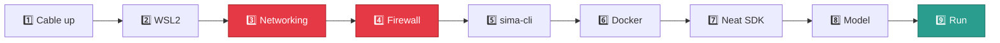

<div align="center">

<br>

# ⚡ SiMa Neat SDK

### Live YOLO object detection on a Modalix DevKit

<br>

[](https://sima.ai)
[](https://docs.sima.ai)
[](https://docs.sima.ai)


</div>

---

## 🎯 What this is

A **setup guide** and a **working detector app**, both written while actually bringing
up a DevKit. Every warning marks somewhere real time was lost.

```
   ┌──────────────┐        ┌──────────────────┐        ┌───────────────┐
   │  WINDOWS PC  │        │   WSL2 · UBUNTU  │        │    DEVKIT     │
   ├──────────────┤        ├──────────────────┤        ├───────────────┤
   │  Chrome      │◄──────►│  sima-cli        │◄──────►│  MLA          │
   │  scp / ssh   │ :9900  │  Docker + SDK    │  UDP   │  your app     │
   │              │        │  Neat Insight    │ 9000/  │               │
   │              │        │                  │ 9100   │               │
   └──────────────┘        └──────────────────┘        └───────────────┘
        viewer                build + receive             inference
```

Your app runs **on the DevKit**. It sends H.264 video and JSON detections over UDP,
and Insight recombines them in your browser.

> [!TIP]
> **Most problems are a command typed in the wrong box.** Check your prompt:
> `PS C:\>` is Windows · `root@neat-sdk:/workspace#` is the container ·
> `sima@modalix:~$` is the DevKit. **Windows paths only work in PowerShell.**

---

## 🚀 Setup



**Red steps are load-bearing.** Doing them late is the usual way to lose an afternoon.

<br>

### 1️⃣ Cable up the DevKit

USB cable (serial console) + Ethernet straight to your PC. Open the
[serial tool](https://docs.sima.ai/_static/tools/serial/index.html), set the DevKit to
**DHCP**.

```powershell
ping 192.168.137.123
```

> ✅ Must reply. Nothing else works until it does.

<br>

### 2️⃣ Install WSL2

```powershell
wsl --install -d Ubuntu      # PowerShell as Administrator
wsl -l -v                    # want: Ubuntu · Running · 2
```

<br>

### 3️⃣ Mirrored networking 

WSL sits behind NAT by default and **cannot see your DevKit**. Later, pairing installs
software onto the board over the network. With no route, the PC half succeeds and the
board half silently does nothing. You find out an hour later.

```powershell
@"
[wsl2]
networkingMode=mirrored
"@ | Set-Content -Path "$env:USERPROFILE\.wslconfig" -Encoding utf8

wsl --shutdown
```

Wait 10 seconds, open a WSL terminal, then verify:

```powershell
wsl -- hostname -I                  # must list 192.168.137.1
wsl -- ping -c 2 192.168.137.123    # must reply
```

> ✅ **Both must pass.** Be stubborn here.
>
> 💡 Made the file in Notepad? Check it is not secretly `.wslconfig.txt`.

<br>

### 4️⃣ Firewall 

Mirrored mode puts WSL behind the Hyper-V firewall, which blocks inbound by default.
Your DevKit pushing video **is** inbound. Skip this and Insight loads perfectly and
shows nothing, with no error anywhere.

```powershell
# PowerShell as Administrator
New-NetFirewallHyperVRule -Name "NeatVideo" -DisplayName "Neat Insight video" `
  -Direction Inbound -VMCreatorId '{40E0AC32-46A5-438A-A0B2-2B479E8F2E90}' `
  -Protocol UDP -LocalPorts 9000-9079 -Action Allow

New-NetFirewallHyperVRule -Name "NeatMeta" -DisplayName "Neat Insight metadata" `
  -Direction Inbound -VMCreatorId '{40E0AC32-46A5-438A-A0B2-2B479E8F2E90}' `
  -Protocol UDP -LocalPorts 9100-9179 -Action Allow
```

> 💡 These live in Windows, not the distro, so they survive `wsl --unregister`.

<br>

### 5️⃣ Install sima-cli

```bash
# WSL
sudo su -                              # become root FIRST
cd /mnt/d/work/sima-projects           # then cd
apt update && apt install -y python3-venv python3-pip
python3 -m venv sima
source sima/bin/activate
pip install sima-cli
sima-cli login                         # needs a community.sima.ai account
```

> [!CAUTION]
> **`cd` after `sudo su -`, never before.** The `-` makes it a login shell that drops
> you in `/root`. Reverse them and your venv is silently built at `/root/sima`.

> 💡 Every new session needs all three lines again: `sudo su -`, `cd`, `source`.

<br>

### 6️⃣ Docker Engine + NFS

The Neat SDK **is** a Docker container. No Docker, no SDK.

```bash
# WSL — from docs.docker.com/engine/install/ubuntu
sudo apt update && sudo apt install -y ca-certificates curl
sudo install -m 0755 -d /etc/apt/keyrings
sudo curl -fsSL https://download.docker.com/linux/ubuntu/gpg -o /etc/apt/keyrings/docker.asc
sudo chmod a+r /etc/apt/keyrings/docker.asc

sudo tee /etc/apt/sources.list.d/docker.sources <<EOF
Types: deb
URIs: https://download.docker.com/linux/ubuntu
Suites: $(. /etc/os-release && echo "${UBUNTU_CODENAME:-$VERSION_CODENAME}")
Components: stable
Architectures: $(dpkg --print-architecture)
Signed-By: /etc/apt/keyrings/docker.asc
EOF

sudo apt update
sudo apt install -y docker-ce docker-ce-cli containerd.io docker-buildx-plugin docker-compose-plugin
sudo apt install -y nfs-kernel-server nfs-common
```

Docker needs systemd to survive a WSL restart:

```bash
grep -q 'systemd=true' /etc/wsl.conf 2>/dev/null || sudo tee -a /etc/wsl.conf <<'EOF'

[boot]
systemd=true
EOF
```

```powershell
wsl --shutdown          # PowerShell, then reopen WSL
```

```bash
sudo systemctl enable --now docker
sudo docker run hello-world
```

> ✅ Must print **"Hello from Docker!"**

<br>

### 7️⃣ Install the Neat SDK 

```bash
sudo su -
cd /mnt/d/work/sima-projects
source sima/bin/activate
sima-cli install ghcr:sima-neat/sdk
sima-cli sdk setup --devkit 192.168.137.123
```

**Answer every prompt.** The ones that matter:

| Prompt | Answer |
|:--|:--|
| `Some system checks failed. Continue?` | `y` — the Firewall row says *Unverified*, not failed |
| `Install Model Compiler extension?` | `Y` — adds **9 GB**, only needed to compile your own models |
| `Install VSCode Extensions?` | `y` — lowercase, bare Enter is rejected |
| `Apply passwordless sudo on DevKit?` | `y` — required for workspace sync |
| everything else | `Y` / Enter |

Then confirm the **board half** actually happened, because it is what fails quietly:

```bash
ssh sima@192.168.137.123 "~/pyneat/bin/python3 -c 'import pyneat; print(pyneat.__version__)'"
```

> ✅ Prints a version → done.
> ❌ `No such file or directory` → see [Recovery](#-recovery).

> [!NOTE]
> **`mount.nfs: Connection timed out` is fine.** Setup falls back to rsync and carries
> on. Also: **the DevKit IP changes between reboots** (DHCP). If things hang, check with
> `arp -a | Select-String "192.168.137"`.

<br>

### 8️⃣ Download a model

```bash
sima-cli sdk neat        # WSL — starts the container and drops you inside

# in the container
sima-cli login
mkdir -p /workspace/assets/models && cd /workspace/assets/models
sima-cli download https://docs.sima.ai/pkg_downloads/SDK2.1.2/models/modalix/yolo26-detection/yolo26m-det-bf16-mla_tess-b1.tar.gz
```

| Variant | Speed | Accuracy |
|:--|:--:|:--:|
| `yolo26n` | ⚡⚡⚡⚡⚡ | ★★☆☆☆ |
| `yolo26s` | ⚡⚡⚡⚡ | ★★★☆☆ |
| **`yolo26m`** | ⚡⚡⚡ | ★★★★☆ ⭐ |
| `yolo26l` | ⚡⚡ | ★★★★☆ |
| `yolo26x` | ⚡ | ★★★★★ |

<br>

### 9️⃣ Deploy and run

**One command copies everything.** Do this after every change:

```powershell
scp -r yolo-detector/ sima@192.168.137.193:~
```

> [!IMPORTANT]
> Run it from `d:\work\sima-projects`, and mind the **IP** — yours may differ.
> This overwrites the board copy, so keep your originals on the PC.

Then on the DevKit:

```bash
ssh -tt sima@192.168.137.193                     # two t's, see below
source ~/pyneat/bin/activate
cd ~/yolo-detector && python3 src/main.py --config config.yaml
```

Healthy output:

```
source: type=video uri=assets/video/video-4.h264 stream=1920x1080@25
preprocess: ... resize=letterbox pad=114 normalize=coco_yolo
model: ... family=yolo26 decode_type=YoloV26 labels=80
graph built
insight: host=192.168.137.1 video=9000 metadata=9100 channel=0
running. press Ctrl-C to stop.
[50] 24.8 fps, 6.2 detections/frame avg
```

> [!CAUTION]
> **Use `ssh -tt`, two t's.** Without a pty, Ctrl-C never reaches the app. It keeps
> running invisibly holding the MLA and your next run fails.
> Rescue: `ssh sima@192.168.137.193 pkill -f src/main.py`

<br>

### 🔟 Watch it

<div align="center">

## 🔗 [https://localhost:9900](https://localhost:9900)

**select channel 0**

</div>

> [!WARNING]
> **Ignore the address `neat` prints.** It says `https://192.168.137.1:9900`, which
> Windows cannot reach: that counts as inbound to the WSL VM and the firewall drops it.
> `localhost` takes a different path. Same for the VS Code URL, keep the token and swap
> the host.

---

## ⚙️ Configuration

Everything lives in `yolo-detector/config.yaml`. Five settings matter:

```yaml
model:
  path: assets/models/yolo26m-det-bf16-mla_tess-b1.tar.gz
  family: yolo26                    # must match your model

source:
  type: video                       # video | rtsp | usb
  uri: assets/video/video-4.h264    # DevKit path, relative to ~/yolo-detector

output:
  insight:
    host: 192.168.137.1             # NOT 127.0.0.1
```

| ❌ Mistake | What happens |
|:--|:--|
| `uri: C:\Users\...\video.mp4` | The DevKit has no `C:` drive |
| `uri: r"C:\path\file.mp4"` | `r"..."` is Python. YAML keeps the `r` and quotes |
| `host: 127.0.0.1` | Means "the board itself". Video goes nowhere |
| `family` mismatched | No detections, or every score near zero |
| A `.mp4` source | Hits a demuxer bug. Convert to `.h264`, see below |

### Video must be raw H.264

The DevKit decodes H.264 in hardware, and `.mp4` containers hit a
[known bug](#-known-issues). Convert once, losslessly:

```powershell
ffmpeg -i video-4.mp4 -c:v copy -bsf:v h264_mp4toannexb -f h264 video-4.h264
```

Raw streams carry no metadata, so set geometry explicitly:

```yaml
source:
  fps: 25
  width: 1920
  height: 1080
```

### First run: prove the model offline

Debugging the model and the network at once is what makes this painful. Set:

```yaml
runtime: { frames: 100, profile: true }
output:
  save:   { enable: true }
  insight: { enable: false }
```

100 frames, annotated JPEGs to disk, timings, exits by itself, **zero networking**.
Boxes look right? Model and config are correct, so anything later is transport.

---

## 🔁 Daily loop

```bash
sudo su - && cd /mnt/d/work/sima-projects && source sima/bin/activate && sima-cli sdk neat
```

Then: **edit → copy → run → watch**, repeat.

```powershell
scp -r yolo-detector/ sima@192.168.137.193:~
```

<details>
<summary><b>📌 Handy extras</b></summary>

<br>

```powershell
# pull annotated frames back
scp -r sima@192.168.137.193:~/yolo-detector/sandbox .

# stop typing your password
ssh-keygen -t ed25519 -C "devkit"
type $env:USERPROFILE\.ssh\id_ed25519.pub | ssh sima@192.168.137.193 "mkdir -p ~/.ssh && cat >> ~/.ssh/authorized_keys"
```

```bash
# from inside the SDK container
dk shell      # SSH to the DevKit
dk status     # sync method and remote path
neat          # component versions and ports
```

</details>

---

## 🩹 Recovery

<details>
<summary><b>DevKit firmware version mismatch</b></summary>

<br>

```
ERROR: DevKit/SDK version mismatch. DevKit 2.0.0, SDK 2.1.2
```

New boards often ship older firmware. **eLxr cannot be updated remotely**, so this runs
**on the board**. It needs internet, which Windows ICS already provides over your
Ethernet cable.

```bash
ssh sima@192.168.137.123
sima-cli login
sima-cli update            # menu → "Update all packages to the latest"
```

The sudo password is the same one you SSH in with. Budget 15–40 minutes plus a reboot.

> `--dryrun` ends with `No ELXR update was applied` — that is what a dry run does. Run
> it again without the flag.
>
> A firmware update may wipe the board's home directory. Never keep the only copy of
> anything there.

Afterwards, re-run `sima-cli sdk setup --devkit <ip>`. If SSH complains the host key
changed, that is expected: `ssh-keygen -R <ip>`.

</details>

<details>
<summary><b>pyneat missing on the DevKit</b></summary>

<br>

Means pairing never installed it, almost always because networking was not fixed first.
Re-run pairing from **WSL** now that it works:

```bash
sima-cli sdk setup --devkit 192.168.137.123
```

Still missing? Install by hand on the board. Match the version from `neat` in the
container, and install under `/media/nvme` because the root filesystem is too small:

```bash
sudo mkdir -p /media/nvme/neat && sudo chown "$USER:$USER" /media/nvme/neat
cd /media/nvme/neat
sima-cli login
sima-cli neat install core@v0.3.0
```

> `sima-cli` downloads into the **current directory**, so `cd` somewhere you own first.
> `-t pyneat` fetches only the wheel, which is not enough to run an app.

</details>

---

## 🔧 Troubleshooting

<details open>
<summary><b>Setup</b></summary>

<br>

| Symptom | Fix |
|:--|:--|
| `sima-cli: command not found` | Venv not active: `sudo su -`, `cd`, `source sima/bin/activate` |
| Venv landed in `/root/sima` | You ran `cd` before `sudo su -` |
| `externally-managed-environment` | Create the venv first |
| `Error: No such command 'sdk'` | You ran it on the board. `sdk` is PC-side |
| WSL cannot ping the DevKit | `.wslconfig` missing, saved as `.txt`, or WSL not restarted |
| `Cannot connect to the Docker daemon` | `sudo systemctl start docker` |
| Docker dead after every restart | systemd not enabled in `/etc/wsl.conf` |

</details>

<details>
<summary><b>Copying and paths</b></summary>

<br>

| Symptom | Fix |
|:--|:--|
| `ssh: Could not resolve hostname d:` | Windows path used in Linux. `scp` read `D:` as a hostname |
| `scp: Connection closed` | Usually follows the above |
| `model archive not found` | Run from `~/yolo-detector`, and check `find assets -type f` |
| `failed to open source` | Same, for the video |
| Copy hangs | IP changed. `arp -a \| Select-String "192.168.137"` |

</details>

<details>
<summary><b>Running</b></summary>

<br>

| Symptom | Fix |
|:--|:--|
| `pyneat requires numpy<2` | `pip install "numpy>=1.24,<2" "opencv-python>=4.7,<5"` |
| `No src-element named "nN_demux"` | `.mp4` demuxer bug. Convert to `.h264` |
| `ModuleNotFoundError: pyneat` | You are on the PC, or pairing never ran |
| Device busy | Orphaned run: `ssh sima@<ip> pkill -f src/main.py` |
| Stuck after `loading model` | First load unpacks the archive. Give it a minute |

</details>

<details>
<summary><b>Detections and display</b></summary>

<br>

| Symptom | Fix |
|:--|:--|
| Insight loads, no video | **Firewall.** Step 4 skipped. Most common failure by far |
| Insight blank, no errors | `insight.host` is `127.0.0.1`. Use `192.168.137.1` |
| `192.168.137.1:9900` will not load | Expected. Use `https://localhost:9900` |
| No detections at all | `model.family` mismatch, then lower `decode.score_threshold` |
| Boxes in the wrong place | `resize.mode: letterbox`, `pad_value: 114`. Do not add your own maths |
| Scores all near zero | Head mismatch. YOLOX, v6 and v26 use raw-logit heads |
| Dropped frames | Raise `runtime.queue_depth`, keep `overflow_policy: keep_latest` |

</details>

---

## 🐞 Known issues

<details>
<summary><b><code>groups.video_input</code> cannot play <code>.mp4</code> · Neat 0.3.0</b></summary>

<br>

```
gst_parse_launch failed: No src-element named "n1_demux" - omitting link
```

`VideoTrackSelect` builds its fragment from one variable, so what it emits is correct:

```cpp
const std::string base = "n" + std::to_string(node_index) + "_demux";
ss << "qtdemux name=" << base << " " << base << ".video_" << idx_;
```

The graph then appends an instance suffix, but the renamer only rewrites `name=<x>`
declarations. `element_names()` reports just `{"n1_demux"}`, so the pad reference is
never fixed. **Any non-empty suffix breaks it**, so reordering does not help.

**Fix:** no container, no demuxer. `main.py` detects `.h264` / `.264` / `.avc` and
builds the chain by hand:

```
FileInput → H264Parse → Queue → SimaDecode → CapsRaw
```

Isolate a source problem from a model problem with:

```bash
python3 src/probe_source.py assets/video/video-4.h264
```

</details>

---

## 📋 Reference

| | |
|:--|:--|
| **DevKit** | `192.168.137.123` (DHCP, changes), user `sima` |
| **Your PC, as the board sees it** | `192.168.137.1` |
| **Insight** | `https://localhost:9900` |
| **Workspace** | `/workspace` = `/root/workspace` = `\\wsl$\Ubuntu\root\workspace` |
| **Container** | `ghcr.io-sima-neat-sdk-latest` |
| **Board venv** | `~/pyneat` |
| **Playbooks** | `/neat-resources/apps-src/skills/` |
| **Neat source** | `/neat-resources/core-src/` |

| Port | | |
|:--|:--|:--|
| `9000-9079` | UDP | Video to Insight |
| `9100-9179` | UDP | Detection metadata |
| `9900` | TCP | Insight web UI |
| `8554` | TCP | RTSP |
| `8022` | TCP | Web SSH |

---

<div align="center">

## ⭐ Six rules

**1.** Networking before pairing · **2.** Docker before the SDK ·
**3.** `cd` after `sudo su -` <br>
**4.** `insight.host = 192.168.137.1` · **5.** Raw `.h264`, not `.mp4` ·
**6.** Always `ssh -tt`

<br>

Built with the `neat-application-builder` playbook <br>
API details verified against `/neat-resources/core-src`, not from memory

<br>


</div>
