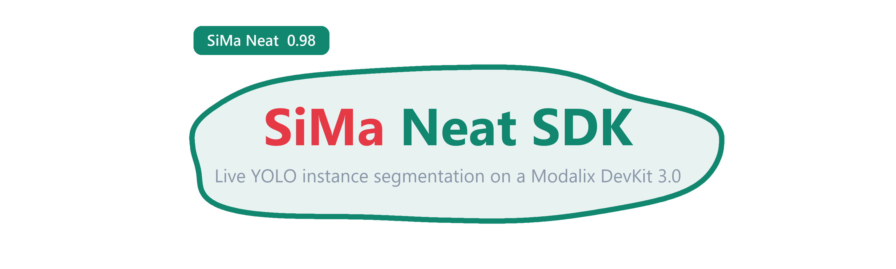

<div align="center">



<br>

[](https://sima.ai)
[](https://docs.sima.ai)
[](https://docs.sima.ai)


</div>

## What this is

**Instance segmentation with a background blur**, running on a Modalix DevKit 3.0.
The model finds objects and their per-pixel outline; the app keeps those pixels sharp
and blurs everything else. Video-call background blur, except the segmentation runs on
the MLA and the compositing runs at frame rate on the board.

```
   ┌───────────────────────────────────────────────────────────────┐
   │ ┌──────────┐  ░░░░░░░░░░░  blurred background  ░░░░░░░░░░░░░  │
   │ │ FPS: 24.7│  ░░░░░░░░░░░░░░░░░░░░░░░░░░░░░░░░░░░░░░░░░░░░░░  │
   │ └──────────┘  ░░░░░░░ ┌──────────────┐ ░░░░░░░░░░░░░░░░░░░░░  │
   │ ░░░░░░░░░░░░░░░░░░░░░ │ person 0.94  │ ░░░░░░░░░░░░░░░░░░░░░  │
   │ ░░░░░░░░░░░░░░░░░ ╭───┴──────────────┴───╮ ░░░░░░░░░░░░░░░░░  │
   │ ░░░░░░░░░░░░░░░░ │                        │ ░░░░░░░░░░░░░░░░  │
   │ ░░░░░░░░░░░░░░░░ │   sharp, mask-shaped   │ ░░░░░░░░░░░░░░░░  │
   │ ░░░░░░░░░░░░░░░░  ╰──────────────────────╯  ░░░░░░░░░░░░░░░░  │
   └───────────────────────────────────────────────────────────────┘
```

It is the companion to [`object-detection/`](../object-detection/README.md), and shares
its whole setup. If you have already brought a board up with that app, everything here is
three commands away.

> [!IMPORTANT]
> **This page assumes a paired board.** The one-time DevKit bring-up (cabling, WSL2,
> networking, Docker, the Neat SDK) is in the [root README](../README.md) and is shared
> by every app here. Do steps 1 to 6 there once, then come back.
>
> ✅ You are ready when this prints a version:
> ```bash
> ssh sima@<devkit-ip> "~/pyneat/bin/python3 -c 'import pyneat; print(pyneat.__version__)'"
> ```

## Contents

Everything on this page is specific to segmentation and the blur. The one-time DevKit
setup lives in the [root README](../README.md).

| Section | What it covers |
|:--|:--|
| [Test it in three commands](#test-it-in-three-commands) | Push, run, pull the result back |
| [Get a segmentation model](#get-a-segmentation-model) | A `-seg` `.tar.gz` pack, not a detect one |
| [Get a test video](#get-a-test-video) | Two ready-made `.h264` clips from the releases page |
| [Deploy and run](#deploy-and-run) | `scp` the app over and run it |
| [See the result](#see-the-result) | Pull `segmentation.mp4` and `frames/` back |
| [The effect](#the-effect) | Every blur, pixelate, dim and feather setting |
| [The overlay](#the-overlay) | Mask tint, outlines, captions, FPS badge |
| [Configuration](#configuration) | `config.yaml`, and the mistakes it catches |
| [Daily loop](#daily-loop) | The commands you repeat after every edit |
| [How the app works](#how-the-app-works) | Pipeline, mask decode, undoing the letterbox |
| [Recipes](#recipes) | Anonymiser, video-call background, spotlight, cheap mode |
| [Known issues](#known-issues) | Mask layout is discovered, not assumed |
| [Questions people ask](#questions-people-ask) | FAQ: no masks, jagged edges, slow runs |
| [Common errors](#common-errors) | One table, symptom to fix |

## Test it in three commands

**Board already paired?** This is the whole loop. Run it from the repo root in WSL:

```bash
scp -r instance-segmentation/ sima@<devkit-ip>:~                    # 1. push the app

ssh -tt sima@<devkit-ip> \
  'source ~/pyneat/bin/activate && cd ~/instance-segmentation && python3 src/app.py && cd ..'

scp sima@<devkit-ip>:~/instance-segmentation/segmentation.mp4 .     # 3. pull the result
```

Play `segmentation.mp4`. A sharp subject on a blurred background means the whole chain
works. Repeat after every edit.

**Faster still, before you touch the board.** This parses and validates `config.yaml`
without pyneat, a model, or any hardware, and runs anywhere:

```bash
python3 instance-segmentation/src/app.py --validate-config
```
```
config OK: instance-segmentation/config.yaml
  family=yolo26-seg -> BoxDecodeType.YoloV26Seg
  preprocess: kind=image enable=on in=NV12 ... resize=letterbox pad=114 | normalize=coco_yolo
  segmentation: masks=on source=auto space=auto threshold=0.5 net=<from the first mask>
  blur: gaussian kernel=41 sigma=auto down=2 on the background | keep=every class | feather=9
```

It catches a detect head pointed at a segmentation app, a misspelled class name in
`blur.keep_classes`, and every out-of-range knob, in under a second.

**A short run instead of a whole clip.** Set `runtime.frames: 100` and
`output.video.enable: false`. You get 100 composited JPEGs in `frames/` and the app exits
by itself.

<a id="get-a-segmentation-model"></a>
## Get a segmentation model

This is the **one thing the detector app does not give you**. A detect pack emits boxes
and nothing else, so it cannot drive a mask-shaped blur. You need a `-seg` pack.

Run this **in WSL, from the repo root**. It downloads straight into
`instance-segmentation/assets/models/`, which is exactly where `config.yaml` already
looks, so there is nothing to move afterwards:

```bash
# WSL
sudo su -
cd sima-projects
source sima/bin/activate
sima-cli login                                    # needs a community.sima.ai account

MODELS=https://docs.sima.ai/pkg_downloads/SDK2.1.2/models/modalix
MODEL=yolo26-segmentation/yolo26m-seg-bf16-mla_tess-b1.tar.gz

mkdir -p instance-segmentation/assets/models
cd instance-segmentation/assets/models && sima-cli download "$MODELS/$MODEL" && cd ../../../
```

> [!IMPORTANT]
> **`sima-cli download` writes into the current directory**, which is the whole reason for
> the `cd`. The trailing `cd ../../../` puts you back at the repo root, ready for the
> `scp` in the next step. Downloading from anywhere else, including the container's
> `/workspace`, is how the pack ends up
> [somewhere `config.yaml` cannot see](../README.md#paths).

Confirm it landed, and that the name matches `model.path`:

```bash
ls -lh instance-segmentation/assets/models/
grep '^  path:' instance-segmentation/config.yaml
```

> ✅ The two must agree. `model.path` is relative to the app directory, so a pack at
> `instance-segmentation/assets/models/X.tar.gz` is written `path: assets/models/X.tar.gz`.

> [!NOTE]
> **Check the listing before you trust that filename.** The segmentation packs follow the
> same naming as the detection ones, but the exact set on offer moves with the SDK
> release. Browse `$MODELS/` while logged in and take whatever `-seg` pack is there, then
> point `model.path` at it. Sizes `n`, `s`, `m`, `l` and `x` trade speed against accuracy;
> `family` stays `yolo26-seg` for all of them.

<details>
<summary><b>Already inside the SDK container?</b></summary>

You can download there instead, but the container's `/workspace` is `/root/workspace` in
WSL, **not** the repo at `/root/sima-projects`, so the file needs one extra move:

```bash
# in the container
sima-cli login
mkdir -p /workspace/assets/models && cd /workspace/assets/models
MODELS=https://docs.sima.ai/pkg_downloads/SDK2.1.2/models/modalix
sima-cli download $MODELS/yolo26-segmentation/yolo26m-seg-bf16-mla_tess-b1.tar.gz
```

```bash
# then back in WSL
mkdir -p /root/sima-projects/instance-segmentation/assets/models
mv /root/workspace/assets/models/yolo26m-seg-*.tar.gz \
   /root/sima-projects/instance-segmentation/assets/models/
```

The WSL route above skips this entirely, which is why it is the one written out first.

</details>

<a id="get-a-test-video"></a>
## Get a test video

Two ready-made 1080p clips, already converted to raw `.h264` so they skip the
[demuxer bug](../README.md#known-issues) entirely. Same idea as the model: run it **in WSL, from the
repo root**, and it lands where `config.yaml` already looks.

```bash
VIDEOS=https://github.com/RizwanMunawar/sima-projects/releases/download/0.0.1

curl -L -o instance-segmentation/assets/videos/people-walking-inside-mall.h264 \
  $VIDEOS/people-walking-inside-mall.h264
curl -L -o instance-segmentation/assets/videos/people-walking-outside-mall.h264 \
  $VIDEOS/people-walking-outside-mall.h264
```

| Clip | Size | Stream |
|:--|:--|:--|
| `people-walking-inside-mall.h264` | 1.2 MB | 1920x1080 @ 30 fps. The shipped default, and quick to pull |
| `people-walking-outside-mall.h264` | 13 MB | 1920x1080 @ 24 fps. A longer run with more people in frame |

Both are crowds of people, which is what makes them useful here: plenty of overlapping
instances to separate, and `person` is the obvious thing to put in `blur.keep_classes`.
`config.yaml` points at the inside-mall clip out of the box. To use the other one, change
one line:

```yaml
source:
  uri: assets/videos/people-walking-outside-mall.h264
```

Confirm the model and the clips all landed:

```bash
ls -lh instance-segmentation/assets/models/ instance-segmentation/assets/videos/
```

> [!NOTE]
> **Bringing your own clip?** It must be a raw H.264 elementary stream, not an `.mp4`.
> See [Video must be raw H.264](../README.md#video-must-be-raw-h264). Leave `source.fps`,
> `source.width` and `source.height` at `0`; the app reads the real geometry out of the
> stream's SPS, and both clips above carry it.

**No segmentation pack available?** The app still runs. Set `segmentation.masks: off` and
the blur uses bounding boxes instead of masks: rectangular edges, but a working effect
and a useful baseline for the rest of the config.

<a id="deploy-and-run"></a>
## Deploy and run

The app lives in [`instance-segmentation/`](.):

```
instance-segmentation/
├── config.yaml          # every setting lives here
├── assets/
│   ├── models/          # -seg .tar.gz model packs  (not in git)
│   └── videos/          # .h264 streams             (not in git)
└── src/
    ├── app.py           # the pipeline and the compositor
    ├── coco_labels.txt  # 80 COCO class names
    └── requirements.txt
```

Models and video are gitignored, so after cloning you fetch them with the commands in
[Get a segmentation model](#get-a-segmentation-model) and
[Get a test video](#get-a-test-video), which put the `-seg` pack in `assets/models/` and
the `.h264` clips in `assets/videos/`.

On the DevKit, once per board (skip it if you already did this for the detector, the
requirements are identical):

```bash
pip install -r ~/instance-segmentation/src/requirements.txt
```

> [!CAUTION]
> **Never let pip pull numpy 2.x.** `pyneat` and every `simaai-*` package need
> `numpy<2`. The pins in `requirements.txt` handle it. If you already broke it:
> `pip install "numpy>=1.24,<2" "opencv-python>=4.7,<5"`

**One command copies everything.** Run it from the repo root in WSL, after every change:

```bash
scp -r instance-segmentation/ sima@<devkit-ip>:~
```

Then on the DevKit:

```bash
ssh -tt sima@<devkit-ip>                     # two t's, see below
source ~/pyneat/bin/activate
cd ~/instance-segmentation && python3 src/app.py && cd ..
```

Healthy output:

```
source: type=video uri=assets/videos/people-walking-inside-mall.h264 stream=1920x1080@30
preprocess: ... resize=letterbox pad=114 normalize=coco_yolo
model: ... family=yolo26-seg decode_type=YoloV26Seg labels=80
segmentation: masks=on source=auto space=auto threshold=0.5 net=<from the first mask>
blur: gaussian kernel=41 sigma=auto down=2 on the background | keep=every class | feather=9
runtime: preset=reliable overflow=block queue_depth=3
graph built
video: segmentation.mp4 codec=mp4v fps=24 hud=True
running. press Ctrl-C to stop.
model output tensors (first frame with instances):
  [0] stream=instances tag=<untagged> dtype=uint8 shape=(1281204,) bytes=1281204
  packed layout: 4 + 50*24 + 50*160*160 = 1281204 bytes
masks: source=packed layout=planes 160x160 slots=50 values=0..255
masks: space=net
[50] 21.4 fps, 5.8 instances/frame avg
```

That **tensor dump is the important line**, and it is printed once per run. See
[How the app works](#how-the-app-works) for what to do with it.

> [!CAUTION]
> **Use `ssh -tt`, two t's.** Without a pty, Ctrl-C never reaches the app. It keeps
> running invisibly holding the MLA and your next run fails.
> Rescue: `ssh sima@<devkit-ip> pkill -f src/app.py`

<a id="see-the-result"></a>
## See the result

Every run writes a composited video and composited stills on the board:

```bash
scp sima@<devkit-ip>:~/instance-segmentation/segmentation.mp4 .
scp -r sima@<devkit-ip>:~/instance-segmentation/frames .
```

On exit the app says exactly what it wrote, and which mask encoding it used:

```
processed=3012 timeouts=0 masks=packed
video: wrote 3012 frames to segmentation.mp4 (44.1 MB)
```

`masks=none` there means the blur fell back to boxes for the whole run.

## The effect

> [!NOTE]
> **The blur is optional.** This app is a segmenter: it finds instances and draws their
> masks whether or not anything here is switched on. The `blur:` block is one extra thing
> it can do with those masks, namely treat the area they do **not** cover. Turn it off
> and you get a plain segmentation overlay, which is a perfectly good way to run it.

Everything about that treatment is config, under `blur:`.

```
   frame ──┬────────────────────────────────► kept where the mask is set ──┐
           │                                                               ├──► output
           └──► gaussian / pixelate / none ─► kept everywhere else ────────┘
                  + grayscale + dim, then × opacity
```

`opacity` is the dial between the two, so you are not limited to on or off:

| `opacity` | Result |
|:--|:--|
| `1.0` | Full-strength treatment. The default |
| `0.5` | Half-strength. The background is softened but still readable |
| `0.0` | Identical to `enable: off` |

```yaml
blur:
  enable: on           # off = segmentation only, no background treatment
  opacity: 1.0         # strength of the treatment, 0.0 to 1.0

  method: gaussian     # gaussian | pixelate | none

  kernel: 41           # gaussian width, forced odd. Bigger is blurrier
  sigma: 0.0           # 0 = derive from kernel
  downscale: 2         # blur at 1/N resolution. The main speed knob

  pixel_size: 24       # mosaic block size, used when method is pixelate

  dim: 0.0             # darken the background, 0.0 to 1.0
  grayscale: off       # desaturate the background
  feather: 9           # cross-fade the mask edge over N px. 0 = hard cut

  invert: off          # blur the instances instead of the background
  keep_classes: []     # which classes stay sharp. Empty = all of them
```

| Key | Effect |
|:--|:--|
| `enable` | `off` skips compositing entirely and leaves a plain segmentation overlay |
| `opacity` | How much of the treatment to keep, `0.0` to `1.0`. Dials the blur, `grayscale` and `dim` down together |
| `method` | `gaussian` for a lens blur, `pixelate` for a mosaic, `none` for dim/grayscale only |
| `kernel`, `sigma` | Blur strength. `sigma: 0` derives it, which is what you want |
| `downscale` | Blur at 1/N resolution and scale back up. **The speed knob**, and visually free |
| `pixel_size` | Mosaic block size for `pixelate` |
| `dim`, `grayscale` | Stack on top of any method. `dim: 0.4` + `grayscale: on` is a good "focus" look |
| `feather` | Softens the mask edge. `0` is faster and shows every jag |
| `invert` | Blurs the instances and leaves the scene sharp. The anonymiser |
| `keep_classes` | Names from the labels file, or bare ids. Empty keeps every detected class |

Sizes are pixels **for a 1080p frame** and follow `visualization.auto_scale`, so a kernel
tuned on a test clip still holds at 4K.

> [!NOTE]
> **A frame with no detections is blurred end to end.** No foreground means everything is
> background. That is the definition working rather than a bug; if a clip flickers between
> sharp and blurred, lower `decode.score_threshold` so the subject is detected on every
> frame.

## The overlay

Drawn **on top of** the composite, so it is never blurred.

```
   ┌───────────────────────────────────────────────────────────┐
   │ ┌──────────┐                                              │
   │ │ FPS: 24.7│                                              │
   │ └──────────┘   ┌────────────┐                             │
   │                │ person 0.94│      caption above the box  │
   │             ╭──┴────────────┴───╮                         │
   │            │  ▒▒▒ mask tint ▒▒▒  │  traced mask outline    │
   │             ╰───────────────────╯                         │
   └───────────────────────────────────────────────────────────┘
```

```yaml
visualization:
  mask_alpha: 0.35         # class-coloured tint over each instance. 0 = none
  mask_outline: on
  outline_thickness: 3

  show_boxes: off          # the mask already shows the extent
  box_thickness: 2

  text_scale: 1.0
  text_thickness: 2
  text_padding: 10

  show_labels: on
  show_scores: on
  score_decimals: 2

  text_color: [255, 255, 255]

  auto_scale: on
  reference_height: 1080

  hud:
    text_color: [104, 31, 17]
    bg_color: [255, 255, 255]
    text_scale: 2.0
    text_thickness: 5
    padding: 22          # all four sides
    padding_x: 34        # left/right gap. 0 follows padding
    padding_y: 24        # top/bottom gap. 0 follows padding
    margin_x: 28         # gap from the left frame edge
    margin_y: 24         # gap from the top frame edge
    fps_decimals: 0      # 0 gives "FPS: 25", 1 gives "FPS: 24.8"
```

| Key | Effect |
|:--|:--|
| `mask_alpha` | Tint strength over each instance. **Set it to `0`** for a clean blur with no colour |
| `mask_outline`, `outline_thickness` | Trace the mask edge |
| `show_boxes`, `box_thickness` | Also draw the rectangle. Off by default; the mask shows the extent |
| `text_scale`, `text_thickness`, `text_padding` | Caption size, stroke and inner gap |
| `show_labels`, `show_scores`, `score_decimals` | What the caption says. `2` gives `person 0.94` |
| `text_color` | Caption text colour |
| `auto_scale`, `reference_height` | Scale every size above with the frame height |
| `hud.padding` | Gap between the text and the badge edge, all four sides. What sets the badge size |
| `hud.padding_x`, `hud.padding_y` | Override the horizontal and vertical gap independently. `0` follows `hud.padding` |
| `hud.margin_x`, `hud.margin_y` | Gap between the badge and the top-left corner of the frame. `0` follows the matching padding |
| `hud.fps_decimals` | `0` gives `FPS: 25`, `1` gives `FPS: 24.8` |
| `hud.text_color`, `hud.bg_color`, `hud.text_scale`, `hud.text_thickness` | Badge colours and type. `0` on a size follows the caption setting above |

Colours come from a 20-entry palette keyed to class id, so a class is always the same
colour. They are `[B, G, R]` because OpenCV is BGR, so `[0, 0, 255]` is red. An instance
whose mask could not be recovered is drawn as a rectangle, so a box in the output is a
visible signal that the mask decode did not work for it.

## Configuration

Everything lives in `instance-segmentation/config.yaml`. These settings matter:

```yaml
model:
  path: assets/models/yolo26m-seg-bf16-mla_tess-b1.tar.gz
  family: yolo26-seg                   # a SEGMENT head, not a detect one

source:
  type: video                          # video | rtsp | usb
  uri: assets/videos/people-walking-inside-mall.h264   # relative to ~/instance-segmentation

decode:
  score_threshold: 0.30                # lower it if the subject flickers in and out

segmentation:
  masks: on                            # off = blur around plain boxes
  source: auto                         # auto | packed | proto | planes
  threshold: 0.5                       # lower grows instances, higher tightens them
  describe: on                         # print the model's output tensors on frame 1

blur:
  method: gaussian
  kernel: 41
  feather: 9

output:
  video:
    enable: true
    path: segmentation.mp4             # composited video, written on the DevKit
  save:
    enable: true
    dir: frames                        # composited stills
    every: 1                           # every Nth frame, 0 disables
```

| Mistake | What happens |
|:--|:--|
| `family: yolo26` (detect) | Refused at startup: a detect head has no mask data |
| `uri: C:\Users\...\video.mp4` | The DevKit has no `C:` drive |
| `uri: r"C:\path\file.mp4"` | `r"..."` is Python. YAML keeps the `r` and quotes |
| A `.mp4` source | Hits a [demuxer bug](../README.md#video-must-be-raw-h264). Convert to `.h264` |
| `keep_classes: [persn]` | Refused at startup, with a spelling suggestion |

## Daily loop

**Edit, copy, run, review**, and repeat.

| Task | Command | Run in |
|:--|:--|:--|
| Validate the config, no hardware | `python3 instance-segmentation/src/app.py --validate-config` | anywhere |
| Push the app to the board | `scp -r instance-segmentation/ sima@<devkit-ip>:~` | WSL |
| Run the app | `python3 src/app.py` | DevKit |
| Pull the video back | `scp sima@<devkit-ip>:~/instance-segmentation/segmentation.mp4 .` | WSL |
| Pull the stills back | `scp -r sima@<devkit-ip>:~/instance-segmentation/frames .` | WSL |
| Kill an orphaned run | `pkill -f src/app.py` | DevKit |

The SDK container (`dk shell`, `dk status`, `neat`) is only needed for board admin, and
is covered in the [root README](../README.md#setup-questions).

## How the app works

<details>
<summary><b>Pipeline, mask decode and undoing the letterbox</b></summary>

The graph is the detector's, with one endpoint renamed and a mask stage bolted onto the
output side:

```
   source --> branch --> frame ---------------+
                   |                          +--> combine("segmenter_output")
                   +---> model --> instances -+
```

`segmenter_output` is pulled from the `Run` handle. The `instances` field carries the
BBOX tensor plus the mask data; `frame` carries the decoded picture.

### The BBOX half is unchanged

BoxDecode emits one UInt8 tensor per frame:

```
[uint32 N][RawBox 24B] * N ... trailing padding
RawBox = <iiiifi  ->  x, y, w, h, score, class_id     (source-image pixels)
```

Boxes arrive in **original-image pixels** because Preproc writes the resize and letterbox
metadata onto the tensor and BoxDecode reads it back. Do not undo the letterbox yourself.

### The mask half is not

Masks get no such treatment. They arrive in the **network's own letterboxed space** at a
quarter resolution, and `neatobjectdecode` does not put them in a tensor of their own.
It appends them to the BBOX buffer:

```
[uint32 count][RawBox 24B * top_k][mask side*side uint8 * top_k]
 └─ 4 bytes ──┘└─ the detect head ─┘└──────── the segment head ────────┘
```

The slot count is **`top_k`, not `count`**, so the buffer is a fixed size on every frame
whether one object or forty were found. With `decode.max_detections: 50` and a 640-input
model:

```
4 + 50*24 + 50*160*160 = 1,281,204 bytes
```

which is exactly the tensor length the app reports on the first frame. 160 is the mask
side, `640 / 4`, the YOLO-seg stride.

Three encodings are handled, and `segmentation.source: auto` tries them in this order:

| Encoding | Where it is | What the app does |
|:--|:--|:--|
| `packed` | Tail of the BBOX tensor, `top_k` masks of `side x side` | **What the shipped SiMa packs emit.** Sliced straight out of the buffer |
| `planes` | A tensor of its own, `N x mh x mw` | Uses each plane directly |
| `proto` | `C x mh x mw` prototypes + `N x C` coefficients | Mask is their weighted sum, one matmul per frame |

`packed` is tried first, and it needs no tensor sniffing at all: the byte length either
decomposes into `4 + slots*24 + slots*side²` or it does not. A plain detect buffer never
decomposes, so a detect head cannot be mistaken for a segment one.

On the first frame with detections the app prints every tensor it received **and the
layout it solved**, so the arithmetic above is visible in your own log:

```
model output tensors (first frame with instances):
  [0] stream=instances tag=<untagged> dtype=uint8 shape=(1281204,) bytes=1281204
  packed layout: 4 + 50*24 + 50*160*160 = 1281204 bytes
masks: source=packed layout=planes 160x160 slots=50 values=0..255
```

If that ever stops matching your model pack, the dump is exactly what you need to pin
`segmentation.source`, `coeff_counts` or `mask_sides`.

**Mask values** are uint8, and can be either a 0/1 binary mask or a 0..255 quantised
probability. Those need cut-offs 255x apart, so the app measures the peak over the used
slots and scales `threshold` to match. A binary mask is never silently thresholded away
to nothing.

**Mask space** is decided the same way. `net` means the mask covers the whole letterboxed
input and the letterbox must be undone; `box` means it is already cropped to its own
detection and only needs scaling. `segmentation.space: auto` maps the detection's box
into the plane, compares it with where the ink actually is, and prints the verdict:

```
masks: space=net
```

### Undoing the letterbox

A 1920x1080 frame letterboxed into 640x640 is scaled by `640/1920 = 1/3`, so it occupies
360 rows, and the remaining 280 are split into two 140-row grey bands:

```
   0 ┌────────────────────────┐        the mask's top 35 rows (140/4) are
     │░░░░ pad, 140 rows ░░░░░│        padding and map to nothing in the frame
 140 ├────────────────────────┤
     │                        │
     │   1920x1080 at 1/3     │   ->   mask row 35..125 is the real picture
     │                        │
 500 ├────────────────────────┤
     │░░░░ pad, 140 rows ░░░░░│
 640 └────────────────────────┘
```

The app rebuilds that transform from the frame size, the network size and
`preprocess.resize.mode`, then inverts it. `letterbox` and `crop` share one scale with
centred padding (negative for `crop`); `stretch` has a scale per axis and no padding.

Two details worth knowing:

* **Only the box region is resampled.** Scaling every `160x160` plane to a full 1080p
  frame and then cropping would mean one near-empty full-frame resize per instance. The
  frame-to-network-to-mask map composes to a pure scale plus translation, so a single
  inverse-mapped affine warp lands each mask straight into its own box.
* **Prototypes are thresholded as logits.** `sigmoid(x) > t` and `x > logit(t)` are the
  same decision, so the sigmoid is skipped.

Where the network size comes from, in order: `segmentation.net_width/net_height`, then
`preprocess.resize.width/height`, then `mask width x segmentation.stride`. All three are
`0`/`4` by default and the last one is right for every YOLO-seg model.

### Compositing

```
   foreground mask = union of every kept instance   (uint8, 0 or 255)
   background      = gaussian / pixelate / dim / grayscale of the frame
   output          = frame where mask is set, background everywhere else
```

Both halves run in uint8 through OpenCV rather than promoting two 1080p frames to
float32: the feather blend is `frame*a + bg*(255-a) >> 8` in SIMD, which is about seven
times faster than the float version and differs from it by at most one level.

### Tuning

| Symptom | Setting |
|:--|:--|
| Subject flickers in and out | Lower `decode.score_threshold` |
| Mask too tight, halo around hair | Raise `segmentation.dilate`, or lower `segmentation.threshold` |
| Mask bleeds past the subject | Raise `segmentation.threshold` |
| Jagged mask edge | Raise `blur.feather`, then `segmentation.blur_mask` |
| Run too slow | Raise `blur.downscale`, lower `blur.kernel`, set `blur.feather: 0` |
| Want timings | `runtime.profile: true`, which breaks out the mask stage separately |

</details>

## Recipes

<details>
<summary><b>Four configs worth keeping</b></summary>

**Anonymiser.** Blur the people, leave the scene sharp.

```yaml
blur: { invert: on, keep_classes: [person], method: pixelate, pixel_size: 20, feather: 0 }
visualization: { mask_alpha: 0.0, mask_outline: off, show_labels: off, show_scores: off }
```

**Video-call background.** One subject sharp, everything else soft.

```yaml
blur: { method: gaussian, kernel: 61, downscale: 2, feather: 13, keep_classes: [person] }
visualization: { mask_alpha: 0.0, mask_outline: off }
output: { video: { hud: false } }
```

**Spotlight.** No blur at all, just a darkened desaturated background.

```yaml
blur: { method: none, dim: 0.55, grayscale: on, feather: 11 }
```

**Cheap mode.** For a slow board or a 4K source.

```yaml
blur: { kernel: 25, downscale: 4, feather: 0 }
segmentation: { blur_mask: 0, dilate: 0 }
visualization: { mask_outline: off }
```

</details>

## Known issues

The `.mp4` demuxer bug in Neat 0.3.0 affects every app in this repo and is written up in
the [root README](../README.md#known-issues). The one below is specific to segmentation.

<details>
<summary><b>Mask layout is solved from the buffer, not assumed</b></summary>

The BBOX wire format is documented and stable, and this app parses it exactly as the
detector does. **The mask half is not covered by that same guarantee across model
packs.** On the packs shipped with SDK 2.1.2, `neatobjectdecode` appends masks to the
BBOX tensor rather than emitting a tensor of its own, and tags nothing:

```
[0] stream=instances tag=<untagged> dtype=uint8 shape=(1281204,) bytes=1281204
```

That length is not a mystery once you write it out: `4 + 50*24 + 50*160*160`. The app
solves it rather than hard-coding it, so a different `top_k` or model input size works
without a code change.

Rather than commit to one layout, the app:

1. prints every tensor it received, **and the layout it solved**, on the first frame
   with detections,
2. tries `packed`, then `planes`, then `proto`,
3. measures whether values are 0/1 or 0..255 and scales the threshold accordingly,
4. checks whether masks are in network space or box space and says which it chose,
5. falls back to box-shaped blur regions, once and loudly, if it recognises nothing.

So the worst case is a working video with rectangular edges and a warning telling you
what to pin. If you hit that, read the dump and set `segmentation.source`,
`segmentation.space`, `segmentation.coeff_counts` or `segmentation.mask_sides` to match.

</details>

## Questions people ask

<details>
<summary><b>I get "no mask data in the model output"</b></summary>

The run still produced video; the blur just used rectangles. Read the first-frame dump,
which prints both the tensor and the layout the app solved:

```
  [0] stream=instances tag=<untagged> dtype=uint8 shape=(1281204,) bytes=1281204
  packed layout: 4 + 50*24 + 50*160*160 = 1281204 bytes
```

In order of likelihood:

1. `model.family` is a detect head. It must end in `-seg`.
2. The model pack is a detection pack. Re-download a `-seg` one.
3. The layout line says the length **does not decompose**. Work out the arithmetic by
   hand from the byte count: subtract `4 + max_detections*24`, divide by
   `max_detections`, and the result should be a perfect square. If your mask side is
   not in `segmentation.mask_sides`, add it.
4. Masks decode but land in the wrong place. That is `segmentation.space`, not
   `source`: set it to `net` or `box` explicitly instead of `auto`.

</details>

<details>
<summary><b>The mask edge is jagged</b></summary>

Expected: the mask is produced at a quarter of the network resolution, so `160x160` for a
640-input model, and 1080p is roughly seven times that. Three fixes, cheapest first:

```yaml
blur: { feather: 13 }             # cross-fade the edge. Costs almost nothing
segmentation: { blur_mask: 5 }    # smooth the mask itself
segmentation: { dilate: 2 }       # then grow it back out
```

</details>

<details>
<summary><b>The output video is only a few frames long, or plays far too fast</b></summary>

Two different faults produce this, and the run's last lines tell you which:

```
[warn] the recording is only 0.4s (12 frames at 30 fps).
       1. output.insight.enable is true. Its H.264 encoder shares the codec daemon ...
```

**The run ended early.** The source stopped producing before the clip did, and the run's
own last lines name the cause. Either the graph starved the hardware decoder of frame
buffers — lower `runtime.queue_depth`, see
[the entry below](#the-run-stops-after-a-dozen-frames) — or the Insight feed wedged the
codec daemon. Its H.264 encoder shares that daemon with the decoder feeding your source,
so when the encoder fails to configure, the decoder stalls with it:

```
sima_enc_daemon ... ERROR: Failed setting advanced configuration
[warn] timed out waiting for instances after 12 frames; ...
```

```yaml
output:
  insight:
    enable: false      # the shipped default
```

The most common way to break it is giving both senders the same port. `video_port_base`
and `metadata_port_base` must differ, and neither may be `9900`, which is the Insight
**web UI** port rather than a stream port. The app now refuses both at startup rather
than letting the run stall:

```yaml
    video_port_base: 9000
    metadata_port_base: 9100
```

**Frames were dropped.** The writer stamps the output at the source rate, so if
inference falls behind and buffers are discarded, the survivors are played at full speed
and the clip is both short and fast. Leave `runtime.overflow_policy: auto`, which picks
`block` for a file so every frame is kept. The run then takes longer than the clip,
which is correct rather than a stall.

Nothing is lost either way: `output.video` and `output.save` are written on the board and
survive the run, which the UDP feed does not.

</details>

<details>
<summary><b>The run stops after a dozen frames with "timed out waiting for instances"</b></summary>

First, the run tells you whether it is even a problem. The app counts the coded pictures
in the clip before it starts and reports against that number, so a stall and a finished
clip are no longer the same event:

```
source: type=video uri=assets/videos/people-walking-outside-mall.h264 stream=1920x1080@24 frames=379 (15.8s)
...
processed=83 of 379 timeouts=1 recovered=0 masks=packed
[warn] the recording is incomplete: 83 of 379 frames, 3.5s of 15.8s.
```

A complete run says so instead:

```
video: complete, all 379 frames of the clip.
```

If it is short, there are two causes, and the log tells you which.

**Decoder buffer starvation**, if there are no codec-daemon errors in the log:

```
[warn] timed out waiting for instances after 22 frames; flushing the sink queue and retrying once
source produced nothing for 20000 ms twice in a row after 22 frames; stopping.
```

The hardware decoder owns a fixed pool of frame buffers — this board prints
`BufferNum=8` in the boot log, and it keeps several of them for its own reference
frames. Every GStreamer element between the decoder and the source appsink can park one
of the rest, and you can count them in the first pipeline the app prints at startup.

That is where this failed. The app used to add a format-only `CapsRaw` node after the
decoder, and the Graph inserts `queue max-size-buffers=5` between adjacent nodes, so the
decoded path read

```
neatdecoder ! videoconvert ! capsfilter ! queue(5) ! capsfilter ! appsink max-buffers=4
```

`5 + 4 = 9` decoded frames could sit there at once, against a pool of 8. The decoder ran
dry, could not produce, so the app could not consume, so nothing was ever released. The
node constrained nothing the decoder's own capsfilter did not already fix, so it is
gone, and the path now ends `capsfilter ! appsink max-buffers=4`.

**`runtime.queue_depth` is not this knob**, despite what the timeout advice used to say.
It does not change the `max-buffers` and `num-buffers` in the printed pipeline — pyneat
fixes those at 4, and they read the same at `queue_depth: 1` as at `3`. Measured with
the `yolo26m-seg` pack, 3 stalled at 22 frames and 1 at 17. Same stall, different noise.
`output_buffers` is real but small, two buffers of the pool:

```yaml
runtime:
  output_buffers: 1
```

To tell a graph that over-allocates apart from an app that simply does too much work per
frame, run once with `--minimal`, which strips the consumer back to a bare pull loop:

```bash
python src/app.py --minimal
```

Reaching the end of the clip means the graph is fine. Stalling at the same frame means
it is not, and the buffer arithmetic above is where to look. If a normal run reports

```
[warn] the source recovered once the backlog was flushed.
```

the app was the one holding buffers: it got them back and the source picked up again.

**A wedged codec daemon**, if the log carries encoder errors:

```
sima_enc_daemon/SimaEncoderWrapper.cpp ... ERROR: Failed setting advanced configuration
[warn] timed out waiting for instances after 12 frames; ...
```

The H.264 **encoder** the Insight sender opens shares the codec daemon with the
**decoder** feeding your source. When the encoder fails to configure, the decoder can
wedge with it, and the source simply stops producing.

```yaml
output:
  insight:
    enable: false      # the shipped default
```

You lose nothing: `segmentation.mp4` and `frames/` are written on the board either way,
and they survive the run whereas the UDP feed does not. If you do want Insight, check
`video_port_base: 9000` and `metadata_port_base: 9100` are still distinct — the app
prints the resolved ports at startup, and seeing the same number twice means they were
overridden.

</details>

<details>
<summary><b>The whole frame is blurred</b></summary>

No instance was detected on those frames, so there was no foreground. Lower
`decode.score_threshold`, and check `blur.keep_classes` is not filtering out the class
you actually want.

</details>

<details>
<summary><b>It runs slower than the detector</b></summary>

It should: the model is bigger and the compositing is real work. The knobs, in order of
how much they buy:

```yaml
blur: { downscale: 4, feather: 0, kernel: 25 }
visualization: { mask_outline: off, mask_alpha: 0.0 }
output: { save: { every: 0 } }     # JPEG encoding is not free
```

`runtime.profile: true` prints the mask stage separately from the sinks, so you can see
which half to attack.

</details>

<details>
<summary><b>Can I use this with a camera or an RTSP stream?</b></summary>

Yes, exactly as the detector does:

```yaml
source:
  type: usb            # or rtsp
  uri: ""              # rtsp://... for rtsp, empty for the default camera
```

Leave `preprocess.input_format: NV12`; all three sources produce NV12. Leave
`runtime.preset` and `runtime.overflow_policy` on `auto` too, which switches a live
source to keep-latest so it stays current instead of falling behind.

</details>

<details>
<summary><b>Can I keep more than one class sharp?</b></summary>

Yes, `keep_classes` is a list, and it takes names or ids:

```yaml
blur:
  keep_classes: [person, dog, 2]     # 2 is `car`
```

A name that is not in the labels file is refused at startup with a suggestion, rather
than silently filtering everything out.

</details>

## Common errors

Problems with a **running segmenter**. Bring-up problems are in the
[root README](../README.md#setup-errors).

| Symptom | Fix |
|:--|:--|
| `model.family ... is a detect head` | Point `model.path` at a `-seg` pack, or set `segmentation.masks: off` |
| `no mask data in the model output` | See [the FAQ above](#questions-people-ask) and the first-frame tensor dump |
| `blur.keep_classes has unknown class` | Typo. The error suggests near matches from the labels file |
| `model archive not found` | Run from `~/instance-segmentation`, and check `find assets -type f` |
| `source file not found` | The path is relative to where you launch `app.py`. The error lists what is in the folder |
| `is not a raw H.264 elementary stream` | You renamed a `.mp4` instead of converting it. Use the ffmpeg command in the error |
| `No src-element named "nN_demux"` | `.mp4` demuxer bug. [Convert to `.h264`](../README.md#video-must-be-raw-h264) |
| `pyneat requires numpy<2` | `pip install "numpy>=1.24,<2" "opencv-python>=4.7,<5"` |
| `ModuleNotFoundError: pyneat` | You are on the PC, or pairing never ran. See the [root README](../README.md#pyneat-missing) |
| Device busy | Orphaned run: `ssh sima@<ip> pkill -f src/app.py` |
| Stuck after `loading model` | First load unpacks the archive. Give it a minute |
| `timed out waiting for instances` after a few frames, no codec-daemon errors | The graph starved the decoder's buffer pool. Count the queues in the printed pipeline, and run `--minimal` to confirm |
| `timed out waiting for instances` after a few frames, with `sima_enc_daemon` errors | The Insight encoder wedged the shared codec daemon. Set `output.insight.enable: false` |
| `packed layout: ... does not decompose` | The mask side is not in `segmentation.mask_sides`. See [the FAQ](#questions-people-ask) |
| Masks decode but sit in the wrong place | `segmentation.space`, not `source`. Pin it to `net` or `box` |
| Whole frame blurred | Nothing detected. Lower `decode.score_threshold` |
| Masks jagged | Raise `blur.feather`, then `segmentation.blur_mask` |
| Masks in the wrong place | `resize.mode: letterbox`, `pad_value: 114`. Do not add your own maths |
| Output shorter than the input, plays fast | Frames dropped. Set `runtime.overflow_policy: auto` |
| `processed=0` and a 20 s timeout | Leave `source.width`, `source.height` and `source.fps` at 0 |

## License

The segmentation model used here for testing is **Ultralytics YOLO26**, released under
**AGPL-3.0**. All other parts of this code are released under **Apache-2.0**.

## Credits

- [SiMa.ai on GitHub](https://github.com/SiMa-ai): Modalix, the Palette SDK and Neat
- [Ultralytics](https://github.com/ultralytics/ultralytics): YOLO26 models

<div align="center">

Created with ❤️ by **Muhammad Rizwan Munawar**, passionate about implementing
computer vision ideas and sharing my gains with the community.

If this saved you an afternoon, **⭐ the repo** and pass it on to someone else
bringing up a DevKit.

<br>

<a href="https://github.com/RizwanMunawar"></a>
&nbsp;&nbsp;
<a href="https://www.linkedin.com/in/muhammadrizwanmunawar/"></a>
&nbsp;&nbsp;
<a href="https://x.com/muhammdrizwanmr"></a>
&nbsp;&nbsp;
<a href="https://www.youtube.com/@muhammadrizwanmunawar"></a>
&nbsp;&nbsp;
<a href="https://muhammadrizwanmunawar.medium.com/"></a>

</div>
