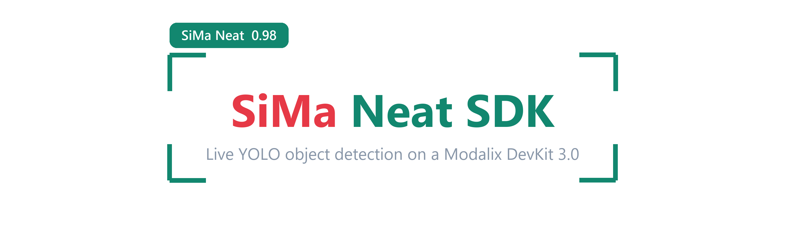

<div align="center">



<br>

[](https://sima.ai)
[](https://docs.sima.ai)
[](https://docs.sima.ai)


</div>

## What this is

**Object detection** on a Modalix DevKit 3.0. A YOLO26 detect head runs on the MLA, and
the app draws a box, a centre marker and a labelled caption on every frame.

```
   ┌───────────────────────────────────────────────────────────┐
   │ ┌──────────┐                                              │
   │ │ FPS: 24.7│                                              │
   │ └──────────┘   ┌────────────┐                             │
   │                │ person 0.94│                             │
   │                ├────────────┴─────────┐                   │
   │                │                      │                   │
   │                │           •          │   centre marker   │
   │                │                      │                   │
   │                └──────────────────────┘                   │
   └───────────────────────────────────────────────────────────┘
```

> [!IMPORTANT]
> **This page assumes a paired board.** The one-time DevKit bring-up (cabling, WSL2,
> networking, Docker, the Neat SDK) is in the [root README](../README.md) and is shared
> by every app here. Do steps 1 to 6 there once, then come back.
>
> ✅ You are ready when this prints a version:
> ```bash
> ssh sima@<devkit-ip> "~/pyneat/bin/python3 -c 'import pyneat; print(pyneat.__version__)'"
> ```

## Contents

| Section | What it covers |
|:--|:--|
| [See it before you deploy](#see-it-before-you-deploy) | The overlay on a laptop, no hardware |
| [Test it in three commands](#test-it-in-three-commands) | Push, run, pull the result back |
| [Get a model and a test video](#get-a-model-and-a-test-video) | Both land in `assets/`, ready to run |
| [Deploy and run](#deploy-and-run) | `scp` the app over and run it |
| [See the result](#see-the-result) | Pull `detections.mp4` and `frames/` back |
| [The overlay](#the-overlay) | Every box, caption and FPS badge setting |
| [Configuration](#configuration) | `config.yaml`, and the mistakes it catches |
| [Daily loop](#daily-loop) | The commands you repeat after every edit |
| [How the app works](#how-the-app-works) | Pipeline, preprocessing, decode types |
| [Questions people ask](#questions-people-ask) | FAQ: model sizes, cameras, short runs, where output lands |
| [Common errors](#common-errors) | One table, symptom to fix |

## See it before you deploy

No board, no model, no SDK. This draws boxes, labels and the frame-rate badge
using your own config:

```bash
pip install "sima-vision[preview]"
sima-vision preview --task detect -c object-detection/config.yaml -o preview.png
```

<div align="center">

</div>

It runs the same drawing code the board does, over a synthetic scene, so every
`visualization:` value below can be tuned here first. **No model is run** --
the detections are placed for you so there is something to draw.

## Test it in three commands

Run these from the **repo root** in WSL:

```bash
scp -r object-detection/ src/ sima@<devkit-ip>:~                         # 1. push the app

ssh -tt sima@<devkit-ip> \
  'source ~/pyneat/bin/activate && cd ~/object-detection && python3 src/app.py && cd ..'

scp sima@<devkit-ip>:~/object-detection/detections.mp4 .            # 3. pull the result
```

Or, with the CLI installed on the board (`pip install sima-vision`):

```bash
ssh -tt sima@<devkit-ip> \
  'source ~/pyneat/bin/activate && cd ~/object-detection && sima-vision detect'
```

`sima-vision detect` finds `config.yaml` in the directory you run it from, so that is the
same run. Every setting below can also be given as a flag, and flags win over the file —
see [the CLI reference](../README.md#the-cli).

Play `detections.mp4`. Boxes on it means the whole chain works. Repeat after every edit.

**Faster still, before you touch the board.** This parses and validates `config.yaml`
without pyneat, a model, or any hardware, and runs anywhere:

```bash
python3 object-detection/src/app.py --validate-config
```
```
config OK: object-detection/config.yaml
  family=yolo26 -> BoxDecodeType.YoloV26
  preprocess: kind=image enable=on in=NV12 ... resize=letterbox pad=114 | normalize=coco_yolo
```

**A short run instead of a whole clip.** Set `runtime.frames: 100` and
`output.video.enable: false`. You get 100 annotated JPEGs in `frames/` and the app exits
by itself.

<a id="get-a-model-and-a-test-video"></a>
## Get a model and a test video

Both are gitignored, so a fresh clone has neither. Run both blocks **in WSL, from the
repo root**; they land in `object-detection/assets/`, which is exactly where
`config.yaml` already looks.

**The model:**

```bash
# WSL
sudo su -
cd sima-projects
source sima/bin/activate
sima-cli login                                    # needs a community.sima.ai account

MODELS=https://docs.sima.ai/pkg_downloads/SDK2.1.2/models/modalix/yolo26-detection

MODEL=yolo26m-det-bf16-mla_tess-b1.tar.gz

mkdir -p object-detection/assets/models
cd object-detection/assets/models && sima-cli download "$MODELS/$MODEL" && cd ../../../
```

Swap `yolo26m` for `n`, `s`, `l` or `x` to trade speed against accuracy. `family` stays
`yolo26` for all of them, since they share the same detect head.

> [!IMPORTANT]
> **`sima-cli download` writes into the current directory**, which is the whole reason for
> the `cd`. The trailing `cd ../../../` puts you back at the repo root, ready for the
> `scp` in the next step. Downloading from anywhere else, including the container's
> `/workspace`, is how the pack ends up
> [somewhere `config.yaml` cannot see](../README.md#paths).

**The test video.** Two ready-made 1080p clips, already converted to raw `.h264` so they
skip the [demuxer bug](../README.md#known-issues) entirely:

```bash
VIDEOS=https://github.com/RizwanMunawar/sima-projects/releases/download/0.0.1

mkdir -p object-detection/assets/videos
curl -L -o object-detection/assets/videos/people-walking-outside-mall.h264 \
  $VIDEOS/people-walking-outside-mall.h264
curl -L -o object-detection/assets/videos/people-walking-inside-mall.h264 \
  $VIDEOS/people-walking-inside-mall.h264
```

| Clip | Size | Stream |
|:--|:--|:--|
| `people-walking-outside-mall.h264` | 13 MB | 1920x1080 @ 24 fps. The shipped default |
| `people-walking-inside-mall.h264` | 1.2 MB | 1920x1080 @ 30 fps. Quicker to pull, good for a smoke test |

`config.yaml` points at the outside-mall clip out of the box. To use the other one, change
one line:

```yaml
source:
  uri: assets/videos/people-walking-inside-mall.h264
```

Confirm both landed:

```bash
ls -lh object-detection/assets/models/ object-detection/assets/videos/
```

> [!NOTE]
> **Bringing your own clip?** It must be a raw H.264 elementary stream, not an `.mp4`.
> See [Video must be raw H.264](../README.md#video-must-be-raw-h264). Leave `source.fps`,
> `source.width` and `source.height` at `0`; the app reads the real geometry out of the
> stream's SPS.

<details>
<summary><b>Already inside the SDK container?</b></summary>

You can download the model there instead, but the container's `/workspace` is
`/root/workspace` in WSL, **not** the repo at `/root/sima-projects`, so it needs one
extra move:

```bash
# in the container
sima-cli login
mkdir -p /workspace/assets/models && cd /workspace/assets/models
MODELS=https://docs.sima.ai/pkg_downloads/SDK2.1.2/models/modalix/yolo26-detection
sima-cli download $MODELS/yolo26m-det-bf16-mla_tess-b1.tar.gz
```

```bash
# then back in WSL
mkdir -p /root/sima-projects/object-detection/assets/models
mv /root/workspace/assets/models/yolo26m-det-*.tar.gz \
   /root/sima-projects/object-detection/assets/models/
```

The WSL route above skips this entirely, which is why it is the one written out first.

</details>

<a id="deploy-and-run"></a>
## Deploy and run

The app lives in [`object-detection/`](.):

```
object-detection/
├── config.yaml          # every setting lives here
├── assets/
│   ├── models/          # .tar.gz model packs  (not in git)
│   └── videos/          # .h264 streams        (not in git)
└── src/
    ├── app.py           # the pipeline
    ├── coco_labels.txt  # 80 COCO class names
    └── requirements.txt
```

On the DevKit, once per board:

```bash
pip install -r ~/object-detection/src/requirements.txt
```

> [!CAUTION]
> **Never let pip pull numpy 2.x.** `pyneat` and every `simaai-*` package need
> `numpy<2`. The pins in `requirements.txt` handle it. If you already broke it:
> `pip install "numpy>=1.24,<2" "opencv-python>=4.7,<5"`

**One command copies everything.** Run it from the repo root in WSL, after every change:

```bash
scp -r object-detection/ src/ sima@<devkit-ip>:~
```

Then on the DevKit:

```bash
ssh -tt sima@<devkit-ip>                     # two t's, see below
source ~/pyneat/bin/activate
cd ~/object-detection && python3 src/app.py && cd ..
```

Healthy output:

```
source: type=video uri=assets/videos/people-walking-outside-mall.h264 stream=1920x1080@24
preprocess: ... resize=letterbox pad=114 normalize=coco_yolo
model: ... family=yolo26 decode_type=YoloV26 labels=80
runtime: preset=reliable overflow=block queue_depth=3
graph built
save: dir=frames every=1 overlay=True
video: detections.mp4 codec=mp4v fps=24 hud=True
running. press Ctrl-C to stop.
[50] 24.8 fps, 6.2 detections/frame avg
```

> [!CAUTION]
> **Use `ssh -tt`, two t's.** Without a pty, Ctrl-C never reaches the app. It keeps
> running invisibly holding the MLA and your next run fails.
> Rescue: `ssh sima@<devkit-ip> pkill -f src/app.py`

Anything other than that output (no detections, a stall, a crash) is in
[Common errors](#common-errors) and [Questions people ask](#questions-people-ask).

<a id="see-the-result"></a>
## See the result

Every run writes an annotated video and annotated stills on the board. Pull them across:

```bash
scp sima@<devkit-ip>:~/object-detection/detections.mp4 .
scp -r sima@<devkit-ip>:~/object-detection/frames .
```

On exit the app says exactly what it wrote, so a short or empty file is obvious:

```
processed=3012 timeouts=0
video: wrote 3012 frames to detections.mp4 (48.3 MB)
```

It looks like this:

<div align="center">

https://github.com/user-attachments/assets/d8fbc213-dce3-4d7b-bda7-bdf643adcf4a

</div>

## The overlay

A rectangle in the class colour, a centre dot, and a filled caption above it carrying
the class name and confidence. Captions flip inside the box rather than clipping off the
top of the frame. Colours come from a 20-entry palette keyed to class id, so a class is
always the same colour.

Every part of it is config, under `visualization:` in `config.yaml`. Sizes are pixels
**for a 1080p frame**; with `auto_scale: on` they are multiplied by
`frame height / reference_height`, so 4K does not get hairlines and 480p does not get
slabs. Colours are `[B, G, R]` because OpenCV is BGR, so `[0, 0, 255]` is red.

```yaml
visualization:
  box_thickness: 3
  text_scale: 1.0
  text_thickness: 2
  text_padding: 10

  centre_dot: on
  centre_dot_radius: 7

  show_labels: on
  show_scores: on
  score_decimals: 2

  text_color: [255, 255, 255]

  auto_scale: on
  reference_height: 1080

  hud:
    text_color: [104, 31, 17]
    bg_color: [255, 255, 255]
    text_scale: 2.0
    text_thickness: 5
    padding: 22          # all four sides
    padding_x: 34        # left/right gap. 0 follows padding
    padding_y: 24        # top/bottom gap. 0 follows padding
    margin_x: 28         # gap from the left frame edge
    margin_y: 24         # gap from the top frame edge
    fps_decimals: 0      # 0 gives "FPS: 25", 1 gives "FPS: 24.8"
    min_width: 0
    min_height: 0
```

| Key | Effect |
|:--|:--|
| `box_thickness` | Detection rectangle outline weight |
| `text_scale` | Caption font size multiplier |
| `text_thickness` | Caption stroke weight |
| `text_padding` | Gap between the caption text and the edge of its band |
| `centre_dot`, `centre_dot_radius` | Filled dot at the centre of each box |
| `show_labels`, `show_scores` | Class name and confidence in the caption |
| `score_decimals` | `2` gives `person 0.57`, `0` gives `person 1` |
| `text_color` | Caption text colour |
| `auto_scale`, `reference_height` | Scale every size above with the frame height |

The FPS badge in the corner is drawn when `output.video.hud` is true, and styled by the
`hud:` block:

| Key | Effect |
|:--|:--|
| `hud.text_color`, `hud.bg_color` | Badge text and background |
| `hud.text_scale`, `hud.text_thickness` | Badge font size and stroke. `0` follows the caption settings |
| `hud.padding` | Gap between the text and the badge edge, all four sides. What actually sets the badge size |
| `hud.padding_x`, `hud.padding_y` | Override the horizontal and vertical gap independently. `0` follows `hud.padding` |
| `hud.margin_x`, `hud.margin_y` | Gap between the badge and the top-left corner of the frame. `0` follows the matching padding |
| `hud.fps_decimals` | `0` gives `FPS: 25`, `1` gives `FPS: 24.8` |
| `hud.min_width`, `hud.min_height` | Floor for the badge box. `0` fits the text, and the text stays centred either way |

Where the output goes:

| Key | Effect |
|:--|:--|
| `output.video.path` | Where to write, relative to the launch directory |
| `output.video.codec` | 4-char FourCC. `mp4v` by default, auto-falls back to `MJPG`/`.avi` |
| `output.video.fps` | `0` matches the source rate |
| `output.video.hud` | Draw the FPS badge. Turn off for clean footage |
| `output.save.every` | Write every Nth frame as a JPEG. `0` disables |

## Configuration

Everything lives in `object-detection/config.yaml`. These settings matter:

```yaml
model:
  path: assets/models/yolo26m-det-bf16-mla_tess-b1.tar.gz
  family: yolo26                       # the YOLO26 detect head

source:
  type: video                          # video | rtsp | usb
  uri: assets/videos/people-walking-outside-mall.h264   # relative to ~/object-detection

decode:
  score_threshold: 0.30                # lower it if detections are missing

visualization:                         # how the boxes and captions are drawn
  box_thickness: 3
  text_scale: 1.0
  centre_dot: on
  show_labels: on
  show_scores: on
  auto_scale: on                       # scale with the frame height
  hud:                                 # the FPS badge
    text_color: [104, 31, 17]
    bg_color: [255, 255, 255]

output:
  video:
    enable: true
    path: detections.mp4               # annotated video, written on the DevKit
    hud: true
  save:
    enable: true
    dir: frames                        # annotated stills
    every: 1                           # every Nth frame, 0 disables
```

Every drawing setting is tunable without touching the code, and takes effect on the
next run: see [The overlay](#the-overlay) for the full list.

| Mistake | What happens |
|:--|:--|
| `uri: C:\Users\...\video.mp4` | The DevKit has no `C:` drive |
| `uri: r"C:\path\file.mp4"` | `r"..."` is Python. YAML keeps the `r` and quotes |
| `family` not `yolo26` | No detections, or every score near zero |
| A `.mp4` source | Hits a [demuxer bug](../README.md#video-must-be-raw-h264). Convert to `.h264` |

## Daily loop

**Edit, copy, run, review**, and repeat.

| Task | Command | Run in |
|:--|:--|:--|
| Validate the config, no hardware | `python3 object-detection/src/app.py --validate-config` | anywhere |
| Push the app to the board | `scp -r object-detection/ src/ sima@<devkit-ip>:~` | WSL |
| Run the app | `python3 src/app.py` | DevKit |
| Pull the video back | `scp sima@<devkit-ip>:~/object-detection/detections.mp4 .` | WSL |
| Pull the stills back | `scp -r sima@<devkit-ip>:~/object-detection/frames .` | WSL |
| Kill an orphaned run | `pkill -f src/app.py` | DevKit |

The SDK container (`dk shell`, `dk status`, `neat`) is only needed for board admin, and
is covered in the [root README](../README.md#setup-questions).

## How the app works

<details>
<summary><b>Pipeline shape, preprocessing and decode types</b></summary>

Built by following the `neat-application-builder` playbook. Every pyneat call was
verified against the packaged core source in the SDK container, not written from
memory:

| What | Source of truth |
|:--|:--|
| `PreprocessOptions` fields | `include/model/PreprocessPlan.h` |
| `ModelOptions` fields | `include/model/Model.h` |
| `BoxDecodeType` members | `include/pipeline/BoxDecodeType.h` |
| Preproc semantics | `docs/reference/nodes/preproc.mdx` |
| BBOX wire payload | `docs/reference/boxdecode_decode_types.md` |
| Python enum names | `python/src/module.cpp` |
| Reference implementation | `apps-src/examples/object-detection/single-stream-object-detector` |

All relative to `/neat-resources/core-src/` inside the container.

### Pipeline

The playbook's decision map puts this on `Graph` rather than `Model.run(...)`, because
there are multiple stages, named public endpoints and a branch with a fan-in:

```
   source --> branch --> frame ----------------+
                   |                           +--> combine("detector_output")
                   +---> model --> detections -+
```

`detector_output` is pulled from the `Run` handle, the BBOX payload is parsed, and the
annotated frame fans out to the video writer and the still writer.

### The BBOX payload

BoxDecode emits one UInt8 tensor per frame:

```
[uint32 N][RawBox 24B] * N ... trailing padding
RawBox = <iiiifi  ->  x, y, w, h, score, class_id     (source-image pixels)
```

### Preprocessing

The `preprocess:` block is an **intent layer**, not a set of instructions. `Model`
resolves it against the archive's MPK contract and compiles the matching Preproc,
Quant, Tess or QuantTess graph. Anything left on `auto` is the planner's call.

| Config key | pyneat field | Notes |
|:--|:--|:--|
| `kind` | `preprocess.kind` | `image` for every source here |
| `enable` | `preprocess.enable` | Master switch |
| `input_format` | `color_convert.input_format` | **Must match what the source produces** |
| `output_format` | `color_convert.output_format` | `auto` takes it from the model |
| `input_max_*` | `input_max_width/height` | Buffer capacity. Defaults to 1920x1080 |
| `resize.mode` | `resize.mode` | `letterbox` preserves aspect and pads |
| `resize.width/height` | `resize.width/height` | `0` infers 640x640, the YOLO26 input |
| `pad_value` | `resize.pad_value` | `114`, what YOLO26 letterboxes with |
| `normalize.preset` | `preprocess.preset` | `coco_yolo`, what YOLO26 expects |
| `quantize`, `tessellate` | same | Leave on `auto` |

**The one that matters most is `input_format`.** Getting it wrong is the usual cause of
"the model runs but detects nothing":

| Source | `input_format` |
|:--|:--|
| `video`, `rtsp` (hardware H.264 decode) | `NV12` |
| `usb` (libcamera) | `NV12` |
| `cv2.imread` images | `BGR` |

**Coordinate mapping is automatic.** Preproc writes resize and letterbox metadata onto
the tensor, and BoxDecode reads it back, so boxes arrive in original-image pixels. Do
not undo the letterbox yourself. Shifted boxes mean `resize.mode` or `pad_value` is
wrong, not that inverse maths is missing.

### Decoding YOLO26 boxes

`model.family: yolo26` selects `BoxDecodeType.YoloV26`, and the app prints the pair it
resolved on startup so you can see it took:

```
model: ... family=yolo26 decode_type=YoloV26 labels=80
```

YOLO26 has a **raw logit head**, so it must not be decoded as a probability-only head.
That is what `YoloV26` handles. Uniformly near-zero scores mean the decode does not match
the head, so check `family` before touching thresholds.

### Tuning

| Symptom | Setting |
|:--|:--|
| Missing detections | Lower `decode.score_threshold` |
| Duplicate boxes | Lower `decode.nms_iou` |
| Too many detections | Raise `decode.score_threshold`, lower `max_detections` |
| Dropped frames | Raise `runtime.queue_depth` |
| Want timings | `runtime.profile: true` |

</details>

## Questions people ask

<details>
<summary><b>Can I use a different YOLO26 size?</b></summary>

Yes. Download the pack you want in
[Get a model and a test video](#get-a-model-and-a-test-video), and point `model.path` at it:

```yaml
model:
  path: assets/models/yolo26s-det-bf16-mla_tess-b1.tar.gz
  family: yolo26
```

`n`, `s`, `m`, `l` and `x` trade speed against accuracy. `family` stays `yolo26`, since
they all share the same detect head.

</details>

<details>
<summary><b>How do I use a camera or an RTSP stream instead of a file?</b></summary>

```yaml
source:
  type: usb            # or rtsp
  uri: ""              # rtsp://... for rtsp, empty for the default camera
  rtsp:
    codec: h264
    tcp: true
    latency_ms: 100
  usb:
    camera_name: ""    # "" = DevKit default camera
```

Leave `preprocess.input_format: NV12`; all three sources produce NV12. Leave
`runtime.preset` and `runtime.overflow_policy` on `auto` too, which switches a live
source to keep-latest so it stays current instead of falling behind.

</details>

<details>
<summary><b>How do I make a test run short?</b></summary>

```yaml
runtime: { frames: 100 }
output:
  video: { enable: false }
  save:  { enable: true, every: 10 }
```

The app stops itself after 100 frames and leaves annotated JPEGs in `frames/`. Good for
checking a new model or clip without waiting out a whole video.

</details>

<details>
<summary><b>Where do the outputs go?</b></summary>

Onto the **board**, relative to wherever you launched `app.py`, which is normally
`~/object-detection`. So `detections.mp4` and `frames/` sit next to `config.yaml` on the
DevKit. Pull them back with `scp`; nothing is written on your PC by the run itself.

</details>

<details>
<summary><b>How do I restyle the boxes and captions?</b></summary>

Every part of the overlay is config, see [The overlay](#the-overlay). Sizes are tuned
for 1080p and scale with the frame when `auto_scale: on`, and colours are `[B, G, R]`
because OpenCV is BGR.

</details>

<details>
<summary><b>The output video is only a few frames long, or plays far too fast</b></summary>

Two different faults produce this, and the run's last lines tell you which:

```
[warn] the recording is only 0.4s (12 frames at 30 fps).
       1. output.insight.enable is true. Its H.264 encoder shares the codec daemon ...
```

**The run ended early.** Almost always the Insight feed. Its H.264 encoder shares the
codec daemon with the decoder feeding your source, so when the encoder fails to
configure, the decoder stalls with it and the source stops producing:

```
sima_enc_daemon ... ERROR: Failed setting advanced configuration
[warn] timed out waiting for instances (1)
```

```yaml
output:
  insight:
    enable: false      # the shipped default
```

The most common way to break it is giving both senders the same port. `video_port_base`
and `metadata_port_base` must differ, and neither may be `9900`, which is the Insight
**web UI** port rather than a stream port. The app now refuses both at startup rather
than letting the run stall:

```yaml
    video_port_base: 9000
    metadata_port_base: 9100
```

**Frames were dropped.** The writer stamps the output at the source rate, so if
inference falls behind and buffers are discarded, the survivors are played at full speed
and the clip is both short and fast. Leave `runtime.overflow_policy: auto`, which picks
`block` for a file so every frame is kept. The run then takes longer than the clip,
which is correct rather than a stall.

Nothing is lost either way: `output.video` and `output.save` are written on the board and
survive the run, which the UDP feed does not.

</details>

<details>
<summary><b>The recording is shorter than the input and plays too fast</b></summary>

Frames are being dropped, because inference is slower than decoding and the survivors
are still written at the source rate. Leave `runtime.overflow_policy: auto`, which picks
`block` for a file so every frame is kept. The run then takes longer than the clip.

</details>

<details>
<summary><b>I want masks, not boxes</b></summary>

That is the companion app:
[instance segmentation with a background blur](../instance-segmentation/README.md). Same
board, same setup, a `-seg` model pack.

</details>

## Common errors

Problems with a **running detector**. Bring-up problems are in the
[root README](../README.md#setup-errors).

| Symptom | Fix |
|:--|:--|
| `model archive not found` | Run from `~/object-detection`, and check `find assets -type f` |
| `source file not found` | The path is relative to where you launch `app.py`. The error lists what is actually in the folder |
| `is not a raw H.264 elementary stream` | You renamed a `.mp4` instead of converting it. Use the ffmpeg command in the error |
| `No src-element named "nN_demux"` | `.mp4` demuxer bug. [Convert to `.h264`](../README.md#video-must-be-raw-h264) |
| `ModuleNotFoundError: pyneat` | You are on the PC, or pairing never ran. See the [root README](../README.md#pyneat-missing) |
| `pyneat requires numpy<2` | `pip install "numpy>=1.24,<2" "opencv-python>=4.7,<5"` |
| Device busy | Orphaned run: `ssh sima@<ip> pkill -f src/app.py` |
| Stuck after `loading model` | First load unpacks the archive. Give it a minute |
| No detections at all | Check `model.family` is `yolo26`, then lower `decode.score_threshold` |
| Scores all near zero | `model.family` is not `yolo26`, so the raw-logit head is being decoded wrong |
| Boxes in the wrong place | `resize.mode: letterbox`, `pad_value: 114`. Do not add your own maths |
| Output video shorter than the input, and plays fast | Frames are being dropped. Set `runtime.overflow_policy: auto` |
| `processed=0` and a 20 s timeout | The source caps filter is not negotiating. Leave `source.width`, `source.height` and `source.fps` at 0 |
| Dropped frames on a live source | Raise `runtime.queue_depth`, keep `overflow_policy: auto` |

## License

The object detection model used here for testing is **Ultralytics YOLO26**, released
under **AGPL-3.0**. All other parts of this code are released under **Apache-2.0**.

## Credits

- [SiMa.ai on GitHub](https://github.com/SiMa-ai): Modalix, the Palette SDK and Neat
- [Ultralytics](https://github.com/ultralytics/ultralytics): YOLO26 models

<div align="center">

Created with ❤️ by **Muhammad Rizwan Munawar**, passionate about implementing
computer vision ideas and sharing my gains with the community.

If this saved you an afternoon, **⭐ the repo** and pass it on to someone else
bringing up a DevKit.

<br>

<a href="https://github.com/RizwanMunawar"></a>
&nbsp;&nbsp;
<a href="https://www.linkedin.com/in/muhammadrizwanmunawar/"></a>
&nbsp;&nbsp;
<a href="https://x.com/muhammdrizwanmr"></a>
&nbsp;&nbsp;
<a href="https://www.youtube.com/@muhammadrizwanmunawar"></a>
&nbsp;&nbsp;
<a href="https://muhammadrizwanmunawar.medium.com/"></a>

</div>
